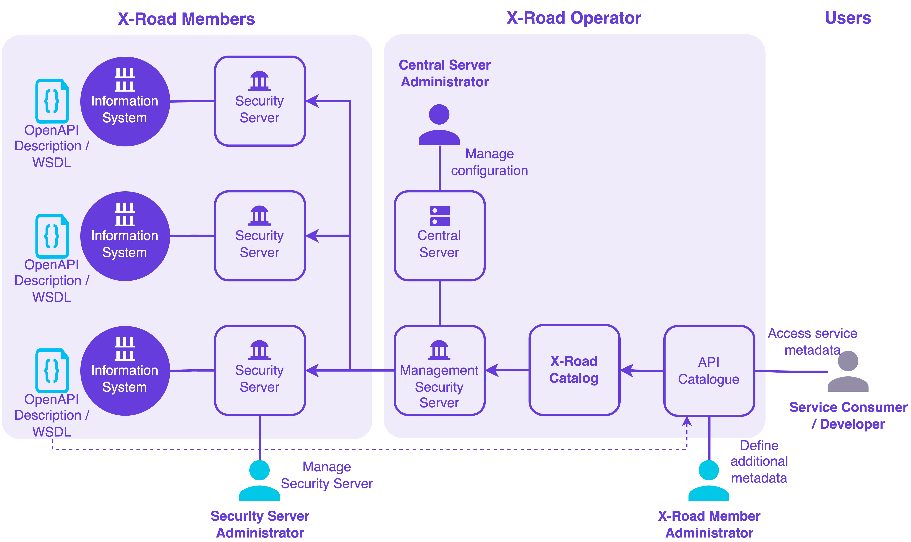
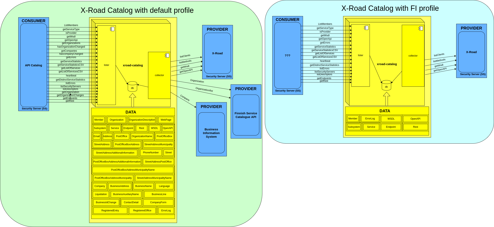

# X-Road Catalog

## About the repository 

This repository contains information about the X-Road Catalog, its source code, development, installation and documentation.

## Introduction to X-Road Catalog

X-Road Catalog is an [X-Road](https://github.com/nordic-institute/X-Road/) extension that collects information on
members, subsystems and services from an X-Road ecosystem and provides a REST and SOAP interfaces to access the data.

X-Road Catalog can be used together with an additional API Catalog component - a web portal that contains descriptions of all the 
services available in the ecosystem. The primary purpose of the API Catalog is to provide a user-friendly channel to 
search and discover available services. The API Catalog is targeted at both business and technical users.

When services are connected to X-Road, their service descriptions are published on the Security Server by the Security 
Server administrator. The service descriptions can then be accessed using a [service discovery mechanism](https://docs.x-road.global/Protocols/pr-mrest_x-road_service_metadata_protocol_for_rest.html) 
provided by X-Road. However, the mechanism is very technical and requires direct access to the Security Server's 
messaging interface. Also, getting a list of all services available in the ecosystem would require querying each 
Security Server separately. Therefore, a more user-friendly API Catalog is needed.

X-Road Catalog is used to automate the collection of the service metadata from the Security Servers. In that way, the 
descriptions need to be maintained in a single place only, and all the changes in the source are automatically updated 
to the API Catalog. Nevertheless, additional metadata must be manually added and maintained on the API Catalog by a service 
administrator representing the organisation owning the service. The metadata may include any information related to the 
service and its use, e.g., a more detailed description of the data set, terms and conditions, contact information, 
pricing information, SLAs, etc.

## Architecture

The X-Road Catalog software consists of three modules:

- [X-Road Catalog Collector](xroad-catalog-collector/README.md)
  * Collects information from the X-Road ecosystem (possibly also from external APIs) and stores it to the postgresql database. 
  * Implemented using concurrent Akka actors. 
- [X-Road Catalog Lister](xroad-catalog-lister/README.md)
  * Provides REST and SOAP interfaces that offer information collected by the Collector. 
  * Can be used as an X-Road service (X-Road headers are in place).
- [X-Road Catalog Persistence](xroad-catalog-persistence/README.md)
  * Library used to persist and read persisted data. Used by the X-Road Catalog Collector and X-Road Catalog Lister modules.
  

## Installation

**How to build X-Road Catalog?**

See instructions in [BUILD.md](BUILD.md).

**How to install and configure X-Road Catalog?**

See the [X-Road Catalog Installation Guide](doc/xroad_catalog_installation_guide.md).

**How to use X-Road Catalog?**

See the [X-Road Catalog User Guide](doc/xroad_catalog_user_guide.md).

## How to contribute?

[Sign up](https://id.atlassian.com/signup) for an account and
get access to the [X-Road Service Desk](https://nordic-institute.atlassian.net/servicedesk/customer/portal/4) and 
[X-Road Catalog Backlog](https://nordic-institute.atlassian.net/browse/XRDCAT).

Submit a pull request to [X-Road Catalog source code Github repository](https://github.com/nordic-institute/X-Road-Catalog)
or an enhancement request to the [X-Road Service Desk](https://nordic-institute.atlassian.net/servicedesk/customer/portal/4).

When opening a pull request, please provide a signed Contributor Licence Agreement (CLA). More information can be found 
[here](https://github.com/nordic-institute/X-Road/blob/develop/CONTRIBUTING.md#legal-notice).

## Support disclaimer

The following activities, among others, are undertaken by the
[Nordic Institute for Interoperability Solutions (NIIS)](https://www.niis.org/)
with regard to X-Road Catalog:

* management, development, verification, and audit of the source code
* administration of documentation
* administration of business and technical requirements
* conducting development
* developing and implementing principles of licensing and distribution
* providing second-line support for the NIIS members
* international cooperation.

[X-Road Technology Partners](https://x-road.global/xroad-technology-partners) are enterprises providing X-Road consultation 
services, e.g. deploying independent X-Road instances, developing X-Road extensions and X-Road-compatible services, 
integrating informations systems with X-Road etc.

No support for X-Road Catalog deployment is provided here.

## Credits

* X-Road Catalog was originally developed by the [Finnish Digital Agency](https://dvv.fi/en) during 2016-2023.
* In 2023 it was agreed that [Nordic Institute for Interoperability Solutions (NIIS)](https://www.niis.org/) takes 
maintenance responsibility.