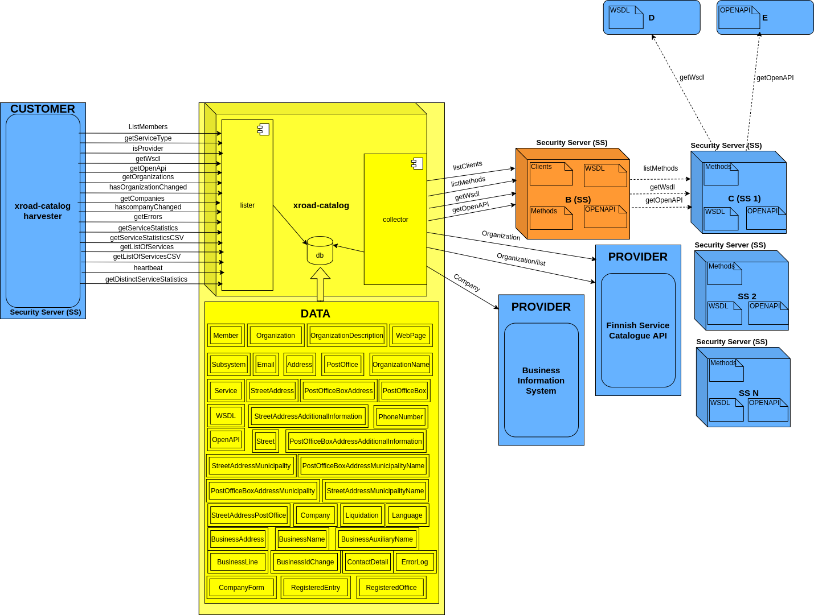

## About the repository 

This repository contains information about the X-Road Catalog, source codes, its development, installation and documentation.

## Introduction to X-Road Catalog

The purpose of this piece of software is to collect information, more specifically members, subsystems and services, from a X-RoadCatalog instance and offer an interface where the information can be read.

The software consists of three parts:
- [xroad-catalog-collector](xroad-catalog-collector/README.md)
  * Collects members, subsystems and services from the x-Road instance and stores them to the postgresql database. 
  * Implemented using concurrent Akka actors. 
- [xroad-catalog-lister](xroad-catalog-lister/README.md)
  * SOAP interface that offers information collected by Collector. 
  * Can be used as an X-Road service (X-Road headers are in place)
- [xroad-catalog-persistence](xroad-catalog-persistence/README.md)
  * Library used to persist and read persisted data. Used by both of the above.
  


## Environments
* Internal development environment in the AWS: [AWS xroad-catalog](http://xroad-catalog.i.palveluvayla.com)
* DVV test: [servicerepotest](https://servicerepotest01.csc.fi)
* DVV production: [servicerepoprod](https://servicerepoprod01.csc.fi)
* XRoad CS(Central Service): [XRoad cs](https://catalog-cs.i.palveluvayla.com:4000)
* XRoad SS1(Security Server 1): [XRoad ss1](https://catalog-ss1.i.palveluvayla.com:4000)
* XRoad SS1(Security Server 2): [XRoad ss2](https://catalog-ss2.i.palveluvayla.com:4000)

## Version management
For versioning, [GitHub Flow](https://guides.github.com/introduction/flow/) is used

* Anything in the master branch is deployable
* To work on something new, create a branch off from master and given a descriptively name(ie: new-oauth2-scopes)
* Commit to that branch locally and regularly push your work to the same named branch on the server
* When you need feedback or help, or you think the branch is ready for merging, open a pull request
* After someone else has reviewed and signed off on the feature, you can merge it into master
* Once it is merged and pushed to master, you can and should deploy immediately

## Tools
Running the X-Road Catalog software requires Linux (Ubuntu or RHEL). If you are using some other operating system (e.g. Windows or macOS), the easiest option is to first install Ubuntu 18.04 or RHEL 7.0 into a virtual machine.


*Required for building*
* OpenJDK / JDK version 8
* Gradle

*Recommended for development environment*
* Docker (for deb/rpm packaging)
* LXD (https://linuxcontainers.org/lxd/)
  * for setting up a local X-Road instance
* Ansible
  * for automating the X-Road instance installation

The development environment should have at least 8GB of memory and 20GB of free disk space (applies to a virtual machine as well), especially if you set up a local X-Road instance.

## Jenkins jobs
* Jenkins job for building the XRoad-Catalog Collector: [xroad-catalog-collector-build](https://dev-jenkins.palveluvayla.com:8082/job/xroad-catalog-collector-build/)
* Jenkins job for building the XRoad-Catalog Lister: [xroad-catalog-lister-build](https://dev-jenkins.palveluvayla.com:8082/job/xroad-catalog-lister-build/)
* Jenkins job for deployment of the XRoad-Catalog Collector: [deploy-xroad-catalog-collector](https://dev-jenkins.palveluvayla.com:8082/view/xroad-catalog/job/deploy-xroad-catalog-collector/)
* Jenkins job for deployment of the XRoad-Catalog Lister: [deploy-xroad-catalog-lister](https://dev-jenkins.palveluvayla.com:8082/view/xroad-catalog/job/deploy-xroad-catalog-lister/)

  
## Installation
The installable software consists of xroad-catalog-collector and xroad-catalog-lister. Both are provides as RPM packages. 

```
sudo yum install xroad-catalog-lister xroad-catalog-collector 
# or
rpm -i install xroad-catalog-lister xroad-catalog-collector 
```
Instructions on how to build the RPM packages using Docker can be found
[here](xroad-catalog-collector/README.md#build-rpm-packages-on-non-redhat-platform)
and
[here](xroad-catalog-lister/README.md#build-rpm-packages-on-non-redhat-platform)

Configure parameters in /etc/xroad/xroad-catalog/collector-production.properties, especially X-Road instance information and URL of security server.
```
xroad-catalog.xroad-instance=FI
xroad-catalog.member-class=GOV
xroad-catalog.member-code=1945065-0
xroad-catalog.subsystem-code=VAAKKO1
xroad-catalog.security-server-host=http://gdev-rh1.i.palveluvayla.com
```

Change also the database password in /etc/xroad/xroad-catalog/catalogdb-production.properties.
```
spring.datasource.password=password
```
and in the DB:
```
sudo -u postgres psql -U postgres -d postgres -c "alter user xroad_catalog with password 'password';"
```

Make sure that the services are enabled on boot and restart services in order to make the changes to have effect.
```
# Enable the service to start on boot
sudo systemctl enable xroad-catalog-lister
sudo systemctl enable xroad-catalog-collector
sudo systemctl restart xroad-catalog-lister
sudo systemctl restart xroad-catalog-collector
```

## SSL
If secure connection to to the security server is required, add the server's cert for the JVM trust store, for example as follows.
```
sudo cp cert.pem /etc/pki/ca-trust/source/anchors/
sudo update-ca-trust extract
```

If you don't have the certificate, it can be asked as follows:
```
openssl s_client -showcerts -connect kapvlpt02.csc.fi:443  </dev/null
```

If listMethods requires authentication, create a certificate and add it to keystore file /etc/xroad/xroad-catalog/keystore as follows:
```
sudo keytool -alias xroad-catalog -genkeypair -keystore /etc/xroad/xroad-catalog/keystore -validity 7300 -keyalg RSA -keysize 2048 -sigalg SHA256withRSA -dname C=FI,CN=xroad-catalog

keytool -keystore /etc/xroad/xroad-catalog/keystore -exportcert -rfc -alias xroad-catalog > xroad-catalog.cer
```
Created xroad-catalog.cer must be added to security server (Through UI: Security Server Clients > SELECT SERVICE > Internal Servers > Internal TLS Certificates > ADD)

The keystore password can be configured in /etc/xroad/xroad-catalog/collector-production.properties
```
xroad-catalog.ssl-keystore-password=changeit
```

## Note

This instruction expects that xroad-catalog-collector and xroad-catalog-lister are installed on the same server. It is also possible to install them on different servers but then database settings need to be set for both services. For server of xroad-catalog-lister file /etc/xroad/xroad-catalog/catalogdb-production.properties must be manually created.

## Status of Services
```
[root@ip-172-31-128-199 xroad-catalog]# systemctl | grep xroad
xroad-async.service                              loaded active running   X-Road Proxy
xroad-catalog-collector.service                  loaded active running   X-Road Catalog Collector
xroad-catalog-lister.service                     loaded active running   X-Road Catalog Lister
xroad-confclient.service                         loaded active running   X-Road Proxy
xroad-jetty9.service                             loaded active running   X-Road Jetty server
xroad-monitor.service                            loaded active running   X-Road Monitor
xroad-proxy.service                              loaded active running   X-Road Proxy
xroad-signer.service                             loaded active running   X-Road signer
```

```
[root@ip-172-31-128-199 xroad-catalog]# service xroad-catalog-collector status
Redirecting to /bin/systemctl status  xroad-catalog-collector.service
● xroad-catalog-collector.service - X-Road Catalog Collector
   Loaded: loaded (/usr/lib/systemd/system/xroad-catalog-collector.service; disabled; vendor preset: enabled)
   Active: active (running) since Thu 2016-04-07 11:00:42 EEST; 3min 11s ago
 Main PID: 7298 (java)
   CGroup: /system.slice/xroad-catalog-collector.service
           └─7298 /bin/java -Dspring.profiles.active=production -jar /usr/lib/xroad-catalog/xroad-catalog-collector.jar -...
Apr 07 11:01:12 ip-172-31-128-199.eu-west-1.compute.internal xroad-catalog-collector[7298]: Hibernate: select subsystem0..._
Apr 07 11:01:12 ip-172-31-128-199.eu-west-1.compute.internal xroad-catalog-collector[7298]: Hibernate: select wsdls0_.ser...
Apr 07 11:01:12 ip-172-31-128-199.eu-west-1.compute.internal xroad-catalog-collector[7298]: Hibernate: select nextval ('...)
Apr 07 11:01:12 ip-172-31-128-199.eu-west-1.compute.internal xroad-catalog-collector[7298]: Hibernate: insert into wsdl ...)
Apr 07 11:01:12 ip-172-31-128-199.eu-west-1.compute.internal xroad-catalog-collector[7298]: 2016-04-07 11:01:12.211  INF...y
Apr 07 11:01:13 ip-172-31-128-199.eu-west-1.compute.internal xroad-catalog-collector[7298]: Hibernate: select service0_....s
Apr 07 11:01:13 ip-172-31-128-199.eu-west-1.compute.internal xroad-catalog-collector[7298]: Hibernate: select subsystem0..._
Apr 07 11:01:13 ip-172-31-128-199.eu-west-1.compute.internal xroad-catalog-collector[7298]: Hibernate: select wsdls0_.ser...
Apr 07 11:01:13 ip-172-31-128-199.eu-west-1.compute.internal xroad-catalog-collector[7298]: Hibernate: update wsdl set d...?
Apr 07 11:01:13 ip-172-31-128-199.eu-west-1.compute.internal xroad-catalog-collector[7298]: 2016-04-07 11:01:13.766  INF...y
Hint: Some lines were ellipsized, use -l to show in full.
```

```
[root@ip-172-31-128-199 xroad-catalog]# service xroad-catalog-lister status
Redirecting to /bin/systemctl status  xroad-catalog-lister.service
● xroad-catalog-lister.service - X-Road Catalog Lister
   Loaded: loaded (/usr/lib/systemd/system/xroad-catalog-lister.service; enabled; vendor preset: enabled)
   Active: active (running) since Thu 2016-04-07 07:06:03 EEST; 3h 58min ago
 Main PID: 763 (java)
   CGroup: /system.slice/xroad-catalog-lister.service
           └─763 /bin/java -Dserver.port=8070 -Dspring.profiles.active=production -jar /usr/lib/xroad-catalog/xroad-catal...
Apr 07 11:01:11 ip-172-31-128-199.eu-west-1.compute.internal xroad-catalog-lister[763]: 2016-04-07 11:01:11.084 DEBUG 76...t
Apr 07 11:01:11 ip-172-31-128-199.eu-west-1.compute.internal xroad-catalog-lister[763]: 2016-04-07 11:01:11.101 DEBUG 76...t
Apr 07 11:01:11 ip-172-31-128-199.eu-west-1.compute.internal xroad-catalog-lister[763]: 2016-04-07 11:01:11.102 DEBUG 76...l
Apr 07 11:01:11 ip-172-31-128-199.eu-west-1.compute.internal xroad-catalog-lister[763]: 2016-04-07 11:01:11.105 DEBUG 76...]
Apr 07 11:01:11 ip-172-31-128-199.eu-west-1.compute.internal xroad-catalog-lister[763]: 2016-04-07 11:01:11.105  INFO 76...s
Apr 07 11:01:11 ip-172-31-128-199.eu-west-1.compute.internal xroad-catalog-lister[763]: 2016-04-07 11:01:11.105 DEBUG 76...y
Apr 07 11:01:11 ip-172-31-128-199.eu-west-1.compute.internal xroad-catalog-lister[763]: 2016-04-07 11:01:11.600 DEBUG 76...]
Apr 07 11:01:11 ip-172-31-128-199.eu-west-1.compute.internal xroad-catalog-lister[763]: 2016-04-07 11:01:11.611 DEBUG 76...]
Apr 07 11:01:11 ip-172-31-128-199.eu-west-1.compute.internal xroad-catalog-lister[763]: 2016-04-07 11:01:11.691 DEBUG 76...t
Apr 07 11:01:11 ip-172-31-128-199.eu-west-1.compute.internal xroad-catalog-lister[763]: 2016-04-07 11:01:11.692 DEBUG 76...t
Hint: Some lines were ellipsized, use -l to show in full.
```


## Logs
```
sudo journalctl -fu xroad-catalog-collector --since="2016-04-07 10:50 --output=cat"
```
