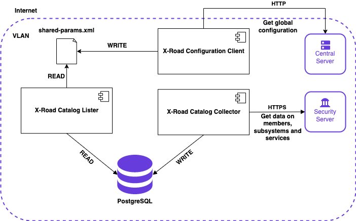

# X-Road Catalog Installation Guide
Version: 1.3.0
Doc. ID: IG-XRDCAT

---

## Version history <!-- omit in toc -->
| Date       | Version | Description                                                                               | Author           |
|------------|---------|-------------------------------------------------------------------------------------------|------------------|
| 22.03.2023 | 1.0.0   | Export installation-related parts from the X-Road Catalog User Guide                      | Petteri Kivimäki |
| 16.08.2023 | 1.1.0   | Add instructions to install and configure the `xroad-conflient` module                    | Petteri Kivimäki |
| 09.09.2023 | 1.2.0   | Remove instructions to install the `xroad-conflient` module manually                      | Petteri Kivimäki |
| 24.09.2023 | 1.3.0   | Add instructions to disable the automatic backup job run by the `xroad-conflient` module  | Petteri Kivimäki |

## Table of Contents <!-- omit in toc -->

<!-- toc -->
<!-- vim-markdown-toc GFM -->

* [License](#license)
* [1. Introduction](#1-introduction)
  * [1.1 Target Audience](#11-target-audience)
* [2. Installation](#2-installation)
  * [2.1 Prerequisites to Installation](#21-prerequisites-to-installation)
  * [2.2 Deployment Diagram](#22-deployment-diagram)
  * [2.3 Setup Package Repository](#23-setup-package-repository)
  * [2.4 Installation](#24-installation)
    * [2.4.1 Complete the Installation of X-Road Configuration Client](#241-complete-the-installation-of-x-road-configuration-client)
  * [2.5 Initial Configuration](#25-initial-configuration)
  * [2.6 SSL (optional)](#26-ssl-optional)
  * [2.7 Post-Installation Checks](#27-post-installation-checks)
  * [2.8 Logs](#28-logs)

<!-- vim-markdown-toc -->
<!-- tocstop -->

## License

This document is licensed under the Creative Commons Attribution-ShareAlike 3.0 Unported License. To view a copy of this license, visit http://creativecommons.org/licenses/by-sa/3.0/.

## 1. Introduction

X-Road Catalog is an [X-Road](https://github.com/nordic-institute/X-Road/) extension that collects information on
members, subsystems and services from an X-Road ecosystem and provides a REST and SOAP interfaces to access the data.

X-Road Catalog consists of three modules:

- X-Road Catalog Collector
  * Collects information from the X-Road ecosystem and stores it to a database.
  * Optionally, can collect information from external APIs too, e.g., a national business registry.
- X-Road Catalog Lister
  * Provides REST and SOAP interfaces offering information collected by the collector.
  * Can be used as an X-Road service (X-Road headers are in place).
- X-Road Catalog Persistence
  * Library used to persist and read persisted data.
  * Used by the X-Road Catalog Collector and X-Road Catalog Lister modules.

### 1.1 Target Audience

The intended audience of this user guide are X-Road Operators responsible for managing and configuring the X-Road Central
Server and related services. The document is intended for readers with a good knowledge of Linux server management,
computer networks, and the X-Road principles.

## 2. Installation

## 2.1 Prerequisites to Installation

Running X-Road Catalog using available RPM packages requires Red Hat Enterprise Linux (RHEL)
version 8 on a x86-64 platform. The software can be installed both on physical and virtualized hardware.

The installation requires that the X-Road Catalog Lister is installed on the same host with the [X-Road Configuration 
Client](https://docs.x-road.global/Architecture/arc-ss_x-road_security_server_architecture.html#33-xroad-confclient) 
(`xroad-confclient`) module. If the X-Road Catalog Lister is not installed on the same host with a Security Server, 
the X-Road Configuration Client (`xroad-confclient`) module is installed automatically as an RPM dependency. Also, the 
X-Road Catalog Lister must be able to access the `/etc/xroad/globalconf/<INSTANCE_IDENTIFIER>/shared-params.xml` 
configuration file.

## 2.2 Deployment Diagram



## 2.3 Setup Package Repository

Install `yum-utils`, a collection of utilities that integrate with `yum` to extend its native features.

```bash
sudo yum install yum-utils
```

Add X-Road package repository and Extra Packages for Enterprise Linux (EPEL) repository:

```bash
sudo yum install https://dl.fedoraproject.org/pub/epel/epel-release-latest-8.noarch.rpm
sudo yum-config-manager --add-repo https://artifactory.niis.org/xroad-release-rpm/rhel/8/current
```

The following packages are fetched from EPEL: `crudini`, and `rlwrap`.

Add the X-Road repository’s signing key to the list of trusted keys:

```bash
sudo rpm --import https://artifactory.niis.org/api/gpg/key/public
```

## 2.4 Installation

The installable software consists of `xroad-catalog-collector` and `xroad-catalog-lister` modules. Both are provided
as RPM packages.

```bash
sudo yum install xroad-catalog-lister.rpm xroad-catalog-collector.rpm
```

Instructions on how to build the RPM packages using Docker can be found [here](../BUILD.md).

## 2.4.1 Complete the Installation of X-Road Configuration Client

**Note:** The configuration steps described in this section are needed only if the X-Road Catalog Lister is not installed on the
same host with a Security Server

If the X-Road Catalog Lister is not installed on the same host with a Security Server, the X-Road Configuration Client
(`xroad-confclient`) module is installed automatically as an RPM dependency. In this case, some manual configuration steps 
are needed.

Copy the X-Road ecosystem configuration anchor to `/etc/xroad/configuration-anchor.xml`. Make sure that the `xroad` user 
is the owner of the file with sufficient permissions:

```bash
sudo chown xroad:xroad /etc/xroad/configuration-anchor.xml
sudo chmod 660 /etc/xroad/configuration-anchor.xml
```

The Configuration Client is responsible for running the Security Server automatic backup job. When the Configuration
Client isn't installed on the same host with the Security Server, the backup job must be disabled. Disable the backup job 
by adding the below configuration in the `/etc/xroad/conf.d/local.ini` configuration file:

```bash
[configuration-client]
proxy-configuration-backup-cron=* * * * * ? 2099
```

Make sure that the `xroad-confclient` service is enabled on boot and start the service:

```bash
sudo systemctl enable xroad-confclient
sudo systemctl start xroad-confclient
```

The application log of the `xroad-confclient` module is available in `/var/log/xroad/configuration_client.log`.

## 2.5 Initial Configuration

Configure the below parameters in `/etc/xroad/xroad-catalog/collector-production.properties`, especially X-Road instance
information and URL of Security Server.

```properties
xroad-catalog.xroad-instance=<XROAD_INSTANCE>
xroad-catalog.member-class=<MEMBER_CLASS>
xroad-catalog.member-code=<MEMBER_CODE>
xroad-catalog.subsystem-code=<SUBSYSTEM_CODE>
xroad-catalog.security-server-host=<SECURITY_SERVER_HOST>
```

In addition, configure also parameters related to behaviour of X-Road Catalog Collector:

```properties
xroad-catalog.flush-log-time-after-hour=<ERROR_LOGS_FLUSH_IN_DB_TIME_INTERVAL_AFTER>
xroad-catalog.flush-log-time-before-hour=<ERROR_LOGS_FLUSH_IN_DB_TIME_INTERVAL_BEFORE>
xroad-catalog.error-log-length-in-days=<ERROR_LOGS_KEPT_IN_DB_LENGTH_IN_DAYS>
xroad-catalog.fetch-run-unlimited=<XROAD_CATALOG_COLLECTOR_FETCH_UNLIMITED>
xroad-catalog.fetch-time-after-hour=<XROAD_CATALOG_COLLECTOR_FETCH_INTERVAL_AFTER>
xroad-catalog.fetch-time-before-hour=<XROAD_CATALOG_COLLECTOR_FETCH_INTERVAL_BEFORE>
xroad-catalog.collector-interval-min=<XROAD_CATALOG_COLLECTOR_FETCH_INTERVAL_MINUTES>
```

The parameters are explained in the table below.

| Parameter | Description                                                                                                                                                                                                                                         |
|-----------|-----------------------------------------------------------------------------------------------------------------------------------------------------------------------------------------------------------------------------------------------------|
| `ERROR_LOGS_FLUSH_IN_DB_TIME_INTERVAL_AFTER` | A parameter for setting the start of time interval during which the error logs in the db will be deleted when those exceed the amount in days set by `ERROR_LOGS_KEPT_IN_DB_LENGTH_IN_DAYS` parameter, e.g. value `18` means starting from `18:00`. |
| `ERROR_LOGS_FLUSH_IN_DB_TIME_INTERVAL_AFTER` | A parameter for setting the start of time interval during which the error logs in the db will be deleted when those exceed the amount in days set by `ERROR_LOGS_KEPT_IN_DB_LENGTH_IN_DAYS` parameter, e.g. value `18` means starting from `18:00`. |
|`ERROR_LOGS_FLUSH_IN_DB_TIME_INTERVAL_BEFORE` | A parameter for setting the end of time interval during which the error logs in the db will be deleted when those exceed the amount in days set by `ERROR_LOGS_KEPT_IN_DB_LENGTH_IN_DAYS` parameter, e.g. value  `23` means ending at `23:00`. |
| `ERROR_LOGS_KEPT_IN_DB_LENGTH_IN_DAYS` | A parameter for setting the amount in days for how long the errors logs should be kept in the db, e.g. value `90` means `for 90 days`. |
| `XROAD_CATALOG_COLLECTOR_FETCH_UNLIMITED` | A parameter for setting whether the X-Road Catalog Collector should try to fetch data from Security Server continuously during a day or only between certain hours, e.g. value `true` means `continously`. |
| `XROAD_CATALOG_COLLECTOR_FETCH_INTERVAL_AFTER` | A parameter for setting the start of time interval during which the X-Road Catalog Collector should try to fetch data from Security Server continuously (this parameter will be ignored if the parameter `XROAD_CATALOG_COLLECTOR_FETCH_UNLIMITED` is set to `true`), e.g. value `18` means starting from `18:00`. |
| `XROAD_CATALOG_COLLECTOR_FETCH_INTERVAL_BEFORE` | A parameter for setting the end of time interval during which the X-Road Catalog Collector should try to fetch data from Security Server continuously (this parameter will be ignored if the parameter `XROAD_CATALOG_COLLECTOR_FETCH_UNLIMITED` is set to `true`), e.g. value `23` means ending at `23:00`. |
| `XROAD_CATALOG_COLLECTOR_FETCH_INTERVAL_MINUTES` | A parameter for setting the amount of time in minutes after which the X-Road Catalog Collector should start re-fetching data from Security Server, e.g. value `60` means `every 60 minutes`. |

In addition, update the `xroad-catalog.shared-params-file` property value in `/etc/xroad/xroad-catalog/lister-production.properties`.
The value must point to the `/etc/xroad/globalconf/<INSTANCE_IDENTIFIER>/shared-params.xml` X-Road global configuration file:

```properties
xroad-catalog.shared-params-file=/etc/xroad/globalconf/<INSTANCE_IDENTIFIER>/shared-params.xml
```

Change also the database password in `/etc/xroad/xroad-catalog/catalogdb-production.properties`:

```properties
spring.datasource.password=password
```
And in the DB:
```bash
sudo -u postgres psql -U postgres -d postgres -c "alter user xroad_catalog with password 'password';"
```

Make sure that the X-Road Catalog services are enabled on boot and restart services in order to make the changes to have effect:
```bash
sudo systemctl enable postgresql 
sudo systemctl enable xroad-catalog-lister
sudo systemctl enable xroad-catalog-collector
sudo systemctl restart xroad-catalog-lister
sudo systemctl restart xroad-catalog-collector
```

## 2.6 SSL (optional)

If secure connection to the Security Server is required, add the server's cert for the JVM trust store. For example:

```bash
sudo cp cert.pem /etc/pki/ca-trust/source/anchors/
sudo update-ca-trust extract
```

If you don't have the certificate, it can be asked as follows:

```bash
openssl s_client -showcerts -connect <SERVER_ADDRESS>:443  </dev/null
```

If accessing the `listMethods` service requires authentication, create a key and a certificate and add it to keystore file
`/etc/xroad/xroad-catalog/keystore` (note: replace the `<COUNTRY_CODE>` placeholder with a real country code):

```bash
sudo keytool -alias xroad-catalog -genkeypair -keystore /etc/xroad/xroad-catalog/keystore -validity 7300 -keyalg RSA -keysize 2048 -sigalg SHA256withRSA -dname C=<COUNTRY_CODE>,CN=xroad-catalog
keytool -keystore /etc/xroad/xroad-catalog/keystore -exportcert -rfc -alias xroad-catalog > xroad-catalog.cer
```

The created `xroad-catalog.cer` file must be added to the Security Server (Through UI: Security Server Clients > SELECT SERVICE > Internal Servers > Internal TLS Certificates > ADD)

The keystore password can be configured in `/etc/xroad/xroad-catalog/collector-production.properties`.

```properties
xroad-catalog.ssl-keystore-password=changeit
```

## 2.7 Post-Installation Checks

This instruction expects that `xroad-catalog-collector` and `xroad-catalog-lister` are installed on the same host. It
is also possible to install them on different hosts, but then database settings need to be set for both services. For the 
`xroad-catalog-lister` host, the file `/etc/xroad/xroad-catalog/catalogdb-production.properties` must be manually created.

**X-Road Catalog Collector**

```bash
sudo systemctl status xroad-catalog-collector
```
```bash
● xroad-catalog-collector.service - X-Road Catalog Collector
   Loaded: loaded (/usr/lib/systemd/system/xroad-catalog-collector.service; disabled; vendor preset: enabled)
   Active: active (running) since Thu 2016-04-07 11:00:42 EEST; 3min 11s ago
 Main PID: 7298 (java)
   CGroup: /system.slice/xroad-catalog-collector.service
           └─7298 /bin/java -Dspring.profiles.active=production -jar /usr/lib/xroad-catalog/xroad-catalog-collector.jar -...
Apr 07 11:01:12 ip-172-31-128-199.eu-west-1.compute.internal xroad-catalog-collector[7298]: Hibernate: select subsystem0..._
Apr 07 11:01:12 ip-172-31-128-199.eu-west-1.compute.internal xroad-catalog-collector[7298]: Hibernate: select wsdls0_.ser...
Apr 07 11:01:12 ip-172-31-128-199.eu-west-1.compute.internal xroad-catalog-collector[7298]: Hibernate: select nextval ('...)
Apr 07 11:01:12 ip-172-31-128-199.eu-west-1.compute.internal xroad-catalog-collector[7298]: Hibernate: insert into wsdl ...)
Apr 07 11:01:12 ip-172-31-128-199.eu-west-1.compute.internal xroad-catalog-collector[7298]: 2016-04-07 11:01:12.211  INF...y
Apr 07 11:01:13 ip-172-31-128-199.eu-west-1.compute.internal xroad-catalog-collector[7298]: Hibernate: select service0_....s
Apr 07 11:01:13 ip-172-31-128-199.eu-west-1.compute.internal xroad-catalog-collector[7298]: Hibernate: select subsystem0..._
Apr 07 11:01:13 ip-172-31-128-199.eu-west-1.compute.internal xroad-catalog-collector[7298]: Hibernate: select wsdls0_.ser...
Apr 07 11:01:13 ip-172-31-128-199.eu-west-1.compute.internal xroad-catalog-collector[7298]: Hibernate: update wsdl set d...?
Apr 07 11:01:13 ip-172-31-128-199.eu-west-1.compute.internal xroad-catalog-collector[7298]: 2016-04-07 11:01:13.766  INF...y
Hint: Some lines were ellipsized, use -l to show in full.
```

**X-Road Catalog Lister**

```bash
sudo systemctl status xroad-catalog-lister
```
```bash
● xroad-catalog-lister.service - X-Road Catalog Lister
   Loaded: loaded (/usr/lib/systemd/system/xroad-catalog-lister.service; enabled; vendor preset: enabled)
   Active: active (running) since Thu 2016-04-07 07:06:03 EEST; 3h 58min ago
 Main PID: 763 (java)
   CGroup: /system.slice/xroad-catalog-lister.service
           └─763 /bin/java -Dserver.port=8070 -Dspring.profiles.active=production -jar /usr/lib/xroad-catalog/xroad-catal...
Apr 07 11:01:11 ip-172-31-128-199.eu-west-1.compute.internal xroad-catalog-lister[763]: 2016-04-07 11:01:11.084 DEBUG 76...t
Apr 07 11:01:11 ip-172-31-128-199.eu-west-1.compute.internal xroad-catalog-lister[763]: 2016-04-07 11:01:11.101 DEBUG 76...t
Apr 07 11:01:11 ip-172-31-128-199.eu-west-1.compute.internal xroad-catalog-lister[763]: 2016-04-07 11:01:11.102 DEBUG 76...l
Apr 07 11:01:11 ip-172-31-128-199.eu-west-1.compute.internal xroad-catalog-lister[763]: 2016-04-07 11:01:11.105 DEBUG 76...]
Apr 07 11:01:11 ip-172-31-128-199.eu-west-1.compute.internal xroad-catalog-lister[763]: 2016-04-07 11:01:11.105  INFO 76...s
Apr 07 11:01:11 ip-172-31-128-199.eu-west-1.compute.internal xroad-catalog-lister[763]: 2016-04-07 11:01:11.105 DEBUG 76...y
Apr 07 11:01:11 ip-172-31-128-199.eu-west-1.compute.internal xroad-catalog-lister[763]: 2016-04-07 11:01:11.600 DEBUG 76...]
Apr 07 11:01:11 ip-172-31-128-199.eu-west-1.compute.internal xroad-catalog-lister[763]: 2016-04-07 11:01:11.611 DEBUG 76...]
Apr 07 11:01:11 ip-172-31-128-199.eu-west-1.compute.internal xroad-catalog-lister[763]: 2016-04-07 11:01:11.691 DEBUG 76...t
Apr 07 11:01:11 ip-172-31-128-199.eu-west-1.compute.internal xroad-catalog-lister[763]: 2016-04-07 11:01:11.692 DEBUG 76...t
Hint: Some lines were ellipsized, use -l to show in full.
```

## 2.8 Logs

The application logs of the `xroad-catalog-collector` and `xroad-catalog-lister` can be accessed using the `journalctl`
command:

```bash
sudo journalctl -fu xroad-catalog-collector --since="2023-08-16 06:00:00" --output=cat
sudo journalctl -fu xroad-catalog-lister --since="2023-08-16 06:00:00" --output=cat
```
