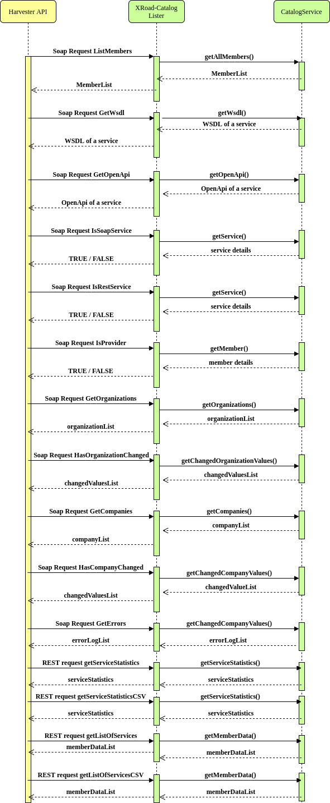

# xroad-catalog-lister

WebService to produce list of X-Road clients

## Introduction to X-Road Catalog Collector

The purpose of this piece of software is to provide a webservice which lists all the XRoad members and the services they provide together with services descriptions

The main endpoints this software provides: 
* ListMembers - SOAP endpoint to list all the members the Catalog Collector has stored to the db
* GetWsdl - SOAP endpoint to retrieve a WSDL description for a given service
* GetOpenAPI - SOAP endpoint to retrieve an OpenAPI description for a given service
* GetServiceType - SOAP endpoint for requesting whether a given service is of type SOAP, REST or OPENAPI
* IsProvider - SOAP endpoint for requesting whether a given member is a provider
* GetOrganizations - SOAP endpoint for requesting public organization details
* HasOrganizationChanged - SOAP endpoint for requesting whether given public organization has some of its details changed
* GetCompanies - SOAP endpoint for requesting private company details
* HasCompanyChanged - SOAP endpoint for requesting whether given private company has some of its details changed
* GetErrors - SOAP endpoint for requesting a list of errors related to fetching data from different apis and security servers
* GetServiceStatistics - REST endpoint for requesting a list of statistics, consisting of numbers of SOAP/REST services over time
* GetServiceStatisticsCSV - REST endpoint for requesting a list of statistics in CSV format, consisting of numbers of SOAP/REST services over time
* GetListOfServices - REST endpoint for requesting a list of members and related subsystems, services and security servers over time
* GetListOfServicesCSV - REST endpoint for requesting a list of members and related subsystems, services and security servers in CSV format
* GetDistinctServiceStatistics - REST endpoint for requesting a list of statistics, consisting of numbers of distinct services over time
* listErrors - REST endpoint for listing errors for a given member or subsystem, supports pagination
* heartbeat - REST endpoint for requesting the heartbeat of X-Road Catalog
* listSecurityServers - REST endpoint for listing security servers and related information
* listDescriptors - REST endpoint for listing subsystems
* getOrganization - REST endpoint for listing organization/company data
* getOrganizationChanges - REST endpoint for requesting whether given organization/company has some of its details changed

A sequence diagram illustrating flow between XRoad-Catalog service layer and XRoad-Catalog Lister




## Build
```sh
../gradlew clean build
```

## Run
```sh
../gradlew bootRun
```

Or

    $ java -jar build/libs/xroad-catalog-lister.jar --spring.config.name=lister,catalogdb


## Test

| Command                                                                                             |           Result            |
|-----------------------------------------------------------------------------------------------------|-----------------------------|
| curl --header "content-type: text/xml" -d @src/main/doc/servicerequest.xml http://localhost:8080/ws |  All services in the system |
| curl http://localhost:8080/ws/services.wsdl                                                         |  Get WSDL                   |

### 1. ListMembers

Request

curl -k -d @servicerequest.xml --header "Content-Type: text/xml" -X POST http://localhost:8080/ws/ListMembers
```xml
<soapenv:Envelope 
xmlns:soapenv="http://schemas.xmlsoap.org/soap/envelope/" 
xmlns:xro="http://x-road.eu/xsd/xroad.xsd" 
xmlns:iden="http://x-road.eu/xsd/identifiers" 
xmlns:xrcl="http://xroad.vrk.fi/xroad-catalog-lister">
   <soapenv:Header>
      <xro:protocolVersion>4.x</xro:protocolVersion>
      <xro:id>ID11234</xro:id>
      <xro:userId>EE1234567890</xro:userId>
      <xro:client iden:objectType="MEMBER">
         <iden:xRoadInstance>FI</iden:xRoadInstance>
         <iden:memberClass>GOV</iden:memberClass>
         <iden:memberCode>1710128-9</iden:memberCode>
      </xro:client>
      <xro:service iden:objectType="SERVICE">
         <iden:xRoadInstance>FI</iden:xRoadInstance>
         <iden:memberClass>GOV</iden:memberClass>
         <iden:memberCode>1710128-9</iden:memberCode>
         <iden:subsystemCode>SS1</iden:subsystemCode>
         <iden:serviceCode>ListMembers</iden:serviceCode>
         <iden:serviceVersion>v1</iden:serviceVersion>
      </xro:service>
   </soapenv:Header>
   <soapenv:Body>
      <xrcl:ListMembers>
         <xrcl:changedAfter>2011-01-01</xrcl:changedAfter>
      </xrcl:ListMembers>
   </soapenv:Body>
</soapenv:Envelope>
```

Response
```xml
<?xml version="1.0" encoding="UTF-8"?>
<SOAP-ENV:Envelope xmlns:SOAP-ENV="http://schemas.xmlsoap.org/soap/envelope/">
  <SOAP-ENV:Header>
    <xro:protocolVersion xmlns:xro="http://x-road.eu/xsd/xroad.xsd">4.x</xro:protocolVersion>
    <xro:id xmlns:xro="http://x-road.eu/xsd/xroad.xsd">ID11234</xro:id>
    <xro:userId xmlns:xro="http://x-road.eu/xsd/xroad.xsd">EE1234567890</xro:userId>
    <xro:client xmlns:xro="http://x-road.eu/xsd/xroad.xsd" xmlns:iden="http://x-road.eu/xsd/identifiers" iden:objectType="MEMBER">
      <iden:xRoadInstance>FI</iden:xRoadInstance>
      <iden:memberClass>GOV</iden:memberClass>
      <iden:memberCode>1710128-9</iden:memberCode>
    </xro:client>
    <xro:service xmlns:xro="http://x-road.eu/xsd/xroad.xsd" xmlns:iden="http://x-road.eu/xsd/identifiers" iden:objectType="SERVICE">
      <iden:xRoadInstance>FI</iden:xRoadInstance>
      <iden:memberClass>GOV</iden:memberClass>
      <iden:memberCode>1710128-9</iden:memberCode>
      <iden:subsystemCode>SS1</iden:subsystemCode>
      <iden:serviceCode>ListMembers</iden:serviceCode>
      <iden:serviceVersion>v1</iden:serviceVersion>
    </xro:service>
  </SOAP-ENV:Header>
  <SOAP-ENV:Body>
    <ns2:ListMembersResponse xmlns:ns2="http://xroad.vrk.fi/xroad-catalog-lister">
      <ns2:memberList>
        <ns2:member>
          <ns2:xRoadInstance>DEV</ns2:xRoadInstance>
          <ns2:memberClass>GOV</ns2:memberClass>
          <ns2:memberCode>1234</ns2:memberCode>
          <ns2:name>ACME</ns2:name>
          <ns2:subsystems>
            <ns2:subsystem>
              <ns2:subsystemCode>MANAGEMENT</ns2:subsystemCode>
              <ns2:services>
                <ns2:service>
                  <ns2:serviceCode>clientReg</ns2:serviceCode>
                  <ns2:wsdl>
                    <ns2:externalId>1584692751893_da8be621-5d6b-4920-91c9-d8c359dddbad</ns2:externalId>
                    <ns2:created>2020-03-20T10:25:51.892+02:00</ns2:created>
                    <ns2:changed>2020-03-20T10:25:51.892+02:00</ns2:changed>
                    <ns2:fetched>2020-03-20T12:31:09.188+02:00</ns2:fetched>
                  </ns2:wsdl>
                  <ns2:created>2020-03-20T10:25:51.632+02:00</ns2:created>
                  <ns2:changed>2020-03-20T10:25:51.632+02:00</ns2:changed>
                  <ns2:fetched>2020-03-20T12:31:07.223+02:00</ns2:fetched>
                </ns2:service>
                <ns2:service>
                  <ns2:serviceCode>respa.tampere.fi</ns2:serviceCode>
                  <ns2:created>2020-03-20T10:25:51.632+02:00</ns2:created>
                  <ns2:changed>2020-03-20T10:25:51.632+02:00</ns2:changed>
                  <ns2:fetched>2020-03-20T12:31:07.223+02:00</ns2:fetched>
                </ns2:service>
                <ns2:service>
                  <ns2:serviceCode>authCertDeletion</ns2:serviceCode>
                  <ns2:wsdl>
                    <ns2:externalId>1584692751942_ab002cbd-bbbd-43c7-a311-b0dc5adf3af1</ns2:externalId>
                    <ns2:created>2020-03-20T10:25:51.936+02:00</ns2:created>
                    <ns2:changed>2020-03-20T10:25:51.936+02:00</ns2:changed>
                    <ns2:fetched>2020-03-20T12:31:09.009+02:00</ns2:fetched>
                  </ns2:wsdl>
                  <ns2:created>2020-03-20T10:25:51.632+02:00</ns2:created>
                  <ns2:changed>2020-03-20T10:25:51.632+02:00</ns2:changed>
                  <ns2:fetched>2020-03-20T12:31:07.223+02:00</ns2:fetched>
                </ns2:service>
                <ns2:service>
                  <ns2:serviceCode>clientDeletion</ns2:serviceCode>
                  <ns2:wsdl>
                    <ns2:externalId>1584692751908_5bdde30d-3a5f-42c0-9f45-d884f5810996</ns2:externalId>
                    <ns2:created>2020-03-20T10:25:51.906+02:00</ns2:created>
                    <ns2:changed>2020-03-20T10:25:51.906+02:00</ns2:changed>
                    <ns2:fetched>2020-03-20T12:31:07.383+02:00</ns2:fetched>
                  </ns2:wsdl>
                  <ns2:created>2020-03-20T10:25:51.632+02:00</ns2:created>
                  <ns2:changed>2020-03-20T10:25:51.632+02:00</ns2:changed>
                  <ns2:fetched>2020-03-20T12:31:07.223+02:00</ns2:fetched>
                </ns2:service>
                <ns2:service>
                  <ns2:serviceCode>ownerChange</ns2:serviceCode>
                  <ns2:wsdl>
                    <ns2:externalId>1584692751888_07141c5a-bfe0-4c84-b621-e5e4a9db01fa</ns2:externalId>
                    <ns2:created>2020-03-20T10:25:51.884+02:00</ns2:created>
                    <ns2:changed>2020-03-20T10:25:51.884+02:00</ns2:changed>
                    <ns2:fetched>2020-03-20T12:31:07.479+02:00</ns2:fetched>
                  </ns2:wsdl>
                  <ns2:created>2020-03-20T10:25:51.632+02:00</ns2:created>
                  <ns2:changed>2020-03-20T10:25:51.632+02:00</ns2:changed>
                  <ns2:fetched>2020-03-20T12:31:07.223+02:00</ns2:fetched>
                </ns2:service>
                <ns2:service>
                  <ns2:serviceCode>PetStoreNew</ns2:serviceCode>
                  <ns2:created>2020-03-20T10:25:51.632+02:00</ns2:created>
                  <ns2:changed>2020-03-20T10:25:51.632+02:00</ns2:changed>
                  <ns2:fetched>2020-03-20T12:31:07.223+02:00</ns2:fetched>
                </ns2:service>
              </ns2:services>
              <ns2:created>2020-03-20T10:25:51.055+02:00</ns2:created>
              <ns2:changed>2020-03-20T10:25:51.055+02:00</ns2:changed>
              <ns2:fetched>2020-03-20T12:31:01.394+02:00</ns2:fetched>
            </ns2:subsystem>
            <ns2:subsystem>
              <ns2:subsystemCode>TEST</ns2:subsystemCode>
              <ns2:services />
              <ns2:created>2020-03-20T10:25:51.055+02:00</ns2:created>
              <ns2:changed>2020-03-20T10:25:51.055+02:00</ns2:changed>
              <ns2:fetched>2020-03-20T12:31:01.394+02:00</ns2:fetched>
            </ns2:subsystem>
          </ns2:subsystems>
          <ns2:created>2020-03-20T10:25:51.055+02:00</ns2:created>
          <ns2:changed>2020-03-20T10:25:51.055+02:00</ns2:changed>
          <ns2:fetched>2020-03-20T12:31:01.394+02:00</ns2:fetched>
        </ns2:member>
      </ns2:memberList>
    </ns2:ListMembersResponse>
  </SOAP-ENV:Body>
</SOAP-ENV:Envelope>
```

### 2. GetWsdl

Request

curl -k -d @wsdlrequest.xml --header "Content-Type: text/xml" -X POST http://localhost:8080/ws/GetWsdl
```xml
<soapenv:Envelope 
xmlns:soapenv="http://schemas.xmlsoap.org/soap/envelope/" 
xmlns:xro="http://x-road.eu/xsd/xroad.xsd" 
xmlns:iden="http://x-road.eu/xsd/identifiers" 
xmlns:xrcl="http://xroad.vrk.fi/xroad-catalog-lister">
   <soapenv:Header>
      <xro:protocolVersion>4.x</xro:protocolVersion>
      <xro:id>ID11234</xro:id>
      <xro:userId>EE1234567890</xro:userId>
      <xro:client iden:objectType="MEMBER">
         <iden:xRoadInstance>FI</iden:xRoadInstance>
         <iden:memberClass>GOV</iden:memberClass>
         <iden:memberCode>1710128-9</iden:memberCode>
      </xro:client>
      <xro:service iden:objectType="SERVICE">
         <iden:xRoadInstance>FI</iden:xRoadInstance>
         <iden:memberClass>GOV</iden:memberClass>
         <iden:memberCode>1710128-9</iden:memberCode>
         <iden:subsystemCode>SS1</iden:subsystemCode>
         <iden:serviceCode>ListMembers</iden:serviceCode>
         <iden:serviceVersion>v1</iden:serviceVersion>
      </xro:service>
   </soapenv:Header>
   <soapenv:Body>
      <xrcl:GetWsdl>
         <xrcl:externalId>1584692751908_5bdde30d-3a5f-42c0-9f45-d884f5810996</xrcl:externalId>
      </xrcl:GetWsdl>
   </soapenv:Body>
</soapenv:Envelope>
```

Response
```xml
<?xml version="1.0" encoding="UTF-8"?>
<SOAP-ENV:Envelope xmlns:SOAP-ENV="http://schemas.xmlsoap.org/soap/envelope/">
  <SOAP-ENV:Header>
    <xro:protocolVersion xmlns:xro="http://x-road.eu/xsd/xroad.xsd">4.x</xro:protocolVersion>
    <xro:id xmlns:xro="http://x-road.eu/xsd/xroad.xsd">ID11234</xro:id>
    <xro:userId xmlns:xro="http://x-road.eu/xsd/xroad.xsd">EE1234567890</xro:userId>
    <xro:client xmlns:xro="http://x-road.eu/xsd/xroad.xsd" xmlns:iden="http://x-road.eu/xsd/identifiers" iden:objectType="MEMBER">
      <iden:xRoadInstance>FI</iden:xRoadInstance>
      <iden:memberClass>GOV</iden:memberClass>
      <iden:memberCode>1710128-9</iden:memberCode>
    </xro:client>
    <xro:service xmlns:xro="http://x-road.eu/xsd/xroad.xsd" xmlns:iden="http://x-road.eu/xsd/identifiers" iden:objectType="SERVICE">
      <iden:xRoadInstance>FI</iden:xRoadInstance>
      <iden:memberClass>GOV</iden:memberClass>
      <iden:memberCode>1710128-9</iden:memberCode>
      <iden:subsystemCode>SS1</iden:subsystemCode>
      <iden:serviceCode>ListMembers</iden:serviceCode>
      <iden:serviceVersion>v1</iden:serviceVersion>
    </xro:service>
  </SOAP-ENV:Header>
  <SOAP-ENV:Body>
    <ns2:GetWsdlResponse xmlns:ns2="http://xroad.vrk.fi/xroad-catalog-lister">
      <ns2:wsdl><![CDATA[<?xml version="1.0" encoding="UTF-8"?><wsdl:definitions xmlns:wsdl="http://schemas.xmlsoap.org/wsdl/" xmlns:soap="http://schemas.xmlsoap.org/wsdl/soap/" xmlns:tns="http://x-road.eu/centralservice/" xmlns:xroad="http://x-road.eu/xsd/xroad.xsd" xmlns:xsd="http://www.w3.org/2001/XMLSchema" name="centralservice" targetNamespace="http://x-road.eu/centralservice/">
    <wsdl:types>
        <!-- Schema for identifiers (reduced) -->
        <xsd:schema xmlns="http://x-road.eu/xsd/identifiers" elementFormDefault="qualified" targetNamespace="http://x-road.eu/xsd/identifiers">
            <xsd:complexType name="XRoadIdentifierType">
                <xsd:annotation>
                    <xsd:documentation>Globally unique identifier in the
                        X-Road system. Identifier consists of object type
                        specifier and list of hierarchical codes
                        (starting with code that identifiers the X-Road
                        instance).
                    </xsd:documentation>
                </xsd:annotation>
                <xsd:sequence>
                    <xsd:element minOccurs="0" ref="xRoadInstance"/>
                    <xsd:element minOccurs="0" ref="memberClass"/>
                    <xsd:element minOccurs="0" ref="memberCode"/>
                    <xsd:element minOccurs="0" ref="subsystemCode"/>
                    <xsd:element minOccurs="0" ref="serverCode"/>
                    <xsd:element minOccurs="0" ref="serviceCode"/>
                    <xsd:element minOccurs="0" ref="serviceVersion"/>
                </xsd:sequence>
                <xsd:attribute ref="objectType" use="required"/>
            </xsd:complexType>
            <xsd:simpleType name="XRoadObjectType">
                <xsd:annotation>
                    <xsd:documentation>Enumeration for X-Road identifier
                        types that can be used in requests.
                    </xsd:documentation>
                </xsd:annotation>
                <xsd:restriction base="xsd:string">
                    <xsd:enumeration value="MEMBER"/>
                    <xsd:enumeration value="SUBSYSTEM"/>
                    <xsd:enumeration value="SERVER"/>
                    <xsd:enumeration value="SERVICE"/>
                </xsd:restriction>
            </xsd:simpleType>
            <xsd:element name="xRoadInstance" type="xsd:string">
                <xsd:annotation>
                    <xsd:documentation>Identifies the X-Road instance.
                        This field is applicable to all identifier
                        types.
                    </xsd:documentation>
                </xsd:annotation>
            </xsd:element>
            <xsd:element name="memberClass" type="xsd:string">
                <xsd:annotation>
                    <xsd:documentation>Type of the member (company,
                        government institution, private person, etc.)
                    </xsd:documentation>
                </xsd:annotation>
            </xsd:element>
            <xsd:element name="memberCode" type="xsd:string">
                <xsd:annotation>
                    <xsd:documentation>Code that uniquely identifies a
                        member of given member type.
                    </xsd:documentation>
                </xsd:annotation>
            </xsd:element>
            <xsd:element name="subsystemCode" type="xsd:string">
                <xsd:annotation>
                    <xsd:documentation>Code that uniquely identifies a
                        subsystem of given X-Road member.
                    </xsd:documentation>
                </xsd:annotation>
            </xsd:element>
            <xsd:element name="serviceCode" type="xsd:string">
                <xsd:annotation>
                    <xsd:documentation>Code that uniquely identifies a
                        service offered by given X-Road member or
                        subsystem.
                    </xsd:documentation>
                </xsd:annotation>
            </xsd:element>
            <xsd:element name="serviceVersion" type="xsd:string">
                <xsd:annotation>
                    <xsd:documentation>Version of the service.
                    </xsd:documentation>
                </xsd:annotation>
            </xsd:element>
            <xsd:element name="serverCode" type="xsd:string">
                <xsd:annotation>
                    <xsd:documentation>Code that uniquely identifies
                        security server offered by a given X-Road member
                        or subsystem.
                    </xsd:documentation>
                </xsd:annotation>
            </xsd:element>
            <xsd:attribute name="objectType" type="XRoadObjectType"/>
            <xsd:complexType name="XRoadClientIdentifierType">
                <xsd:complexContent>
                    <xsd:restriction base="XRoadIdentifierType">
                        <xsd:sequence>
                            <xsd:element ref="xRoadInstance"/>
                            <xsd:element ref="memberClass"/>
                            <xsd:element ref="memberCode"/>
                            <xsd:element minOccurs="0" ref="subsystemCode"/>
                        </xsd:sequence>
                    </xsd:restriction>
                </xsd:complexContent>
            </xsd:complexType>
            <xsd:complexType name="XRoadServiceIdentifierType">
                <xsd:complexContent>
                    <xsd:restriction base="XRoadIdentifierType">
                        <xsd:sequence>
                            <xsd:element ref="xRoadInstance"/>
                            <xsd:element ref="memberClass"/>
                            <xsd:element ref="memberCode"/>
                            <xsd:element minOccurs="0" ref="subsystemCode"/>
                            <xsd:element ref="serviceCode"/>
                            <xsd:element minOccurs="0" ref="serviceVersion"/>
                        </xsd:sequence>
                    </xsd:restriction>
                </xsd:complexContent>
            </xsd:complexType>
            <xsd:complexType name="XRoadSecurityServerIdentifierType">
                <xsd:complexContent>
                    <xsd:restriction base="XRoadIdentifierType">
                        <xsd:sequence>
                            <xsd:element ref="xRoadInstance"/>
                            <xsd:element ref="memberClass"/>
                            <xsd:element ref="memberCode"/>
                            <xsd:element ref="serverCode"/>
                        </xsd:sequence>
                    </xsd:restriction>
                </xsd:complexContent>
            </xsd:complexType>
        </xsd:schema>
        <!-- Schema for requests (reduced) -->
        <xsd:schema xmlns="http://www.w3.org/2001/XMLSchema" xmlns:tns="http://x-road.eu/xsd/xroad.xsd" xmlns:id="http://x-road.eu/xsd/identifiers" targetNamespace="http://x-road.eu/xsd/xroad.xsd" elementFormDefault="qualified">
            <xsd:import namespace="http://x-road.eu/xsd/identifiers" id="id"/>
            <xsd:element name="clientReg" type="tns:ClientRequestType"/>
            <xsd:element name="clientRegResponse" type="tns:ClientRequestType"/>
            <xsd:element name="clientDeletion" type="tns:ClientRequestType"/>
            <xsd:element name="clientDeletionResponse" type="tns:ClientRequestType"/>
            <xsd:element name="authCertReg" type="tns:AuthCertRegRequestType"/>
            <xsd:element name="authCertRegResponse" type="tns:AuthCertRegRequestType"/>
            <xsd:element name="authCertDeletion" type="tns:AuthCertDeletionRequestType"/>
            <xsd:element name="authCertDeletionResponse" type="tns:AuthCertDeletionRequestType"/>
            <xsd:element name="ownerChange" type="tns:ClientRequestType"/>
            <xsd:element name="ownerChangeResponse" type="tns:ClientRequestType"/>
            <!-- Header fields -->
            <xsd:element name="client" type="id:XRoadClientIdentifierType"/>
            <xsd:element name="service" type="id:XRoadServiceIdentifierType"/>
            <xsd:element name="id" type="xsd:string"/>
            <xsd:element name="protocolVersion" type="xsd:string"/>
            <xsd:element name="requestHash" type="xsd:string"/>
            <xsd:complexType name="AuthCertRegRequestType">
                <xsd:sequence>
                    <xsd:element name="server" type="id:XRoadSecurityServerIdentifierType">
                        <xsd:annotation>
                            <xsd:documentation>Identity of the security server the
                                authentication certificate will be associated with.
                            </xsd:documentation>
                        </xsd:annotation>
                    </xsd:element>
                    <xsd:element name="address" type="string" minOccurs="0">
                        <xsd:annotation>
                            <xsd:documentation>Address of the security server the
                                authentication certificate will be associated with.
                            </xsd:documentation>
                        </xsd:annotation>
                    </xsd:element>
                    <xsd:element name="authCert" type="base64Binary">
                        <xsd:annotation>
                            <xsd:documentation>
                              Contents (in DER encoding) of
                              the authentication certificate that will
                              be added to the list of certificates
                              authenticating the security server.
                          </xsd:documentation>
                        </xsd:annotation>
                    </xsd:element>
                    <xsd:element name="requestId" type="tns:RequestIdType" minOccurs="0"/>
                </xsd:sequence>
            </xsd:complexType>
            <xsd:complexType name="AuthCertDeletionRequestType">
                <xsd:sequence>
                    <xsd:element name="server" type="id:XRoadSecurityServerIdentifierType">
                        <xsd:annotation>
                            <xsd:documentation>Identity of the security server the
                                authentication certificate will be deleted from.
                            </xsd:documentation>
                        </xsd:annotation>
                    </xsd:element>
                    <xsd:element name="authCert" type="base64Binary">
                        <xsd:annotation>
                            <xsd:documentation>Contents (in DER encoding) of
                                the authentication certificate that will
                                be deleted from the list of certificates
                                authenticating the security server.
                            </xsd:documentation>
                        </xsd:annotation>
                    </xsd:element>
                    <xsd:element name="requestId" type="tns:RequestIdType" minOccurs="0"/>
                </xsd:sequence>
            </xsd:complexType>
            <xsd:complexType name="ClientRequestType">
                <xsd:sequence>
                    <xsd:element name="server" type="id:XRoadSecurityServerIdentifierType">
                        <xsd:annotation>
                            <xsd:documentation>Identifier of the security
                                server where the client is added to or removed
                                from (depending on the request type).
                            </xsd:documentation>
                        </xsd:annotation>
                    </xsd:element>
                    <xsd:element name="client" type="id:XRoadClientIdentifierType">
                        <xsd:annotation>
                            <xsd:documentation>Identifier of the client
                                associated with the security server. When the
                                request is for registering client, the client is
                                added to the security server. When the request
                                is for deleting client, the client is removed
                                from the clients' list of the security server.
                            </xsd:documentation>
                        </xsd:annotation>
                    </xsd:element>
                    <xsd:element name="requestId" type="tns:RequestIdType" minOccurs="0"/>
                </xsd:sequence>
            </xsd:complexType>
            <xsd:simpleType name="RequestIdType">
                <xsd:annotation>
                    <xsd:documentation>For responses only, unique identifier 
                        of the request that is stored in the central server database.
                    </xsd:documentation>
                </xsd:annotation>
                <xsd:restriction base="integer"/>
            </xsd:simpleType>
        </xsd:schema>
    </wsdl:types>
    <wsdl:message name="requestheader">
        <wsdl:part name="client" element="xroad:client"/>
        <wsdl:part name="service" element="xroad:service"/>
        <wsdl:part name="id" element="xroad:id"/>
        <wsdl:part name="protocolVersion" element="xroad:protocolVersion"/>
        <wsdl:part name="requestHash" element="xroad:requestHash"/>
    </wsdl:message>
    <wsdl:message name="clientReg">
        <wsdl:part element="xroad:clientReg" name="parameters"/>
    </wsdl:message>
    <wsdl:message name="clientRegResponse">
        <wsdl:part element="xroad:clientRegResponse" name="parameters"/>
    </wsdl:message>
    <wsdl:message name="clientDeletion">
        <wsdl:part element="xroad:clientDeletion" name="parameters"/>
    </wsdl:message>
    <wsdl:message name="clientDeletionResponse">
        <wsdl:part element="xroad:clientDeletionResponse" name="parameters"/>
    </wsdl:message>
    <wsdl:message name="authCertReg">
        <wsdl:part element="xroad:authCertReg" name="parameters"/>
    </wsdl:message>
    <wsdl:message name="authCertRegResponse">
        <wsdl:part element="xroad:authCertRegResponse" name="parameters"/>
    </wsdl:message>
    <wsdl:message name="authCertDeletion">
        <wsdl:part element="xroad:authCertDeletion" name="parameters"/>
    </wsdl:message>
    <wsdl:message name="authCertDeletionResponse">
        <wsdl:part element="xroad:authCertDeletionResponse" name="parameters"/>
    </wsdl:message>
    <wsdl:message name="ownerChange">
        <wsdl:part element="xroad:ownerChange" name="parameters"/>
    </wsdl:message>
    <wsdl:message name="ownerChangeResponse">
        <wsdl:part element="xroad:ownerChangeResponse" name="parameters"/>
    </wsdl:message>
    <wsdl:portType name="centralservice">
        <wsdl:operation name="clientReg">
            <wsdl:input message="tns:clientReg"/>
            <wsdl:output message="tns:clientRegResponse"/>
        </wsdl:operation>
        <wsdl:operation name="clientDeletion">
            <wsdl:input message="tns:clientDeletion"/>
            <wsdl:output message="tns:clientDeletionResponse"/>
        </wsdl:operation>
        <wsdl:operation name="authCertDeletion">
            <wsdl:input message="tns:authCertDeletion"/>
            <wsdl:output message="tns:authCertDeletionResponse"/>
        </wsdl:operation>
        <wsdl:operation name="ownerChange">
            <wsdl:input message="tns:ownerChange"/>
            <wsdl:output message="tns:ownerChangeResponse"/>
        </wsdl:operation>
    </wsdl:portType>
    <wsdl:binding name="centralserviceSOAP" type="tns:centralservice">
        <soap:binding style="document" transport="http://schemas.xmlsoap.org/soap/http"/>
        <wsdl:operation name="clientReg">
            <soap:operation soapAction=""/>
            <wsdl:input>
                <soap:body use="literal"/>
                <soap:header message="tns:requestheader" part="client" use="literal"/>
                <soap:header message="tns:requestheader" part="service" use="literal"/>
                <soap:header message="tns:requestheader" part="id" use="literal"/>
                <soap:header message="tns:requestheader" part="protocolVersion" use="literal"/>
            </wsdl:input>
            <wsdl:output>
                <soap:body use="literal"/>
                <soap:header message="tns:requestheader" part="client" use="literal"/>
                <soap:header message="tns:requestheader" part="service" use="literal"/>
                <soap:header message="tns:requestheader" part="id" use="literal"/>
                <soap:header message="tns:requestheader" part="protocolVersion" use="literal"/>
                <soap:header message="tns:requestheader" part="requestHash" use="literal"/>
            </wsdl:output>
        </wsdl:operation>
        <wsdl:operation name="clientDeletion">
            <soap:operation soapAction=""/>
            <wsdl:input>
                <soap:body use="literal"/>
                <soap:header message="tns:requestheader" part="client" use="literal"/>
                <soap:header message="tns:requestheader" part="service" use="literal"/>
                <soap:header message="tns:requestheader" part="id" use="literal"/>
                <soap:header message="tns:requestheader" part="protocolVersion" use="literal"/>
            </wsdl:input>
            <wsdl:output>
                <soap:body use="literal"/>
                <soap:header message="tns:requestheader" part="client" use="literal"/>
                <soap:header message="tns:requestheader" part="service" use="literal"/>
                <soap:header message="tns:requestheader" part="id" use="literal"/>
                <soap:header message="tns:requestheader" part="protocolVersion" use="literal"/>
                <soap:header message="tns:requestheader" part="requestHash" use="literal"/>
            </wsdl:output>
        </wsdl:operation>
        <wsdl:operation name="authCertDeletion">
            <soap:operation soapAction=""/>
            <wsdl:input>
                <soap:body use="literal"/>
                <soap:header message="tns:requestheader" part="client" use="literal"/>
                <soap:header message="tns:requestheader" part="service" use="literal"/>
                <soap:header message="tns:requestheader" part="id" use="literal"/>
                <soap:header message="tns:requestheader" part="protocolVersion" use="literal"/>
            </wsdl:input>
            <wsdl:output>
                <soap:body use="literal"/>
                <soap:header message="tns:requestheader" part="client" use="literal"/>
                <soap:header message="tns:requestheader" part="service" use="literal"/>
                <soap:header message="tns:requestheader" part="id" use="literal"/>
                <soap:header message="tns:requestheader" part="protocolVersion" use="literal"/>
                <soap:header message="tns:requestheader" part="requestHash" use="literal"/>
            </wsdl:output>
        </wsdl:operation>
        <wsdl:operation name="ownerChange">
            <soap:operation soapAction=""/>
            <wsdl:input>
                <soap:body use="literal"/>
                <soap:header message="tns:requestheader" part="client" use="literal"/>
                <soap:header message="tns:requestheader" part="service" use="literal"/>
                <soap:header message="tns:requestheader" part="id" use="literal"/>
                <soap:header message="tns:requestheader" part="protocolVersion" use="literal"/>
            </wsdl:input>
            <wsdl:output>
                <soap:body use="literal"/>
                <soap:header message="tns:requestheader" part="client" use="literal"/>
                <soap:header message="tns:requestheader" part="service" use="literal"/>
                <soap:header message="tns:requestheader" part="id" use="literal"/>
                <soap:header message="tns:requestheader" part="protocolVersion" use="literal"/>
                <soap:header message="tns:requestheader" part="requestHash" use="literal"/>
            </wsdl:output>
        </wsdl:operation>
    </wsdl:binding>
    <wsdl:service name="centralservice">
        <wsdl:port binding="tns:centralserviceSOAP" name="centralserviceSOAP">
            <soap:address location="http://example.org/xroad-endpoint"/>
        </wsdl:port>
    </wsdl:service>
</wsdl:definitions>]]></ns2:wsdl>
    </ns2:GetWsdlResponse>
  </SOAP-ENV:Body>
</SOAP-ENV:Envelope>
```

### 3. GetOpenAPI

Request

curl -k -d @openapirequest.xml --header "Content-Type: text/xml" -X POST http://localhost:8080/ws/GetOpenAPI
```xml
<soapenv:Envelope 
xmlns:soapenv="http://schemas.xmlsoap.org/soap/envelope/" 
xmlns:xro="http://x-road.eu/xsd/xroad.xsd" 
xmlns:iden="http://x-road.eu/xsd/identifiers" 
xmlns:xrcl="http://xroad.vrk.fi/xroad-catalog-lister">
   <soapenv:Header>
      <xro:protocolVersion>4.x</xro:protocolVersion>
      <xro:id>ID11234</xro:id>
      <xro:userId>EE1234567890</xro:userId>
      <xro:client iden:objectType="MEMBER">
         <iden:xRoadInstance>FI</iden:xRoadInstance>
         <iden:memberClass>GOV</iden:memberClass>
         <iden:memberCode>1710128-9</iden:memberCode>
      </xro:client>
      <xro:service iden:objectType="SERVICE">
         <iden:xRoadInstance>FI</iden:xRoadInstance>
         <iden:memberClass>GOV</iden:memberClass>
         <iden:memberCode>1710128-9</iden:memberCode>
         <iden:subsystemCode>SS1</iden:subsystemCode>
         <iden:serviceCode>ListMembers</iden:serviceCode>
         <iden:serviceVersion>v1</iden:serviceVersion>
      </xro:service>
   </soapenv:Header>
   <soapenv:Body>
      <xrcl:GetOpenAPI>
         <xrcl:externalId>1584692752414_504b3ad4-eca3-4b96-8b21-71209225cfc8</xrcl:externalId>
      </xrcl:GetOpenAPI>
   </soapenv:Body>
</soapenv:Envelope>
```

Response
```xml
<?xml version="1.0" encoding="UTF-8"?>
<SOAP-ENV:Envelope xmlns:SOAP-ENV="http://schemas.xmlsoap.org/soap/envelope/">
  <SOAP-ENV:Header>
    <xro:protocolVersion xmlns:xro="http://x-road.eu/xsd/xroad.xsd">4.x</xro:protocolVersion>
    <xro:id xmlns:xro="http://x-road.eu/xsd/xroad.xsd">ID11234</xro:id>
    <xro:userId xmlns:xro="http://x-road.eu/xsd/xroad.xsd">EE1234567890</xro:userId>
    <xro:client xmlns:xro="http://x-road.eu/xsd/xroad.xsd" xmlns:iden="http://x-road.eu/xsd/identifiers" iden:objectType="MEMBER">
      <iden:xRoadInstance>FI</iden:xRoadInstance>
      <iden:memberClass>GOV</iden:memberClass>
      <iden:memberCode>1710128-9</iden:memberCode>
    </xro:client>
    <xro:service xmlns:xro="http://x-road.eu/xsd/xroad.xsd" xmlns:iden="http://x-road.eu/xsd/identifiers" iden:objectType="SERVICE">
      <iden:xRoadInstance>FI</iden:xRoadInstance>
      <iden:memberClass>GOV</iden:memberClass>
      <iden:memberCode>1710128-9</iden:memberCode>
      <iden:subsystemCode>SS1</iden:subsystemCode>
      <iden:serviceCode>ListMembers</iden:serviceCode>
      <iden:serviceVersion>v1</iden:serviceVersion>
    </xro:service>
  </SOAP-ENV:Header>
  <SOAP-ENV:Body>
    <ns2:GetOpenAPIResponse xmlns:ns2="http://xroad.vrk.fi/xroad-catalog-lister">
      <ns2:openapi>{"components":{"schemas":{"Order":{"xml":{"name":"order"},"type":"object","properties":{"petId":{"format":"int64","type":"integer","example":198772},"quantity":{"format":"int32","type":"integer","example":7},"id":{"format":"int64","type":"integer","example":10},"shipDate":{"format":"date-time","type":"string"},"complete":{"type":"boolean"},"status":{"description":"Order Status","type":"string","enum":["placed","approved","delivered"],"example":"approved"}}},"Category":{"xml":{"name":"category"},"type":"object","properties":{"name":{"type":"string","example":"Dogs"},"id":{"format":"int64","type":"integer","example":1}}},"User":{"xml":{"name":"user"},"type":"object","properties":{"firstName":{"type":"string","example":"John"},"lastName":{"type":"string","example":"James"},"password":{"type":"string","example":"12345"},"userStatus":{"format":"int32","description":"User Status","type":"integer","example":1},"phone":{"type":"string","example":"12345"},"id":{"format":"int64","type":"integer","example":10},"email":{"type":"string","example":"john@email.com"},"username":{"type":"string","example":"theUser"}}},"Address":{"xml":{"name":"address"},"type":"object","properties":{"zip":{"type":"string","example":"94301"},"city":{"type":"string","example":"Palo Alto"},"street":{"type":"string","example":"437 Lytton"},"state":{"type":"string","example":"CA"}}},"Customer":{"xml":{"name":"customer"},"type":"object","properties":{"address":{"xml":{"name":"addresses","wrapped":true},"type":"array","items":{"$ref":"#/components/schemas/Address"}},"id":{"format":"int64","type":"integer","example":100000},"username":{"type":"string","example":"fehguy"}}},"Tag":{"xml":{"name":"tag"},"type":"object","properties":{"name":{"type":"string"},"id":{"format":"int64","type":"integer"}}},"Pet":{"xml":{"name":"pet"},"type":"object","required":["name","photoUrls"],"properties":{"photoUrls":{"xml":{"wrapped":true},"type":"array","items":{"xml":{"name":"photoUrl"},"type":"string"}},"name":{"type":"string","example":"doggie"},"id":{"format":"int64","type":"integer","example":10},"category":{"$ref":"#/components/schemas/Category"},"tags":{"xml":{"wrapped":true},"type":"array","items":{"$ref":"#/components/schemas/Tag"}},"status":{"description":"pet status in the store","type":"string","enum":["available","pending","sold"]}}},"ApiResponse":{"xml":{"name":"##default"},"type":"object","properties":{"code":{"format":"int32","type":"integer"},"type":{"type":"string"},"message":{"type":"string"}}}},"requestBodies":{"UserArray":{"description":"List of user object","content":{"application/json":{"schema":{"type":"array","items":{"$ref":"#/components/schemas/User"}}}}},"Pet":{"description":"Pet object that needs to be added to the store","content":{"application/xml":{"schema":{"$ref":"#/components/schemas/Pet"}},"application/json":{"schema":{"$ref":"#/components/schemas/Pet"}}}}},"securitySchemes":{"petstore_auth":{"flows":{"implicit":{"authorizationUrl":"https://petstore3.swagger.io/oauth/authorize","scopes":{"write:pets":"modify pets in your account","read:pets":"read your pets"}}},"type":"oauth2"},"api_key":{"in":"header","name":"api_key","type":"apiKey"}}},"servers":[{"url":"/api/v3"}],"openapi":"3.0.2","paths":{"/pet":{"post":{"summary":"Add a new pet to the store","security":[{"petstore_auth":["write:pets","read:pets"]}],"requestBody":{"description":"Create a new pet in the store","content":{"application/xml":{"schema":{"$ref":"#/components/schemas/Pet"}},"application/json":{"schema":{"$ref":"#/components/schemas/Pet"}},"application/x-www-form-urlencoded":{"schema":{"$ref":"#/components/schemas/Pet"}}},"required":true},"description":"Add a new pet to the store","operationId":"addPet","responses":{"200":{"description":"Successful operation","content":{"application/xml":{"schema":{"$ref":"#/components/schemas/Pet"}},"application/json":{"schema":{"$ref":"#/components/schemas/Pet"}}}},"405":{"description":"Invalid input"}},"tags":["pet"]},"put":{"summary":"Update an existing pet","security":[{"petstore_auth":["write:pets","read:pets"]}],"requestBody":{"description":"Update an existent pet in the store","content":{"application/xml":{"schema":{"$ref":"#/components/schemas/Pet"}},"application/json":{"schema":{"$ref":"#/components/schemas/Pet"}},"application/x-www-form-urlencoded":{"schema":{"$ref":"#/components/schemas/Pet"}}},"required":true},"description":"Update an existing pet by Id","operationId":"updatePet","responses":{"200":{"description":"Successful operation","content":{"application/xml":{"schema":{"$ref":"#/components/schemas/Pet"}},"application/json":{"schema":{"$ref":"#/components/schemas/Pet"}}}},"400":{"description":"Invalid ID supplied"},"404":{"description":"Pet not found"},"405":{"description":"Validation exception"}},"tags":["pet"]}},"/user/{username}":{"get":{"summary":"Get user by user name","description":"","operationId":"getUserByName","responses":{"200":{"description":"successful operation","content":{"application/xml":{"schema":{"$ref":"#/components/schemas/User"}},"application/json":{"schema":{"$ref":"#/components/schemas/User"}}}},"400":{"description":"Invalid username supplied"},"404":{"description":"User not found"}},"parameters":[{"schema":{"type":"string"},"in":"path","name":"username","description":"The name that needs to be fetched. Use user1 for testing. ","required":true}],"tags":["user"]},"delete":{"summary":"Delete user","description":"This can only be done by the logged in user.","operationId":"deleteUser","responses":{"400":{"description":"Invalid username supplied"},"404":{"description":"User not found"}},"parameters":[{"schema":{"type":"string"},"in":"path","name":"username","description":"The name that needs to be deleted","required":true}],"tags":["user"]},"put":{"summary":"Update user","requestBody":{"description":"Update an existent user in the store","content":{"application/xml":{"schema":{"$ref":"#/components/schemas/User"}},"application/json":{"schema":{"$ref":"#/components/schemas/User"}},"application/x-www-form-urlencoded":{"schema":{"$ref":"#/components/schemas/User"}}}},"description":"This can only be done by the logged in user.","operationId":"updateUser","responses":{"default":{"description":"successful operation"}},"parameters":[{"schema":{"type":"string"},"in":"path","name":"username","description":"name that need to be deleted","required":true}],"tags":["user"]}},"/pet/findByStatus":{"get":{"summary":"Finds Pets by status","security":[{"petstore_auth":["write:pets","read:pets"]}],"description":"Multiple status values can be provided with comma separated strings","operationId":"findPetsByStatus","responses":{"200":{"description":"successful operation","content":{"application/xml":{"schema":{"type":"array","items":{"$ref":"#/components/schemas/Pet"}}},"application/json":{"schema":{"type":"array","items":{"$ref":"#/components/schemas/Pet"}}}}},"400":{"description":"Invalid status value"}},"parameters":[{"schema":{"default":"available","type":"string","enum":["available","pending","sold"]},"in":"query","explode":true,"name":"status","description":"Status values that need to be considered for filter","required":false}],"tags":["pet"]}},"/user/createWithList":{"post":{"summary":"Creates list of users with given input array","requestBody":{"content":{"application/json":{"schema":{"type":"array","items":{"$ref":"#/components/schemas/User"}}}}},"description":"Creates list of users with given input array","operationId":"createUsersWithListInput","responses":{"200":{"description":"Successful operation","content":{"application/xml":{"schema":{"$ref":"#/components/schemas/User"}},"application/json":{"schema":{"$ref":"#/components/schemas/User"}}}},"default":{"description":"successful operation"}},"tags":["user"]}},"/pet/{petId}/uploadImage":{"post":{"summary":"uploads an image","security":[{"petstore_auth":["write:pets","read:pets"]}],"requestBody":{"content":{"application/octet-stream":{"schema":{"format":"binary","type":"string"}}}},"description":"","operationId":"uploadFile","responses":{"200":{"description":"successful operation","content":{"application/json":{"schema":{"$ref":"#/components/schemas/ApiResponse"}}}}},"parameters":[{"schema":{"format":"int64","type":"integer"},"in":"path","name":"petId","description":"ID of pet to update","required":true},{"schema":{"type":"string"},"in":"query","name":"additionalMetadata","description":"Additional Metadata","required":false}],"tags":["pet"]}},"/store/inventory":{"get":{"summary":"Returns pet inventories by status","security":[{"api_key":[]}],"description":"Returns a map of status codes to quantities","operationId":"getInventory","responses":{"200":{"description":"successful operation","content":{"application/json":{"schema":{"additionalProperties":{"format":"int32","type":"integer"},"type":"object"}}}}},"tags":["store"]}},"/user/login":{"get":{"summary":"Logs user into the system","description":"","operationId":"loginUser","responses":{"200":{"headers":{"X-Rate-Limit":{"schema":{"format":"int32","type":"integer"},"description":"calls per hour allowed by the user"},"X-Expires-After":{"schema":{"format":"date-time","type":"string"},"description":"date in UTC when toekn expires"}},"description":"successful operation","content":{"application/xml":{"schema":{"type":"string"}},"application/json":{"schema":{"type":"string"}}}},"400":{"description":"Invalid username/password supplied"}},"parameters":[{"schema":{"type":"string"},"in":"query","name":"username","description":"The user name for login","required":false},{"schema":{"type":"string"},"in":"query","name":"password","description":"The password for login in clear text","required":false}],"tags":["user"]}},"/user":{"post":{"summary":"Create user","requestBody":{"description":"Created user object","content":{"application/xml":{"schema":{"$ref":"#/components/schemas/User"}},"application/json":{"schema":{"$ref":"#/components/schemas/User"}},"application/x-www-form-urlencoded":{"schema":{"$ref":"#/components/schemas/User"}}}},"description":"This can only be done by the logged in user.","operationId":"createUser","responses":{"default":{"description":"successful operation","content":{"application/xml":{"schema":{"$ref":"#/components/schemas/User"}},"application/json":{"schema":{"$ref":"#/components/schemas/User"}}}}},"tags":["user"]}},"/pet/findByTags":{"get":{"summary":"Finds Pets by tags","security":[{"petstore_auth":["write:pets","read:pets"]}],"description":"Multiple tags can be provided with comma separated strings. Use tag1, tag2, tag3 for testing.","operationId":"findPetsByTags","responses":{"200":{"description":"successful operation","content":{"application/xml":{"schema":{"type":"array","items":{"$ref":"#/components/schemas/Pet"}}},"application/json":{"schema":{"type":"array","items":{"$ref":"#/components/schemas/Pet"}}}}},"400":{"description":"Invalid tag value"}},"parameters":[{"schema":{"type":"array","items":{"type":"string"}},"in":"query","explode":true,"name":"tags","description":"Tags to filter by","required":false}],"tags":["pet"]}},"/store/order":{"post":{"summary":"Place an order for a pet","requestBody":{"content":{"application/xml":{"schema":{"$ref":"#/components/schemas/Order"}},"application/json":{"schema":{"$ref":"#/components/schemas/Order"}},"application/x-www-form-urlencoded":{"schema":{"$ref":"#/components/schemas/Order"}}}},"description":"Place a new order in the store","operationId":"placeOrder","responses":{"200":{"description":"successful operation","content":{"application/json":{"schema":{"$ref":"#/components/schemas/Order"}}}},"405":{"description":"Invalid input"}},"tags":["store"]}},"/user/logout":{"get":{"summary":"Logs out current logged in user session","description":"","operationId":"logoutUser","responses":{"default":{"description":"successful operation"}},"parameters":[],"tags":["user"]}},"/pet/{petId}":{"post":{"summary":"Updates a pet in the store with form data","security":[{"petstore_auth":["write:pets","read:pets"]}],"description":"","operationId":"updatePetWithForm","responses":{"405":{"description":"Invalid input"}},"parameters":[{"schema":{"format":"int64","type":"integer"},"in":"path","name":"petId","description":"ID of pet that needs to be updated","required":true},{"schema":{"type":"string"},"in":"query","name":"name","description":"Name of pet that needs to be updated"},{"schema":{"type":"string"},"in":"query","name":"status","description":"Status of pet that needs to be updated"}],"tags":["pet"]},"get":{"summary":"Find pet by ID","security":[{"api_key":[]},{"petstore_auth":["write:pets","read:pets"]}],"description":"Returns a single pet","operationId":"getPetById","responses":{"200":{"description":"successful operation","content":{"application/xml":{"schema":{"$ref":"#/components/schemas/Pet"}},"application/json":{"schema":{"$ref":"#/components/schemas/Pet"}}}},"400":{"description":"Invalid ID supplied"},"404":{"description":"Pet not found"}},"parameters":[{"schema":{"format":"int64","type":"integer"},"in":"path","name":"petId","description":"ID of pet to return","required":true}],"tags":["pet"]},"delete":{"summary":"Deletes a pet","security":[{"petstore_auth":["write:pets","read:pets"]}],"description":"","operationId":"deletePet","responses":{"400":{"description":"Invalid pet value"}},"parameters":[{"schema":{"type":"string"},"in":"header","name":"api_key","description":"","required":false},{"schema":{"format":"int64","type":"integer"},"in":"path","name":"petId","description":"Pet id to delete","required":true}],"tags":["pet"]}},"/store/order/{orderId}":{"get":{"summary":"Find purchase order by ID","description":"For valid response try integer IDs with value &lt;= 5 or &gt; 10. Other values will generated exceptions","operationId":"getOrderById","responses":{"200":{"description":"successful operation","content":{"application/xml":{"schema":{"$ref":"#/components/schemas/Order"}},"application/json":{"schema":{"$ref":"#/components/schemas/Order"}}}},"400":{"description":"Invalid ID supplied"},"404":{"description":"Order not found"}},"parameters":[{"schema":{"format":"int64","type":"integer"},"in":"path","name":"orderId","description":"ID of order that needs to be fetched","required":true}],"tags":["store"]},"delete":{"summary":"Delete purchase order by ID","description":"For valid response try integer IDs with value &lt; 1000. Anything above 1000 or nonintegers will generate API errors","operationId":"deleteOrder","responses":{"400":{"description":"Invalid ID supplied"},"404":{"description":"Order not found"}},"parameters":[{"schema":{"format":"int64","type":"integer"},"in":"path","name":"orderId","description":"ID of the order that needs to be deleted","required":true}],"tags":["store"]}}},"externalDocs":{"description":"Find out more about Swagger","url":"http://swagger.io"},"info":{"license":{"name":"Apache 2.0","url":"http://www.apache.org/licenses/LICENSE-2.0.html"},"contact":{"email":"apiteam@swagger.io"},"description":"This is a sample Pet Store Server based on the OpenAPI 3.0 specification.  You can find out more about\nSwagger at [http://swagger.io](http://swagger.io). In the third iteration of the pet store, we've switched to the design first approach!\nYou can now help us improve the API whether it's by making changes to the definition itself or to the code.\nThat way, with time, we can improve the API in general, and expose some of the new features in OAS3.\n\nSome useful links:\n- [The Pet Store repository](https://github.com/swagger-api/swagger-petstore)\n- [The source API definition for the Pet Store](https://github.com/swagger-api/swagger-petstore/blob/master/src/main/resources/openapi.yaml) ","termsOfService":"http://swagger.io/terms/","title":"Swagger Petstore - OpenAPI 3.0","version":"1.0.4"},"tags":[{"name":"pet","description":"Everything about your Pets","externalDocs":{"description":"Find out more","url":"http://swagger.io"}},{"name":"store","description":"Operations about user"},{"name":"user","description":"Access to Petstore orders","externalDocs":{"description":"Find out more about our store","url":"http://swagger.io"}}]}</ns2:openapi>
    </ns2:GetOpenAPIResponse>
  </SOAP-ENV:Body>
</SOAP-ENV:Envelope>
```

### 4. GetServiceType
Request

curl -k -d @GetServiceTypeRequest.xml --header "Content-Type: text/xml" -X POST http://localhost:8080/ws/GetServiceType
```xml
<soapenv:Envelope 
xmlns:soapenv="http://schemas.xmlsoap.org/soap/envelope/" 
xmlns:xro="http://x-road.eu/xsd/xroad.xsd" 
xmlns:iden="http://x-road.eu/xsd/identifiers" 
xmlns:xrcl="http://xroad.vrk.fi/xroad-catalog-lister">
   <soapenv:Header>
      <xro:protocolVersion>4.x</xro:protocolVersion>
      <xro:id>ID11234</xro:id>
      <xro:userId>EE1234567890</xro:userId>
      <xro:client iden:objectType="MEMBER">
         <iden:xRoadInstance>FI</iden:xRoadInstance>
         <iden:memberClass>GOV</iden:memberClass>
         <iden:memberCode>1710128-9</iden:memberCode>
      </xro:client>
      <xro:service iden:objectType="SERVICE">
         <iden:xRoadInstance>FI</iden:xRoadInstance>
         <iden:memberClass>GOV</iden:memberClass>
         <iden:memberCode>1710128-9</iden:memberCode>
         <iden:subsystemCode>SS1</iden:subsystemCode>
         <iden:serviceCode>ListMembers</iden:serviceCode>
         <iden:serviceVersion>v1</iden:serviceVersion>
      </xro:service>
   </soapenv:Header>
   <soapenv:Body>
      <xrcl:GetServiceType>
         <xrcl:xRoadInstance>DEV</xrcl:xRoadInstance>
         <xrcl:memberClass>GOV</xrcl:memberClass>
         <xrcl:memberCode>1234</xrcl:memberCode>
         <xrcl:serviceCode>authCertDeletion</xrcl:serviceCode>
         <xrcl:subsystemCode>MANAGEMENT</xrcl:subsystemCode>
         <xrcl:serviceVersion>v1</xrcl:serviceVersion>
      </xrcl:GetServiceType>
   </soapenv:Body>
</soapenv:Envelope>


```

Response
```xml
<?xml version="1.0" encoding="UTF-8"?>
<SOAP-ENV:Envelope xmlns:SOAP-ENV="http://schemas.xmlsoap.org/soap/envelope/">
  <SOAP-ENV:Header>
    <xro:protocolVersion xmlns:xro="http://x-road.eu/xsd/xroad.xsd">4.x</xro:protocolVersion>
    <xro:id xmlns:xro="http://x-road.eu/xsd/xroad.xsd">ID11234</xro:id>
    <xro:userId xmlns:xro="http://x-road.eu/xsd/xroad.xsd">EE1234567890</xro:userId>
    <xro:client xmlns:xro="http://x-road.eu/xsd/xroad.xsd" xmlns:iden="http://x-road.eu/xsd/identifiers" iden:objectType="MEMBER">
      <iden:xRoadInstance>FI</iden:xRoadInstance>
      <iden:memberClass>GOV</iden:memberClass>
      <iden:memberCode>1710128-9</iden:memberCode>
    </xro:client>
    <xro:service xmlns:xro="http://x-road.eu/xsd/xroad.xsd" xmlns:iden="http://x-road.eu/xsd/identifiers" iden:objectType="SERVICE">
      <iden:xRoadInstance>FI</iden:xRoadInstance>
      <iden:memberClass>GOV</iden:memberClass>
      <iden:memberCode>1710128-9</iden:memberCode>
      <iden:subsystemCode>SS1</iden:subsystemCode>
      <iden:serviceCode>ListMembers</iden:serviceCode>
      <iden:serviceVersion>v1</iden:serviceVersion>
    </xro:service>
  </SOAP-ENV:Header>
  <SOAP-ENV:Body>
    <ns2:GetServiceTypeResponse xmlns:ns2="http://xroad.vrk.fi/xroad-catalog-lister">
      <ns2:type>REST</ns2:type>
    </ns2:GetServiceTypeResponse>
  </SOAP-ENV:Body>
</SOAP-ENV:Envelope>
```

### 5. IsProvider
Request

curl -k -d @IsProviderRequest.xml --header "Content-Type: text/xml" -X POST http://localhost:8080/ws/IsProvider
```xml
<soapenv:Envelope 
xmlns:soapenv="http://schemas.xmlsoap.org/soap/envelope/" 
xmlns:xro="http://x-road.eu/xsd/xroad.xsd" 
xmlns:iden="http://x-road.eu/xsd/identifiers" 
xmlns:xrcl="http://xroad.vrk.fi/xroad-catalog-lister">
   <soapenv:Header>
      <xro:protocolVersion>4.x</xro:protocolVersion>
      <xro:id>ID11234</xro:id>
      <xro:userId>EE1234567890</xro:userId>
      <xro:client iden:objectType="MEMBER">
         <iden:xRoadInstance>FI</iden:xRoadInstance>
         <iden:memberClass>GOV</iden:memberClass>
         <iden:memberCode>1710128-9</iden:memberCode>
      </xro:client>
      <xro:service iden:objectType="SERVICE">
         <iden:xRoadInstance>FI</iden:xRoadInstance>
         <iden:memberClass>GOV</iden:memberClass>
         <iden:memberCode>1710128-9</iden:memberCode>
         <iden:subsystemCode>SS1</iden:subsystemCode>
         <iden:serviceCode>ListMembers</iden:serviceCode>
         <iden:serviceVersion>v1</iden:serviceVersion>
      </xro:service>
   </soapenv:Header>
   <soapenv:Body>
      <xrcl:IsProvider>
         <xrcl:xRoadInstance>DEV</xrcl:xRoadInstance>
         <xrcl:memberClass>GOV</xrcl:memberClass>
         <xrcl:memberCode>1234</xrcl:memberCode>
      </xrcl:IsProvider>
   </soapenv:Body>
</soapenv:Envelope>

```

Response
```xml
<?xml version="1.0" encoding="UTF-8"?>
<SOAP-ENV:Envelope xmlns:SOAP-ENV="http://schemas.xmlsoap.org/soap/envelope/">
  <SOAP-ENV:Header>
    <xro:protocolVersion xmlns:xro="http://x-road.eu/xsd/xroad.xsd">4.x</xro:protocolVersion>
    <xro:id xmlns:xro="http://x-road.eu/xsd/xroad.xsd">ID11234</xro:id>
    <xro:userId xmlns:xro="http://x-road.eu/xsd/xroad.xsd">EE1234567890</xro:userId>
    <xro:client xmlns:xro="http://x-road.eu/xsd/xroad.xsd" xmlns:iden="http://x-road.eu/xsd/identifiers" iden:objectType="MEMBER">
      <iden:xRoadInstance>FI</iden:xRoadInstance>
      <iden:memberClass>GOV</iden:memberClass>
      <iden:memberCode>1710128-9</iden:memberCode>
    </xro:client>
    <xro:service xmlns:xro="http://x-road.eu/xsd/xroad.xsd" xmlns:iden="http://x-road.eu/xsd/identifiers" iden:objectType="SERVICE">
      <iden:xRoadInstance>FI</iden:xRoadInstance>
      <iden:memberClass>GOV</iden:memberClass>
      <iden:memberCode>1710128-9</iden:memberCode>
      <iden:subsystemCode>SS1</iden:subsystemCode>
      <iden:serviceCode>ListMembers</iden:serviceCode>
      <iden:serviceVersion>v1</iden:serviceVersion>
    </xro:service>
  </SOAP-ENV:Header>
  <SOAP-ENV:Body>
    <ns2:IsProviderResponse xmlns:ns2="http://xroad.vrk.fi/xroad-catalog-lister">
      <ns2:provider>true</ns2:provider>
    </ns2:IsProviderResponse>
  </SOAP-ENV:Body>
</SOAP-ENV:Envelope>
```

### 6. GetOrganizations
Request

curl -k -d @GetOrganizationsRequest.xml --header "Content-Type: text/xml" -X POST http://localhost:8080/ws/GetOrganizations

```xml
<soapenv:Envelope
        xmlns:soapenv="http://schemas.xmlsoap.org/soap/envelope/"
        xmlns:xro="http://x-road.eu/xsd/xroad.xsd"
        xmlns:iden="http://x-road.eu/xsd/identifiers"
        xmlns:xrcl="http://xroad.vrk.fi/xroad-catalog-lister">
   <soapenv:Header>
      <xro:protocolVersion>4.x</xro:protocolVersion>
      <xro:id>ID11234</xro:id>
      <xro:userId>EE1234567890</xro:userId>
      <xro:client iden:objectType="MEMBER">
         <iden:xRoadInstance>FI</iden:xRoadInstance>
         <iden:memberClass>GOV</iden:memberClass>
         <iden:memberCode>1710128-9</iden:memberCode>
      </xro:client>
      <xro:service iden:objectType="SERVICE">
         <iden:xRoadInstance>FI</iden:xRoadInstance>
         <iden:memberClass>GOV</iden:memberClass>
         <iden:memberCode>1710128-9</iden:memberCode>
         <iden:subsystemCode>SS1</iden:subsystemCode>
         <iden:serviceCode>ListMembers</iden:serviceCode>
         <iden:serviceVersion>v1</iden:serviceVersion>
      </xro:service>
   </soapenv:Header>
   <soapenv:Body>
      <xrcl:GetOrganizations>
         <xrcl:businessCode>0181367-9</xrcl:businessCode>
      </xrcl:GetOrganizations>
   </soapenv:Body>
</soapenv:Envelope>


```

Response
```xml
<?xml version="1.0" encoding="UTF-8"?>
<SOAP-ENV:Envelope xmlns:SOAP-ENV="http://schemas.xmlsoap.org/soap/envelope/">
   <SOAP-ENV:Header>
      <xro:protocolVersion xmlns:xro="http://x-road.eu/xsd/xroad.xsd">4.x</xro:protocolVersion>
      <xro:id xmlns:xro="http://x-road.eu/xsd/xroad.xsd">ID11234</xro:id>
      <xro:userId xmlns:xro="http://x-road.eu/xsd/xroad.xsd">EE1234567890</xro:userId>
      <xro:client xmlns:xro="http://x-road.eu/xsd/xroad.xsd" xmlns:iden="http://x-road.eu/xsd/identifiers" iden:objectType="MEMBER">
         <iden:xRoadInstance>FI</iden:xRoadInstance>
         <iden:memberClass>GOV</iden:memberClass>
         <iden:memberCode>1710128-9</iden:memberCode>
      </xro:client>
      <xro:service xmlns:xro="http://x-road.eu/xsd/xroad.xsd" xmlns:iden="http://x-road.eu/xsd/identifiers" iden:objectType="SERVICE">
         <iden:xRoadInstance>FI</iden:xRoadInstance>
         <iden:memberClass>GOV</iden:memberClass>
         <iden:memberCode>1710128-9</iden:memberCode>
         <iden:subsystemCode>SS1</iden:subsystemCode>
         <iden:serviceCode>ListMembers</iden:serviceCode>
         <iden:serviceVersion>v1</iden:serviceVersion>
      </xro:service>
   </SOAP-ENV:Header>
   <SOAP-ENV:Body>
      <ns2:GetOrganizationsResponse xmlns:ns2="http://xroad.vrk.fi/xroad-catalog-lister">
         <ns2:organizationList>
            <ns2:organization>
               <ns2:organizationType>Municipality</ns2:organizationType>
               <ns2:publishingStatus>Published</ns2:publishingStatus>
               <ns2:businessCode>0181367-9</ns2:businessCode>
               <ns2:guid>e6b33f11-bb47-496e-98c5-6a736dae6014</ns2:guid>
               <ns2:organizationNames>
                  <ns2:organizationName>
                     <ns2:language>fi</ns2:language>
                     <ns2:type>Name</ns2:type>
                     <ns2:value>Närpiön kaupunki</ns2:value>
                     <ns2:created>2020-04-24T07:44:38.523+03:00</ns2:created>
                     <ns2:changed>2020-04-24T10:48:50.301+03:00</ns2:changed>
                     <ns2:fetched>2020-04-24T10:48:50.301+03:00</ns2:fetched>
                  </ns2:organizationName>
               </ns2:organizationNames>
               <ns2:organizationDescriptions>
                  <ns2:organizationDescription>
                     <ns2:language>fi</ns2:language>
                     <ns2:type>Description</ns2:type>
                     <ns2:value />
                     <ns2:created>2020-04-24T07:44:38.562+03:00</ns2:created>
                     <ns2:changed>2020-04-24T10:48:50.307+03:00</ns2:changed>
                     <ns2:fetched>2020-04-24T10:48:50.307+03:00</ns2:fetched>
                  </ns2:organizationDescription>
               </ns2:organizationDescriptions>
               <ns2:emails>
                  <ns2:email>
                     <ns2:language>fi</ns2:language>
                     <ns2:description>Asiakaspalvelu</ns2:description>
                     <ns2:value>staden@narpes.fi</ns2:value>
                     <ns2:created>2020-04-24T07:44:38.584+03:00</ns2:created>
                     <ns2:changed>2020-04-24T10:48:50.314+03:00</ns2:changed>
                     <ns2:fetched>2020-04-24T10:48:50.314+03:00</ns2:fetched>
                  </ns2:email>
               </ns2:emails>
               <ns2:phoneNumbers>
                  <ns2:phoneNumber>
                     <ns2:language>fi</ns2:language>
                     <ns2:additionalInformation>Puhelinvaihde</ns2:additionalInformation>
                     <ns2:serviceChargeType>Chargeable</ns2:serviceChargeType>
                     <ns2:chargeDescription />
                     <ns2:prefixNumber>+358</ns2:prefixNumber>
                     <ns2:number>62249111</ns2:number>
                     <ns2:isFinnishServiceNumber>false</ns2:isFinnishServiceNumber>
                     <ns2:created>2020-04-24T07:44:38.606+03:00</ns2:created>
                     <ns2:changed>2020-04-24T10:48:50.320+03:00</ns2:changed>
                     <ns2:fetched>2020-04-24T10:48:50.320+03:00</ns2:fetched>
                  </ns2:phoneNumber>
               </ns2:phoneNumbers>
               <ns2:webPages>
                  <ns2:webPage>
                     <ns2:language>fi</ns2:language>
                     <ns2:url>https://www.narpes.fi/fi</ns2:url>
                     <ns2:value>Närpiön Kaupunki</ns2:value>
                     <ns2:created>2020-04-24T07:44:38.630+03:00</ns2:created>
                     <ns2:changed>2020-04-24T10:48:50.326+03:00</ns2:changed>
                     <ns2:fetched>2020-04-24T10:48:50.326+03:00</ns2:fetched>
                  </ns2:webPage>
               </ns2:webPages>
               <ns2:addresses>
                  <ns2:address>
                     <ns2:country>FI</ns2:country>
                     <ns2:type>Postal</ns2:type>
                     <ns2:subType>Street</ns2:subType>
                     <ns2:streetAddresses>
                        <ns2:streetAddress>
                           <ns2:postalCode>64200</ns2:postalCode>
                           <ns2:latitude>6939589.246</ns2:latitude>
                           <ns2:longitude>208229.722</ns2:longitude>
                           <ns2:coordinateState>Ok</ns2:coordinateState>
                           <ns2:streets>
                              <ns2:street>
                                 <ns2:language>sms</ns2:language>
                                 <ns2:value>Kirkkotie</ns2:value>
                                 <ns2:created>2020-04-24T07:44:38.813+03:00</ns2:created>
                                 <ns2:changed>2020-04-24T10:48:50.633+03:00</ns2:changed>
                                 <ns2:fetched>2020-04-24T10:48:50.633+03:00</ns2:fetched>
                              </ns2:street>
                           </ns2:streets>
                           <ns2:postOffices>
                              <ns2:streetAddressPostOffice>
                                 <ns2:language>fi</ns2:language>
                                 <ns2:value>NÄRPIÖ</ns2:value>
                                 <ns2:created>2020-04-24T07:44:38.725+03:00</ns2:created>
                                 <ns2:changed>2020-04-24T10:48:50.607+03:00</ns2:changed>
                                 <ns2:fetched>2020-04-24T10:48:50.607+03:00</ns2:fetched>
                              </ns2:streetAddressPostOffice>
                           </ns2:postOffices>
                           <ns2:municipalities>
                              <ns2:streetAddressMunicipality>
                                 <ns2:code>545</ns2:code>
                                 <ns2:streetAddressMunicipalityNames>
                                    <ns2:streetAddressMunicipalityName>
                                       <ns2:language>fi</ns2:language>
                                       <ns2:value>Närpiö</ns2:value>
                                       <ns2:created>2020-04-24T07:44:38.678+03:00</ns2:created>
                                       <ns2:changed>2020-04-24T10:48:50.579+03:00</ns2:changed>
                                       <ns2:fetched>2020-04-24T10:48:50.579+03:00</ns2:fetched>
                                    </ns2:streetAddressMunicipalityName>
                                 </ns2:streetAddressMunicipalityNames>
                                 <ns2:created>2020-04-24T07:44:38.669+03:00</ns2:created>
                                 <ns2:changed>2020-04-24T07:44:38.669+03:00</ns2:changed>
                                 <ns2:fetched>2020-04-24T10:48:50.568+03:00</ns2:fetched>
                              </ns2:streetAddressMunicipality>
                           </ns2:municipalities>
                           <ns2:additionalInformation>
                              <ns2:streetAddressAdditionalInformation>
                                 <ns2:language>fi</ns2:language>
                                 <ns2:value />
                                 <ns2:created>2020-04-24T07:44:38.956+03:00</ns2:created>
                                 <ns2:changed>2020-04-24T07:44:38.956+03:00</ns2:changed>
                                 <ns2:fetched>2020-04-24T10:48:50.584+03:00</ns2:fetched>
                              </ns2:streetAddressAdditionalInformation>
                           </ns2:additionalInformation>
                           <ns2:created>2020-04-24T07:44:38.661+03:00</ns2:created>
                           <ns2:changed>2020-04-24T07:44:38.661+03:00</ns2:changed>
                           <ns2:fetched>2020-04-24T10:48:50.565+03:00</ns2:fetched>
                        </ns2:streetAddress>
                     </ns2:streetAddresses>
                     <ns2:postOfficeBoxAddresses />
                     <ns2:created>2020-04-24T07:44:38.652+03:00</ns2:created>
                     <ns2:changed>2020-04-24T10:48:50.497+03:00</ns2:changed>
                     <ns2:fetched>2020-04-24T10:48:50.497+03:00</ns2:fetched>
                  </ns2:address>
               </ns2:addresses>
               <ns2:created>2020-04-24T07:44:38.502+03:00</ns2:created>
               <ns2:changed>2020-04-24T07:44:38.502+03:00</ns2:changed>
               <ns2:fetched>2020-04-24T10:48:50.289+03:00</ns2:fetched>
            </ns2:organization>
         </ns2:organizationList>
      </ns2:GetOrganizationsResponse>
   </SOAP-ENV:Body>
</SOAP-ENV:Envelope>
```

### 7. HasOrganizationChanged
Request

curl -k -d @HasOrganizationChangedRequest.xml --header "Content-Type: text/xml" -X POST http://localhost:8080/ws/HasOrganizationChanged

```xml
<soapenv:Envelope
        xmlns:soapenv="http://schemas.xmlsoap.org/soap/envelope/"
        xmlns:xro="http://x-road.eu/xsd/xroad.xsd"
        xmlns:iden="http://x-road.eu/xsd/identifiers"
        xmlns:xrcl="http://xroad.vrk.fi/xroad-catalog-lister">
   <soapenv:Header>
      <xro:protocolVersion>4.x</xro:protocolVersion>
      <xro:id>ID11234</xro:id>
      <xro:userId>EE1234567890</xro:userId>
      <xro:client iden:objectType="MEMBER">
         <iden:xRoadInstance>FI</iden:xRoadInstance>
         <iden:memberClass>GOV</iden:memberClass>
         <iden:memberCode>1710128-9</iden:memberCode>
      </xro:client>
      <xro:service iden:objectType="SERVICE">
         <iden:xRoadInstance>FI</iden:xRoadInstance>
         <iden:memberClass>GOV</iden:memberClass>
         <iden:memberCode>1710128-9</iden:memberCode>
         <iden:subsystemCode>SS1</iden:subsystemCode>
         <iden:serviceCode>ListMembers</iden:serviceCode>
         <iden:serviceVersion>v1</iden:serviceVersion>
      </xro:service>
   </soapenv:Header>
   <soapenv:Body>
      <xrcl:HasOrganizationChanged>
         <xrcl:guid>e6b33f11-bb47-496e-98c5-6a736dae6014</xrcl:guid>
         <xrcl:changedAfter>2011-01-01</xrcl:changedAfter>
      </xrcl:HasOrganizationChanged>
   </soapenv:Body>
</soapenv:Envelope>

```

Response
```xml
<?xml version="1.0" encoding="UTF-8"?>
<SOAP-ENV:Envelope xmlns:SOAP-ENV="http://schemas.xmlsoap.org/soap/envelope/">
   <SOAP-ENV:Header>
      <xro:protocolVersion xmlns:xro="http://x-road.eu/xsd/xroad.xsd">4.x</xro:protocolVersion>
      <xro:id xmlns:xro="http://x-road.eu/xsd/xroad.xsd">ID11234</xro:id>
      <xro:userId xmlns:xro="http://x-road.eu/xsd/xroad.xsd">EE1234567890</xro:userId>
      <xro:client xmlns:xro="http://x-road.eu/xsd/xroad.xsd" xmlns:iden="http://x-road.eu/xsd/identifiers" iden:objectType="MEMBER">
         <iden:xRoadInstance>FI</iden:xRoadInstance>
         <iden:memberClass>GOV</iden:memberClass>
         <iden:memberCode>1710128-9</iden:memberCode>
      </xro:client>
      <xro:service xmlns:xro="http://x-road.eu/xsd/xroad.xsd" xmlns:iden="http://x-road.eu/xsd/identifiers" iden:objectType="SERVICE">
         <iden:xRoadInstance>FI</iden:xRoadInstance>
         <iden:memberClass>GOV</iden:memberClass>
         <iden:memberCode>1710128-9</iden:memberCode>
         <iden:subsystemCode>SS1</iden:subsystemCode>
         <iden:serviceCode>ListMembers</iden:serviceCode>
         <iden:serviceVersion>v1</iden:serviceVersion>
      </xro:service>
   </SOAP-ENV:Header>
   <SOAP-ENV:Body>
      <ns2:HasOrganizationChangedResponse xmlns:ns2="http://xroad.vrk.fi/xroad-catalog-lister">
         <ns2:changed>true</ns2:changed>
         <ns2:changedValueList>
            <ns2:changedValue>
               <ns2:name>Organization</ns2:name>
            </ns2:changedValue>
            <ns2:changedValue>
               <ns2:name>OrganizationName</ns2:name>
            </ns2:changedValue>
            <ns2:changedValue>
               <ns2:name>OrganizationDescription</ns2:name>
            </ns2:changedValue>
            <ns2:changedValue>
               <ns2:name>Email</ns2:name>
            </ns2:changedValue>
            <ns2:changedValue>
               <ns2:name>PhoneNumber</ns2:name>
            </ns2:changedValue>
            <ns2:changedValue>
               <ns2:name>WebPage</ns2:name>
            </ns2:changedValue>
            <ns2:changedValue>
               <ns2:name>Address</ns2:name>
            </ns2:changedValue>
            <ns2:changedValue>
               <ns2:name>StreetAddress</ns2:name>
            </ns2:changedValue>
            <ns2:changedValue>
               <ns2:name>Street</ns2:name>
            </ns2:changedValue>
            <ns2:changedValue>
               <ns2:name>StreetAddress PostOffice</ns2:name>
            </ns2:changedValue>
            <ns2:changedValue>
               <ns2:name>StreetAddress Municipality</ns2:name>
            </ns2:changedValue>
            <ns2:changedValue>
               <ns2:name>StreetAddress Municipality Name</ns2:name>
            </ns2:changedValue>
            <ns2:changedValue>
               <ns2:name>StreetAddress AdditionalInformation</ns2:name>
            </ns2:changedValue>
         </ns2:changedValueList>
      </ns2:HasOrganizationChangedResponse>
   </SOAP-ENV:Body>
</SOAP-ENV:Envelope>
```

### 8. GetCompanies

Request

curl -k -d @GetCompaniesRequest.xml --header "Content-Type: text/xml" -X POST http://localhost:8080/ws/GetCompanies

```xml
<soapenv:Envelope
        xmlns:soapenv="http://schemas.xmlsoap.org/soap/envelope/"
        xmlns:xro="http://x-road.eu/xsd/xroad.xsd"
        xmlns:iden="http://x-road.eu/xsd/identifiers"
        xmlns:xrcl="http://xroad.vrk.fi/xroad-catalog-lister">
    <soapenv:Header>
        <xro:protocolVersion>4.x</xro:protocolVersion>
        <xro:id>ID11234</xro:id>
        <xro:userId>EE1234567890</xro:userId>
        <xro:client iden:objectType="MEMBER">
            <iden:xRoadInstance>FI</iden:xRoadInstance>
            <iden:memberClass>GOV</iden:memberClass>
            <iden:memberCode>1710128-9</iden:memberCode>
        </xro:client>
        <xro:service iden:objectType="SERVICE">
            <iden:xRoadInstance>FI</iden:xRoadInstance>
            <iden:memberClass>GOV</iden:memberClass>
            <iden:memberCode>1710128-9</iden:memberCode>
            <iden:subsystemCode>SS1</iden:subsystemCode>
            <iden:serviceCode>ListMembers</iden:serviceCode>
            <iden:serviceVersion>v1</iden:serviceVersion>
        </xro:service>
    </soapenv:Header>
    <soapenv:Body>
        <xrcl:GetCompanies>
            <xrcl:businessId>1710128-9</xrcl:businessId>
        </xrcl:GetCompanies>
    </soapenv:Body>
</soapenv:Envelope>
```

Response
```xml
<?xml version="1.0" encoding="UTF-8"?>
<SOAP-ENV:Envelope xmlns:SOAP-ENV="http://schemas.xmlsoap.org/soap/envelope/">
   <SOAP-ENV:Header>
      <xro:protocolVersion xmlns:xro="http://x-road.eu/xsd/xroad.xsd">4.x</xro:protocolVersion>
      <xro:id xmlns:xro="http://x-road.eu/xsd/xroad.xsd">ID11234</xro:id>
      <xro:userId xmlns:xro="http://x-road.eu/xsd/xroad.xsd">EE1234567890</xro:userId>
      <xro:client xmlns:xro="http://x-road.eu/xsd/xroad.xsd" xmlns:iden="http://x-road.eu/xsd/identifiers" iden:objectType="MEMBER">
         <iden:xRoadInstance>FI</iden:xRoadInstance>
         <iden:memberClass>GOV</iden:memberClass>
         <iden:memberCode>1710128-9</iden:memberCode>
      </xro:client>
      <xro:service xmlns:xro="http://x-road.eu/xsd/xroad.xsd" xmlns:iden="http://x-road.eu/xsd/identifiers" iden:objectType="SERVICE">
         <iden:xRoadInstance>FI</iden:xRoadInstance>
         <iden:memberClass>GOV</iden:memberClass>
         <iden:memberCode>1710128-9</iden:memberCode>
         <iden:subsystemCode>SS1</iden:subsystemCode>
         <iden:serviceCode>ListMembers</iden:serviceCode>
         <iden:serviceVersion>v1</iden:serviceVersion>
      </xro:service>
   </SOAP-ENV:Header>
   <SOAP-ENV:Body>
      <ns2:GetCompaniesResponse xmlns:ns2="http://xroad.vrk.fi/xroad-catalog-lister">
         <ns2:companyList>
            <ns2:company>
               <ns2:companyForm>OYJ</ns2:companyForm>
               <ns2:detailsUri />
               <ns2:businessId>1710128-9</ns2:businessId>
               <ns2:name>Gofore Oyj</ns2:name>
               <ns2:registrationDate>2001-06-11T00:00:00.000+02:00</ns2:registrationDate>
               <ns2:businessAddresses>
                  <ns2:businessAddress>
                     <ns2:source>0</ns2:source>
                     <ns2:version>1</ns2:version>
                     <ns2:careOf />
                     <ns2:street>Kalevantie 2</ns2:street>
                     <ns2:postCode>33100</ns2:postCode>
                     <ns2:city>TAMPERE</ns2:city>
                     <ns2:language>FI</ns2:language>
                     <ns2:type>2</ns2:type>
                     <ns2:country />
                     <ns2:registrationDate>2016-07-12T00:00:00.000+03:00</ns2:registrationDate>
                     <ns2:created>2020-05-04T11:41:17.540+03:00</ns2:created>
                     <ns2:changed>2020-05-06T15:12:03.464+03:00</ns2:changed>
                     <ns2:fetched>2020-05-06T15:12:03.464+03:00</ns2:fetched>
                  </ns2:businessAddress>
               </ns2:businessAddresses>
               <ns2:businessAuxiliaryNames>
                  <ns2:businessAuxiliaryName>
                     <ns2:source>1</ns2:source>
                     <ns2:ordering>5</ns2:ordering>
                     <ns2:version>1</ns2:version>
                     <ns2:name>Solinor</ns2:name>
                     <ns2:language />
                     <ns2:registrationDate>2019-01-31T00:00:00.000+02:00</ns2:registrationDate>
                     <ns2:created>2020-05-04T11:41:24.717+03:00</ns2:created>
                     <ns2:changed>2020-05-06T15:12:03.485+03:00</ns2:changed>
                     <ns2:fetched>2020-05-06T15:12:03.485+03:00</ns2:fetched>
                  </ns2:businessAuxiliaryName>
               </ns2:businessAuxiliaryNames>
               <ns2:businessIdChanges>
                  <ns2:businessIdChange>
                     <ns2:source>2</ns2:source>
                     <ns2:description />
                     <ns2:reason />
                     <ns2:changeDate>2019-02-01</ns2:changeDate>
                     <ns2:change>44</ns2:change>
                     <ns2:oldBusinessId>1796717-0</ns2:oldBusinessId>
                     <ns2:newBusinessId>1710128-9</ns2:newBusinessId>
                     <ns2:language />
                     <ns2:created>2020-05-04T11:41:24.747+03:00</ns2:created>
                     <ns2:changed>2020-05-06T15:12:03.519+03:00</ns2:changed>
                     <ns2:fetched>2020-05-06T15:12:03.519+03:00</ns2:fetched>
                  </ns2:businessIdChange>
               </ns2:businessIdChanges>
               <ns2:businessLines>
                  <ns2:businessLine>
                     <ns2:source>2</ns2:source>
                     <ns2:ordering>0</ns2:ordering>
                     <ns2:version>1</ns2:version>
                     <ns2:name>Dataprogrammering</ns2:name>
                     <ns2:language>SE</ns2:language>
                     <ns2:registrationDate>2007-12-31T00:00:00.000+02:00</ns2:registrationDate>
                     <ns2:created>2020-05-04T11:41:24.792+03:00</ns2:created>
                     <ns2:changed>2020-05-06T15:12:03.537+03:00</ns2:changed>
                     <ns2:fetched>2020-05-06T15:12:03.537+03:00</ns2:fetched>
                  </ns2:businessLine>
               </ns2:businessLines>
               <ns2:businessNames />
               <ns2:companyForms>
                  <ns2:companyForm>
                     <ns2:source>1</ns2:source>
                     <ns2:version>1</ns2:version>
                     <ns2:name>Public limited company</ns2:name>
                     <ns2:language>EN</ns2:language>
                     <ns2:type>0</ns2:type>
                     <ns2:registrationDate>2017-10-19T00:00:00.000+03:00</ns2:registrationDate>
                     <ns2:created>2020-05-04T11:41:27.345+03:00</ns2:created>
                     <ns2:changed>2020-05-06T15:12:03.554+03:00</ns2:changed>
                     <ns2:fetched>2020-05-06T15:12:03.554+03:00</ns2:fetched>
                  </ns2:companyForm>
               </ns2:companyForms>
               <ns2:contactDetails>
                  <ns2:contactDetail>
                     <ns2:source>0</ns2:source>
                     <ns2:version>1</ns2:version>
                     <ns2:language>EN</ns2:language>
                     <ns2:value />
                     <ns2:type>0</ns2:type>
                     <ns2:registrationDate>2010-05-03T00:00:00.000+03:00</ns2:registrationDate>
                     <ns2:created>2020-05-04T11:41:27.754+03:00</ns2:created>
                     <ns2:changed>2020-05-06T15:12:03.648+03:00</ns2:changed>
                     <ns2:fetched>2020-05-06T15:12:03.648+03:00</ns2:fetched>
                  </ns2:contactDetail>
               </ns2:contactDetails>
               <ns2:languages>
                  <ns2:language>
                     <ns2:source>0</ns2:source>
                     <ns2:version>1</ns2:version>
                     <ns2:name>Finska</ns2:name>
                     <ns2:language>SE</ns2:language>
                     <ns2:registrationDate>2001-06-27T00:00:00.000+02:00</ns2:registrationDate>
                     <ns2:created>2020-05-04T11:41:28.286+03:00</ns2:created>
                     <ns2:changed>2020-05-06T15:12:03.664+03:00</ns2:changed>
                     <ns2:fetched>2020-05-06T15:12:03.664+03:00</ns2:fetched>
                  </ns2:language>
               </ns2:languages>
               <ns2:liquidations />
               <ns2:registeredEntries>
                  <ns2:registeredEntry>
                     <ns2:description>Unregistered</ns2:description>
                     <ns2:status>2</ns2:status>
                     <ns2:register>1</ns2:register>
                     <ns2:language>EN</ns2:language>
                     <ns2:authority>2</ns2:authority>
                     <ns2:registrationDate>2001-06-11T00:00:00.000+02:00</ns2:registrationDate>
                     <ns2:endDate>2001-06-24T00:00:00.000+02:00</ns2:endDate>
                     <ns2:created>2020-05-04T11:41:30.645+03:00</ns2:created>
                     <ns2:changed>2020-05-06T15:12:03.781+03:00</ns2:changed>
                     <ns2:fetched>2020-05-06T15:12:03.781+03:00</ns2:fetched>
                  </ns2:registeredEntry>
               </ns2:registeredEntries>
               <ns2:registeredOffices />
               <ns2:created>2020-05-04T11:41:17.484+03:00</ns2:created>
               <ns2:changed>2020-05-04T18:23:05.052+03:00</ns2:changed>
               <ns2:fetched>2020-05-06T15:12:03.410+03:00</ns2:fetched>
            </ns2:company>
         </ns2:companyList>
      </ns2:GetCompaniesResponse>
   </SOAP-ENV:Body>
</SOAP-ENV:Envelope>
```

### 9. HasCompanyChanged

Request

curl -k -d @HasCompanyChangedRequest.xml --header "Content-Type: text/xml" -X POST http://localhost:8080/ws/HasCompanyChanged

```xml
<soapenv:Envelope
        xmlns:soapenv="http://schemas.xmlsoap.org/soap/envelope/"
        xmlns:xro="http://x-road.eu/xsd/xroad.xsd"
        xmlns:iden="http://x-road.eu/xsd/identifiers"
        xmlns:xrcl="http://xroad.vrk.fi/xroad-catalog-lister">
    <soapenv:Header>
        <xro:protocolVersion>4.x</xro:protocolVersion>
        <xro:id>ID11234</xro:id>
        <xro:userId>EE1234567890</xro:userId>
        <xro:client iden:objectType="MEMBER">
            <iden:xRoadInstance>FI</iden:xRoadInstance>
            <iden:memberClass>GOV</iden:memberClass>
            <iden:memberCode>1710128-9</iden:memberCode>
        </xro:client>
        <xro:service iden:objectType="SERVICE">
            <iden:xRoadInstance>FI</iden:xRoadInstance>
            <iden:memberClass>GOV</iden:memberClass>
            <iden:memberCode>1710128-9</iden:memberCode>
            <iden:subsystemCode>SS1</iden:subsystemCode>
            <iden:serviceCode>ListMembers</iden:serviceCode>
            <iden:serviceVersion>v1</iden:serviceVersion>
        </xro:service>
    </soapenv:Header>
    <soapenv:Body>
        <xrcl:HasCompanyChanged>
            <xrcl:businessId>1710128-9</xrcl:businessId>
            <xrcl:changedAfter>2011-01-01</xrcl:changedAfter>
        </xrcl:HasCompanyChanged>
    </soapenv:Body>
</soapenv:Envelope>
```

Response

```xml
<?xml version="1.0" encoding="UTF-8"?>
<SOAP-ENV:Envelope xmlns:SOAP-ENV="http://schemas.xmlsoap.org/soap/envelope/">
   <SOAP-ENV:Header>
      <xro:protocolVersion xmlns:xro="http://x-road.eu/xsd/xroad.xsd">4.x</xro:protocolVersion>
      <xro:id xmlns:xro="http://x-road.eu/xsd/xroad.xsd">ID11234</xro:id>
      <xro:userId xmlns:xro="http://x-road.eu/xsd/xroad.xsd">EE1234567890</xro:userId>
      <xro:client xmlns:xro="http://x-road.eu/xsd/xroad.xsd" xmlns:iden="http://x-road.eu/xsd/identifiers" iden:objectType="MEMBER">
         <iden:xRoadInstance>FI</iden:xRoadInstance>
         <iden:memberClass>GOV</iden:memberClass>
         <iden:memberCode>1710128-9</iden:memberCode>
      </xro:client>
      <xro:service xmlns:xro="http://x-road.eu/xsd/xroad.xsd" xmlns:iden="http://x-road.eu/xsd/identifiers" iden:objectType="SERVICE">
         <iden:xRoadInstance>FI</iden:xRoadInstance>
         <iden:memberClass>GOV</iden:memberClass>
         <iden:memberCode>1710128-9</iden:memberCode>
         <iden:subsystemCode>SS1</iden:subsystemCode>
         <iden:serviceCode>ListMembers</iden:serviceCode>
         <iden:serviceVersion>v1</iden:serviceVersion>
      </xro:service>
   </SOAP-ENV:Header>
   <SOAP-ENV:Body>
      <ns2:HasCompanyChangedResponse xmlns:ns2="http://xroad.vrk.fi/xroad-catalog-lister">
         <ns2:changed>true</ns2:changed>
         <ns2:changedValueList>
            <ns2:changedValue>
               <ns2:name>Company</ns2:name>
            </ns2:changedValue>
            <ns2:changedValue>
               <ns2:name>BusinessAddress</ns2:name>
            </ns2:changedValue>
            <ns2:changedValue>
               <ns2:name>BusinessAuxiliaryName</ns2:name>
            </ns2:changedValue>
            <ns2:changedValue>
               <ns2:name>BusinessIdChange</ns2:name>
            </ns2:changedValue>
            <ns2:changedValue>
               <ns2:name>BusinessLine</ns2:name>
            </ns2:changedValue>
            <ns2:changedValue>
               <ns2:name>CompanyForm</ns2:name>
            </ns2:changedValue>
            <ns2:changedValue>
               <ns2:name>ContactDetail</ns2:name>
            </ns2:changedValue>
            <ns2:changedValue>
               <ns2:name>Language</ns2:name>
            </ns2:changedValue>
            <ns2:changedValue>
               <ns2:name>RegisteredEntry</ns2:name>
            </ns2:changedValue>
         </ns2:changedValueList>
      </ns2:HasCompanyChangedResponse>
   </SOAP-ENV:Body>
</SOAP-ENV:Envelope>
```

### 10. GetErrors

Request

curl -k -d @GetErrorsRequest.xml --header "Content-Type: text/xml" -X POST http://localhost:8080/ws/GetErrors

```xml
<soapenv:Envelope
        xmlns:soapenv="http://schemas.xmlsoap.org/soap/envelope/"
        xmlns:xro="http://x-road.eu/xsd/xroad.xsd"
        xmlns:iden="http://x-road.eu/xsd/identifiers"
        xmlns:xrcl="http://xroad.vrk.fi/xroad-catalog-lister">
    <soapenv:Header>
        <xro:protocolVersion>4.x</xro:protocolVersion>
        <xro:id>ID11234</xro:id>
        <xro:userId>EE1234567890</xro:userId>
        <xro:client iden:objectType="MEMBER">
            <iden:xRoadInstance>FI</iden:xRoadInstance>
            <iden:memberClass>GOV</iden:memberClass>
            <iden:memberCode>1710128-9</iden:memberCode>
        </xro:client>
        <xro:service iden:objectType="SERVICE">
            <iden:xRoadInstance>FI</iden:xRoadInstance>
            <iden:memberClass>GOV</iden:memberClass>
            <iden:memberCode>1710128-9</iden:memberCode>
            <iden:subsystemCode>SS1</iden:subsystemCode>
            <iden:serviceCode>ListMembers</iden:serviceCode>
            <iden:serviceVersion>v1</iden:serviceVersion>
        </xro:service>
    </soapenv:Header>
    <soapenv:Body>
        <xrcl:GetErrors>
            <xrcl:since>2020-01-01</xrcl:since>
        </xrcl:GetErrors>
    </soapenv:Body>
</soapenv:Envelope>
```

Response

```xml
<?xml version="1.0" encoding="UTF-8"?>
<SOAP-ENV:Envelope xmlns:SOAP-ENV="http://schemas.xmlsoap.org/soap/envelope/">
   <SOAP-ENV:Header>
      <xro:protocolVersion xmlns:xro="http://x-road.eu/xsd/xroad.xsd">4.x</xro:protocolVersion>
      <xro:id xmlns:xro="http://x-road.eu/xsd/xroad.xsd">ID11234</xro:id>
      <xro:userId xmlns:xro="http://x-road.eu/xsd/xroad.xsd">EE1234567890</xro:userId>
      <xro:client xmlns:xro="http://x-road.eu/xsd/xroad.xsd" xmlns:iden="http://x-road.eu/xsd/identifiers" iden:objectType="MEMBER">
         <iden:xRoadInstance>FI</iden:xRoadInstance>
         <iden:memberClass>GOV</iden:memberClass>
         <iden:memberCode>1710128-9</iden:memberCode>
      </xro:client>
      <xro:service xmlns:xro="http://x-road.eu/xsd/xroad.xsd" xmlns:iden="http://x-road.eu/xsd/identifiers" iden:objectType="SERVICE">
         <iden:xRoadInstance>FI</iden:xRoadInstance>
         <iden:memberClass>GOV</iden:memberClass>
         <iden:memberCode>1710128-9</iden:memberCode>
         <iden:subsystemCode>SS1</iden:subsystemCode>
         <iden:serviceCode>ListMembers</iden:serviceCode>
         <iden:serviceVersion>v1</iden:serviceVersion>
      </xro:service>
   </SOAP-ENV:Header>
   <SOAP-ENV:Body>
      <ns2:GetErrorsResponse xmlns:ns2="http://xroad.vrk.fi/xroad-catalog-lister">
         <ns2:errorLogList>
            <ns2:errorLog>
               <ns2:message>Service not found</ns2:message>
               <ns2:code>500</ns2:code>
               <ns2:created>2020-05-04T11:41:24.792+03:00</ns2:created>
            </ns2:errorLog>
            <ns2:errorLog>
               <ns2:message>Certificate issue</ns2:message>
               <ns2:code>500</ns2:code>
               <ns2:created>2020-05-05T11:41:24.792+03:00</ns2:created>
            </ns2:errorLog>
         </ns2:errorLogList>
      </ns2:GetErrorsResponse>
   </SOAP-ENV:Body>
</SOAP-ENV:Envelope>
```

### 11. GetServiceStatistics

Request

curl "http://localhost:8080/api/getServiceStatistics/2" -H "Content-Type: application/json"

Response

```json
{"serviceStatisticsList":[{"created":[2021,8,24,14,56,24,413000000],"numberOfSoapServices":4,"numberOfRestServices":0,"numberOfOpenApiServices":1},{"created":[2021,8,25,14,56,24,413000000],"numberOfSoapServices":4,"numberOfRestServices":1,"numberOfOpenApiServices":1}]}
```

### 12. GetServiceStatisticsCSV

Request

curl "http://localhost:8080/api/getServiceStatisticsCSV/2" -H "Content-Type: text/csv" --output service_statistics.csv

Response

```
service_statistcs.csv file with content:
Date,Number of REST services,Number of SOAP services,Number of OpenApi services
2021-02-08T13:23:46.062,0,0,0,0
2021-02-09T13:23:46.062,0,0,0,0
```

### 13. GetListOfServices

Request

curl "http://localhost:8080/api/getListOfServices/2" -H "Content-Type: application/json"

Response

```json
{"memberData":[{"date":{"hour":11,"minute":55,"second":54,"nano":66000000,"dayOfYear":279,"dayOfWeek":"MONDAY","month":"OCTOBER","dayOfMonth":5,"year":2020,"monthValue":10,"chronology":{"calendarType":"iso8601","id":"ISO"}},"memberDataList":[{"created":{"hour":10,"minute":44,"second":30,"nano":896000000,"dayOfYear":248,"dayOfWeek":"FRIDAY","month":"SEPTEMBER","dayOfMonth":4,"year":2020,"monthValue":9,"chronology":{"calendarType":"iso8601","id":"ISO"}},"memberClass":"GOV","memberCode":"1234","name":"ACME","subsystemList":[{"created":{"hour":10,"minute":44,"second":30,"nano":896000000,"dayOfYear":248,"dayOfWeek":"FRIDAY","month":"SEPTEMBER","dayOfMonth":4,"year":2020,"monthValue":9,"chronology":{"calendarType":"iso8601","id":"ISO"}},"subsystemCode":"MANAGEMENT","serviceList":[{"created":{"hour":10,"minute":44,"second":33,"nano":871000000,"dayOfYear":248,"dayOfWeek":"FRIDAY","month":"SEPTEMBER","dayOfMonth":4,"year":2020,"monthValue":9,"chronology":{"calendarType":"iso8601","id":"ISO"}},"serviceCode":"authCertDeletion","serviceVersion":null},{"created":{"hour":10,"minute":44,"second":33,"nano":871000000,"dayOfYear":248,"dayOfWeek":"FRIDAY","month":"SEPTEMBER","dayOfMonth":4,"year":2020,"monthValue":9,"chronology":{"calendarType":"iso8601","id":"ISO"}},"serviceCode":"clientReg","serviceVersion":null},{"created":{"hour":10,"minute":44,"second":33,"nano":871000000,"dayOfYear":248,"dayOfWeek":"FRIDAY","month":"SEPTEMBER","dayOfMonth":4,"year":2020,"monthValue":9,"chronology":{"calendarType":"iso8601","id":"ISO"}},"serviceCode":"clientDeletion","serviceVersion":null},{"created":{"hour":10,"minute":44,"second":33,"nano":871000000,"dayOfYear":248,"dayOfWeek":"FRIDAY","month":"SEPTEMBER","dayOfMonth":4,"year":2020,"monthValue":9,"chronology":{"calendarType":"iso8601","id":"ISO"}},"serviceCode":"ownerChange","serviceVersion":null},{"created":{"hour":10,"minute":44,"second":33,"nano":871000000,"dayOfYear":248,"dayOfWeek":"FRIDAY","month":"SEPTEMBER","dayOfMonth":4,"year":2020,"monthValue":9,"chronology":{"calendarType":"iso8601","id":"ISO"}},"serviceCode":"PetStore","serviceVersion":""}]}],"xroadInstance":"DEV"},{"created":{"hour":10,"minute":44,"second":30,"nano":896000000,"dayOfYear":248,"dayOfWeek":"FRIDAY","month":"SEPTEMBER","dayOfMonth":4,"year":2020,"monthValue":9,"chronology":{"calendarType":"iso8601","id":"ISO"}},"memberClass":"COM","memberCode":"1710128-9","name":"GOFORE","subsystemList":[],"xroadInstance":"DEV"},{"created":{"hour":13,"minute":30,"second":1,"nano":896000000,"dayOfYear":255,"dayOfWeek":"FRIDAY","month":"SEPTEMBER","dayOfMonth":11,"year":2020,"monthValue":9,"chronology":{"calendarType":"iso8601","id":"ISO"}},"memberClass":"COM","memberCode":"1951458-9","name":"HKScan","subsystemList":[],"xroadInstance":"DEV"}]},{"date":{"hour":11,"minute":55,"second":54,"nano":66000000,"dayOfYear":280,"dayOfWeek":"TUESDAY","month":"OCTOBER","dayOfMonth":6,"year":2020,"monthValue":10,"chronology":{"calendarType":"iso8601","id":"ISO"}},"memberDataList":[{"created":{"hour":10,"minute":44,"second":30,"nano":896000000,"dayOfYear":248,"dayOfWeek":"FRIDAY","month":"SEPTEMBER","dayOfMonth":4,"year":2020,"monthValue":9,"chronology":{"calendarType":"iso8601","id":"ISO"}},"memberClass":"GOV","memberCode":"1234","name":"ACME","subsystemList":[{"created":{"hour":10,"minute":44,"second":30,"nano":896000000,"dayOfYear":248,"dayOfWeek":"FRIDAY","month":"SEPTEMBER","dayOfMonth":4,"year":2020,"monthValue":9,"chronology":{"calendarType":"iso8601","id":"ISO"}},"subsystemCode":"MANAGEMENT","serviceList":[{"created":{"hour":10,"minute":44,"second":33,"nano":871000000,"dayOfYear":248,"dayOfWeek":"FRIDAY","month":"SEPTEMBER","dayOfMonth":4,"year":2020,"monthValue":9,"chronology":{"calendarType":"iso8601","id":"ISO"}},"serviceCode":"authCertDeletion","serviceVersion":null},{"created":{"hour":10,"minute":44,"second":33,"nano":871000000,"dayOfYear":248,"dayOfWeek":"FRIDAY","month":"SEPTEMBER","dayOfMonth":4,"year":2020,"monthValue":9,"chronology":{"calendarType":"iso8601","id":"ISO"}},"serviceCode":"clientReg","serviceVersion":null},{"created":{"hour":10,"minute":44,"second":33,"nano":871000000,"dayOfYear":248,"dayOfWeek":"FRIDAY","month":"SEPTEMBER","dayOfMonth":4,"year":2020,"monthValue":9,"chronology":{"calendarType":"iso8601","id":"ISO"}},"serviceCode":"clientDeletion","serviceVersion":null},{"created":{"hour":10,"minute":44,"second":33,"nano":871000000,"dayOfYear":248,"dayOfWeek":"FRIDAY","month":"SEPTEMBER","dayOfMonth":4,"year":2020,"monthValue":9,"chronology":{"calendarType":"iso8601","id":"ISO"}},"serviceCode":"ownerChange","serviceVersion":null},{"created":{"hour":10,"minute":44,"second":33,"nano":871000000,"dayOfYear":248,"dayOfWeek":"FRIDAY","month":"SEPTEMBER","dayOfMonth":4,"year":2020,"monthValue":9,"chronology":{"calendarType":"iso8601","id":"ISO"}},"serviceCode":"PetStore","serviceVersion":""}]}],"xroadInstance":"DEV"},{"created":{"hour":10,"minute":44,"second":30,"nano":896000000,"dayOfYear":248,"dayOfWeek":"FRIDAY","month":"SEPTEMBER","dayOfMonth":4,"year":2020,"monthValue":9,"chronology":{"calendarType":"iso8601","id":"ISO"}},"memberClass":"COM","memberCode":"1710128-9","name":"GOFORE","subsystemList":[],"xroadInstance":"DEV"},{"created":{"hour":13,"minute":30,"second":1,"nano":896000000,"dayOfYear":255,"dayOfWeek":"FRIDAY","month":"SEPTEMBER","dayOfMonth":11,"year":2020,"monthValue":9,"chronology":{"calendarType":"iso8601","id":"ISO"}},"memberClass":"COM","memberCode":"1951458-9","name":"HKScan","subsystemList":[],"xroadInstance":"DEV"}]}],"securityServerData":[{"serverCode":"SS1","address":"10.18.150.48","memberClass":"GOV","memberCode":"1234"}]}
```

### 14. GetListOfServicesCSV

Request

curl "http://localhost:8080/api/getListOfServicesCSV/2" -H "Content-Type: text/csv" --output list_of_services.csv

Response

```list_of_services.csv file with content:
Date,XRoad instance,Member class,Member code,Member name,Member created,Subsystem code,Subsystem created,Service code,Service version,Service created
2020-10-05T11:57:05.072,,,,,,,,,,
"",DEV,GOV,1234,ACME,2020-09-04T10:44:30.896,MANAGEMENT,2020-09-04T10:44:30.896,clientDeletion,,2020-09-04T10:44:33.871
"",DEV,GOV,1234,ACME,2020-09-04T10:44:30.896,MANAGEMENT,2020-09-04T10:44:30.896,clientReg,,2020-09-04T10:44:33.871
"",DEV,GOV,1234,ACME,2020-09-04T10:44:30.896,MANAGEMENT,2020-09-04T10:44:30.896,ownerChange,,2020-09-04T10:44:33.871
"",DEV,GOV,1234,ACME,2020-09-04T10:44:30.896,MANAGEMENT,2020-09-04T10:44:30.896,PetStore,,2020-09-04T10:44:33.871
"",DEV,GOV,1234,ACME,2020-09-04T10:44:30.896,MANAGEMENT,2020-09-04T10:44:30.896,authCertDeletion,,2020-09-04T10:44:33.871
"",DEV,COM,1710128-9,GOFORE,2020-09-04T10:44:30.896,,,,,
"",DEV,COM,1951458-9,HKScan,2020-09-11T13:30:01.896,,,,,
2020-10-06T11:57:05.072,,,,,,,,,,
"",DEV,GOV,1234,ACME,2020-09-04T10:44:30.896,MANAGEMENT,2020-09-04T10:44:30.896,clientDeletion,,2020-09-04T10:44:33.871
"",DEV,GOV,1234,ACME,2020-09-04T10:44:30.896,MANAGEMENT,2020-09-04T10:44:30.896,clientReg,,2020-09-04T10:44:33.871
"",DEV,GOV,1234,ACME,2020-09-04T10:44:30.896,MANAGEMENT,2020-09-04T10:44:30.896,ownerChange,,2020-09-04T10:44:33.871
"",DEV,GOV,1234,ACME,2020-09-04T10:44:30.896,MANAGEMENT,2020-09-04T10:44:30.896,PetStore,,2020-09-04T10:44:33.871
"",DEV,GOV,1234,ACME,2020-09-04T10:44:30.896,MANAGEMENT,2020-09-04T10:44:30.896,authCertDeletion,,2020-09-04T10:44:33.871
"",DEV,COM,1710128-9,GOFORE,2020-09-04T10:44:30.896,,,,,
"",DEV,COM,1951458-9,HKScan,2020-09-11T13:30:01.896,,,,,
"",Security server (SS) info:,,,,,,,,,
member class,member code,server code,address,,,,,,,
GOV,1234,SS1,10.18.150.48,,,,,,,
```

### 15. GetDistinctServiceStatistics

Request

curl "http://localhost:8080/api/getDistinctServiceStatistics/2" -H "Content-Type: application/json"

Response

```json
{"distinctServiceStatisticsList":[{"created":[2021,8,24,14,58,11,165000000],"numberOfDistinctServices":5},{"created":[2021,8,25,14,58,11,165000000],"numberOfDistinctServices":6}]}
```

### 16. ListErrors

Requests

List errors for a given subsystem:
curl "http://localhost:8080/api/listErrors/<INSTANCE>/<MEMBER_CLASS>/<MEMBER_CODE>/<SUBSYSTEM_CODE>/<HISTORY_AMOUNT_IN_DAYS>" -H "Content-Type: application/json"

List errors for a given member:
curl "http://localhost:8080/api/listErrors/<INSTANCE>/<MEMBER_CLASS>/<MEMBER_CODE>/<HISTORY_AMOUNT_IN_DAYS>" -H "Content-Type: application/json"

List errors for a given member class:
curl "http://localhost:8080/api/listErrors/<INSTANCE>/<MEMBER_CLASS>/<HISTORY_AMOUNT_IN_DAYS>" -H "Content-Type: application/json"

List errors for a given instance:
curl "http://localhost:8080/api/listErrors/<INSTANCE>/<HISTORY_AMOUNT_IN_DAYS>" -H "Content-Type: application/json"

List errors for all the members and instances:
curl "http://localhost:8080/api/listErrors/<HISTORY_AMOUNT_IN_DAYS>" -H "Content-Type: application/json"

List errors for a given subsystem with pagination:
curl "http://localhost:8080/api/listErrors/<INSTANCE>/<MEMBER_CLASS>/<MEMBER_CODE>/<SUBSYSTEM_CODE>/<HISTORY_AMOUNT_IN_DAYS>?page=<PAGE_NUMBER>&limit=<NO_OF_ERRORS_PER_PAGE>" -H "Content-Type: application/json"

List errors for a given member with pagination:
curl "http://localhost:8080/api/listErrors/<INSTANCE>/<MEMBER_CLASS>/<MEMBER_CODE>/<HISTORY_AMOUNT_IN_DAYS>?page=<PAGE_NUMBER>&limit=<NO_OF_ERRORS_PER_PAGE>" -H "Content-Type: application/json"

List errors for a given member class with pagination:
curl "http://localhost:8080/api/listErrors/<INSTANCE>/<MEMBER_CLASS>/<HISTORY_AMOUNT_IN_DAYS>?page=<PAGE_NUMBER>&limit=<NO_OF_ERRORS_PER_PAGE>" -H "Content-Type: application/json"

List errors for a given instance with pagination:
curl "http://localhost:8080/api/listErrors/<INSTANCE>/<HISTORY_AMOUNT_IN_DAYS>?page=<PAGE_NUMBER>&limit=<NO_OF_ERRORS_PER_PAGE>" -H "Content-Type: application/json"

List errors for all the instances and members with pagination:
curl "http://localhost:8080/api/listErrors/<HISTORY_AMOUNT_IN_DAYS>?page=<PAGE_NUMBER>&limit=<NO_OF_ERRORS_PER_PAGE>" -H "Content-Type: application/json"

Example request
curl "http://localhost:8080/api/listErrors/DEV/GOV/1234/TEST/29?page=0&limit=10" -H "Content-Type: application/json"

Response

```json
{
  "pageNumber": 0,
  "pageSize": 10,
  "numberOfPages": 3,
  "errorLogList": [
    {
      "id": 158,
      "message": "Fetch of SOAP services failed: Client (SUBSYSTEM:DEV/GOV/1234/MANAGEMENT) specifies HTTPS NO AUTH but client made  plaintext connection",
      "code": "500",
      "created": [
        2021,
        9,
        28,
        10,
        35,
        33,
        255000000
      ],
      "memberClass": "GOV",
      "memberCode": "1234",
      "subsystemCode": "TEST",
      "groupCode": "",
      "serviceCode": "",
      "serviceVersion": null,
      "securityCategoryCode": "",
      "serverCode": "",
      "xroadInstance": "DEV"
    },
    {}
  ]
}
```


### 17. heartbeat

Request

curl "http://localhost:8080/api/heartbeat" -H "Content-Type: application/json"

Response

```
{"appWorking":true,
 "dbWorking":true,
 "appName":"X-Road Catalog Lister",
 "appVersion":"1.2.1",
 "systemTime":[2021,9,20,10,12,15,132000000],
 "lastCollectionData":
 {"organizationsLastFetched":[2021,9,20,10,10,55,153000000],
  "companiesLastFetched":null,
  "membersLastFetched":[2021,9,20,10,8,51,380000000],
  "subsystemsLastFetched":[2021,9,20,10,8,51,380000000],
  "servicesLastFetched":[2021,9,1,15,32,51,123000000],
  "wsdlsLastFetched":[2021,9,1,15,32,53,87000000],
  "openapisLastFetched":[2020,11,22,22,12,32,202000000]
 }
}
```

### 18. listSecurityServers

Request

curl "http://localhost:8080/api/listSecurityServers" -H "Content-Type: application/json"

Response

```
{
  "securityServerDataList": [
    {
      "owner": {
        "memberClass": "GOV",
        "memberCode": "1234",
        "name": "ACME",
        "subsystemCode": null
      },
      "serverCode": "SS1",
      "address": "SS1",
      "clients": [
        {
          "memberClass": "GOV",
          "memberCode": "1234",
          "name": "ACME",
          "subsystemCode": "MANAGEMENT"
        }
      ]
    },
    {
      "owner": {
        "memberClass": "GOV",
        "memberCode": "1234",
        "name": "ACME",
        "subsystemCode": null
      },
      "serverCode": "ss4",
      "address": "ss4",
      "clients": [
        {
          "memberClass": "GOV",
          "memberCode": "1234",
          "name": "ACME",
          "subsystemCode": "THESUBSYSTEM"
        },
        {
          "memberClass": "COM",
          "memberCode": "222",
          "name": "FRUIT",
          "subsystemCode": null
        }
      ]
    }
  ]
}
```

**owner** indicates the owner of the security server

**clients** provides a list of clients using the security server, where a client can be considered a member when their subsystemCode is null

### 18. listDescriptors

Request

curl "http://localhost:8080/api/listDescriptors" -H "Content-Type: application/json"

Response

```
[
    {
        "x_road_instance":"DEV",
        "subsystem_name":{
            "et":"Subsystem Name ET",
            "en":"Subsystem Name EN"
        },
        "email":[
            {
                "name":"Firstname Lastname",
                "email":"yourname@yourdomain"
            }
        ],
        "member_class":"GOV",
        "member_code":"1234",
        "member_name":"ACME",
        "subsystem_code":"MANAGEMENT"
    },
    {
        "x_road_instance":"DEV",
        "subsystem_name":{
            "et":"Subsystem Name ET",
            "en":"Subsystem Name EN"
        },
        "email":[
            {
                "name":"Firstname Lastname",
                "email":"yourname@yourdomain"
            }
        ],
        "member_class":"GOV",
        "member_code":"1234",
        "member_name":"ACME",
        "subsystem_code":"TEST"
    },
    {}
...
]
```

### 19. getOrganization

Request

curl "http://localhost:8080/api/getOrganization/0130729-0" -H "Content-Type: application/json"

Response

```
{
  "organizationData": {
    "businessCode": "0130729-0",
    "created": [2021,8,24,16,21,53,649000000],
    "changed": [2021,8,24,16,21,53,649000000],
    "fetched": [2022,2,3,13,19,34,411000000],
    "removed": null,
    "organizationType": "Municipality",
    "publishingStatus": "Published",
    "guid": "37962bfb-07a1-4f07-bad8-2b5c77e85451",
    "organizationNames": [
      {
        "language": "fi",
        "type": "Name",
        "value": "Pukkilan kunta",
        "created": [2021,8,24,16,21,53,651000000],
        "changed": [2021,8,24,16,21,53,651000000],
        "fetched": [2022,2,3,13,19,34,414000000],
        "removed": null
      }
    ],

  ...

  },
  "companyData": null
}
```

### 20. getOrganizationChanges

Request

curl "http://localhost:8080/api/getOrganizationChanges/0130729-0/2022-01-01" -H "Content-Type: application/json"

Response

```
{
  "changed": true,
  "changedValueList": [
    {
      "name": "StreetAddress"
    },
    {
      "name": "StreetAddress AdditionalInformation"
    },
    {
      "name": "StreetAddress"
    },
    {
      "name": "StreetAddress AdditionalInformation"
    }
  ]
}
```

## Build RPM Packages on Non-RedHat Platform
 
    $ ../gradlew clean build
    $ docker build -t lister-rpm packages/xroad-catalog-lister/docker
    $ docker run -v $PWD/..:/workspace lister-rpm


