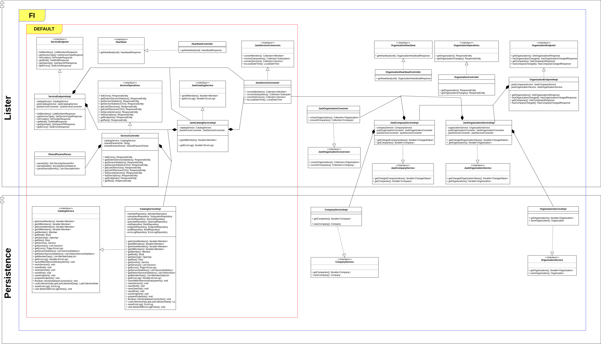

# Introduction to X-Road Catalog Lister

The purpose of this module is to provide a web service which lists all the X-Road members and the services they provide 
together with services descriptions.

A class diagram illustrating X-Road Catalog Lister implementation with the `default` and `FI` profiles:



See also the [Installation Guide](../doc/xroad_catalog_installation_guide.md) and
[User Guide](../doc/xroad_catalog_user_guide.md).

## Build

X-Road Catalog Lister can be built by running:

```bash
../gradlew clean build
```

## Build RPM Packages on Non-RedHat Platform

If the `default` profile is used, the `CATALOG_PROFILE` argument can be omitted. More information about profiles is 
available in the [build instructions](../BUILD.md#profiles).

```bash
../gradlew clean build
docker build -t lister-rpm packages/xroad-catalog-lister/docker --build-arg CATALOG_PROFILE=<PROFILE>
docker run -v $PWD/..:/workspace lister-rpm
```

## Run

X-Road Catalog Lister can be run using Gradle:

```bash
../gradlew bootRun
```

or running it from a JAR file:

```bash
java -jar build/libs/xroad-catalog-lister.jar --spring.config.name=lister,catalogdb
```
