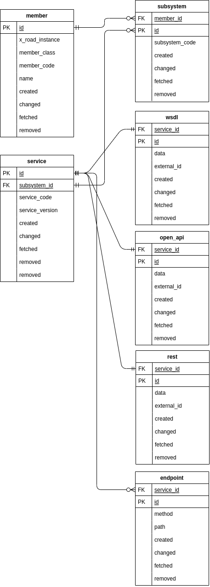
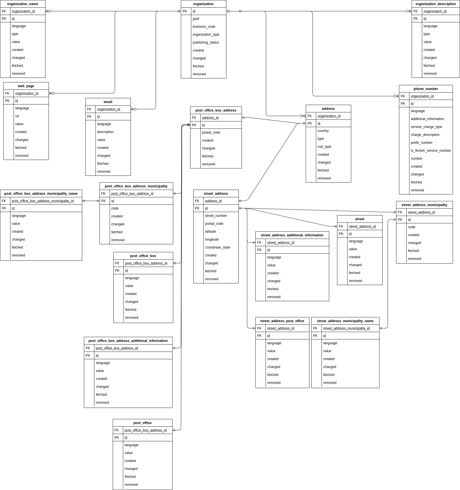
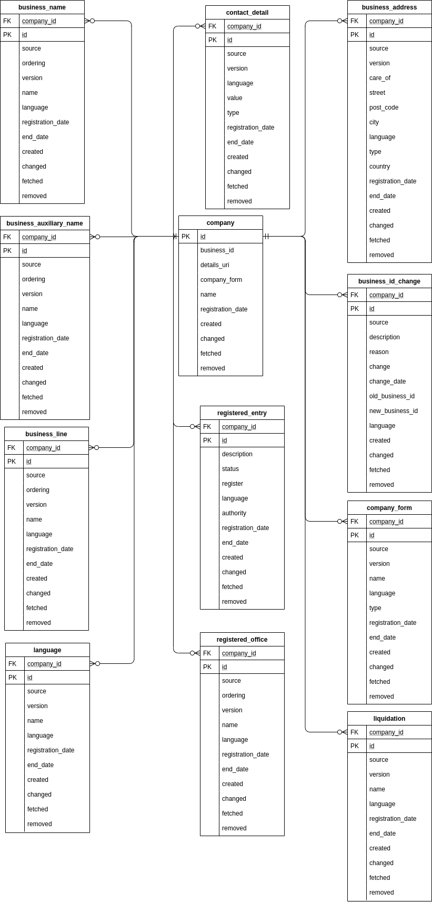

# xroad-catalog-persistence
Persistence library for xroad-catalog

## Introduction to X-Road Catalog Persistence

The purpose of this piece of software is to persist and read persisted data. Used by the Collector and Lister

1. A diagram of members and related subsystems and services



2. A diagram of public organizations and related details



3. A diagram of private companies and related details



## Create database
```sh
sudo -u postgres psql --file=src/main/sql/init_database.sql
sudo -u postgres psql --file=src/main/sql/create_tables.sql
```

## Build
```sh
gradle clean build
```

## Profiles
There are two spring boot profiles. 
Default profile connects to in-memory H2 database. 
This has schema autogenerated based on JPA entities, and data populated from data.sql.
"Production" profile connects to a real PostgreSQL instance (currently defined in src/main/resources/application-production.properties)
and does not autocreate anything.

## Run
```sh
../gradlew bootRun
```
or
```sh
../gradlew bootRun -Dspring.profiles.active=production
```

## Test

```sh
../gradlew test
```


