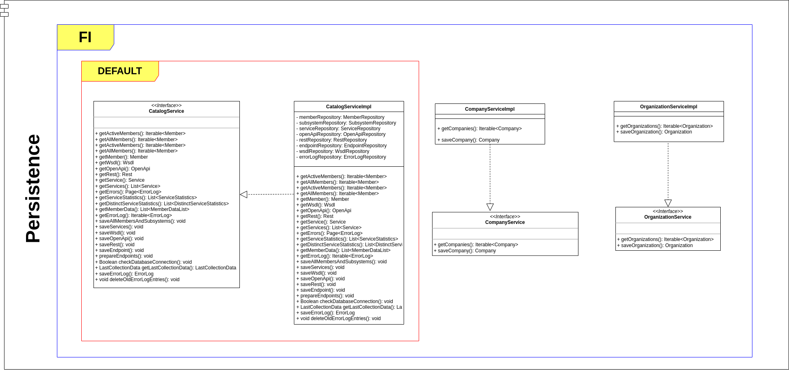

# Introduction to X-Road Catalog Persistence

The purpose of this piece of software is to persist and read persisted data. Used by the Collector and Lister.

1. A diagram of persistence classes for ```default``` and ```FI```



See also the [User Guide](../xroad_catalog_user_guide.md#license)

## Profiles

There are four spring boot profiles.

* default (a profile used for default operation of X-Road Catalog, without any country-specific features)
* FI (an extra profile used in addition to the default profile, which has country specific features)
* production (a profile used in the production)
* sshtest (a profile used to test SSH tunneling with X-Road Catalog)

## Create database

The database required for X-Road Catalog can be created with the following:

```sh
$ sudo -u postgres psql --file=src/main/sql/init_database.sql
```

and the tables for the database either with
```sh
$ sudo -u postgres psql --file=src/main/sql/create_tables.sql
```
or 
```sh
$ sudo -u postgres psql --file=src/main/sql/create_tables_fi.sql
```
whether the chosen profile is ```default``` or ```FI```.

Also note that these scripts will be run automatically ([X-Road Catalog Collector spec](../xroad-catalog-collector/packages/xroad-catalog-collector/redhat/SPECS/xroad-catalog-collector.spec)) 
when xroad-catalog-collector service ([X-Road Catalog Collector service](../xroad-catalog-collector/packages/xroad-catalog-collector/redhat/SOURCES/xroad-catalog-collector.service)) is installed to the target server

## Build

X-Road persistence can be built with:

```../gradlew clean build ```

## Run

X-Road persistence can be run with Gradle:

``` ../gradlew bootRun ```

or run from a JAR file:

``` ../gradlew bootRun -Dspring.profiles.active=default ```
