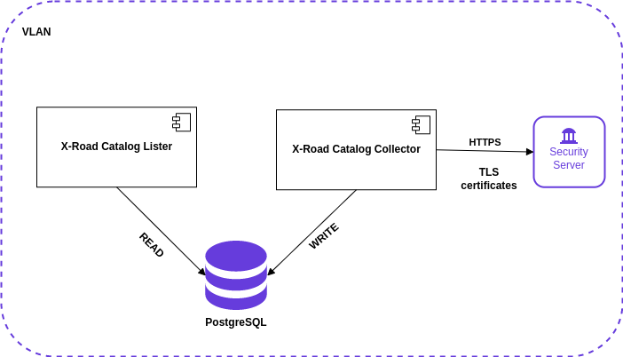

# X-Road Catalog User Guide
Version: 3.0.1
Doc. ID: XRDCAT-CONF

---

## Version history <!-- omit in toc -->
| Date       | Version | Description                                                                    | Author             |
|------------|---------|--------------------------------------------------------------------------------|--------------------|
| 21.07.2021 | 1.0.0   | Initial draft                                                                  | Bert Viikmäe       |
| 21.07.2021 | 1.0.1   | Add installation section                                                       | Bert Viikmäe       |
| 22.07.2021 | 1.0.2   | Add X-Road Catalog Collector section                                           | Bert Viikmäe       |
| 23.07.2021 | 1.0.3   | Add X-Road Catalog Lister section                                              | Bert Viikmäe       |
| 23.07.2021 | 1.0.4   | Add X-Road Catalog Persistence section                                         | Bert Viikmäe       |
| 25.08.2021 | 1.0.5   | Add list distinct services endpoint description                                | Bert Viikmäe       |
| 02.09.2021 | 1.0.6   | Add list errors endpoint description                                           | Bert Viikmäe       |
| 22.09.2021 | 1.0.7   | Update heartbeat endpoint description                                          | Bert Viikmäe       |
| 26.10.2021 | 1.0.8   | Update listErrors endpoint description                                         | Bert Viikmäe       |
| 27.10.2021 | 1.1.0   | Add listSecurityServers and listDescriptors endpoint descriptions              | Bert Viikmäe       |
| 15.12.2021 | 1.1.1   | Update listErrors endpoint description                                         | Bert Viikmäe       |
| 08.02.2022 | 1.2.0   | Add getOrganization and getOrganizationChanges endpoint descriptions           | Bert Viikmäe       |
| 29.07.2022 | 2.0.0   | Substitute since with start and end date parameter and update related chapters | Bert Viikmäe       |
| 04.10.2022 | 2.1.0   | Add getRest and getEndpoints descriptions                                      | Bert Viikmäe       |
| 15.01.2023 | 3.0.0   | Restructure of the document                                                    | Bert Viikmäe       |

## Table of Contents <!-- omit in toc -->

<!-- toc -->
<!-- vim-markdown-toc GFM -->

* [License](#license)
* [1. Introduction](#1-introduction)
  * [1.1 Target Audience](#11-target-audience)
* [2. Installation](#2-installation)
    * [2.1 Prerequisites to Installation](#21-prerequisites-to-installation)
    * [2.2 Installation](#22-installation)
    * [2.3 SSL](#23-ssl)
    * [2.4 Status of services](#24-status-of-services)
    * [2.5 Logs](#25-logs)
    * [2.6 Profiles](#26-profiles)
        * [2.6.1 Default profile](#261-default-profile)
        * [2.6.2 FI profile](#262-fi-profile)      
* [3. X-Road Catalog](#3-x-road-catalog)
    * [3.1 X-Road Catalog Collector](#31-x-road-catalog-collector)
    * [3.2 X-Road Catalog Lister](#32-x-road-catalog-lister)
        * [3.2.1 SOAP endpoints](#321-soap-endpoints)
            * [3.2.1.1 List all members](#3211-list-all-members)
            * [3.2.1.2 Retrieve WSDL descriptions](#3212-retrieve-wsdl-descriptions)   
            * [3.2.1.3 Retrieve OPENAPI descriptions](#3213-retrieve-openapi-descriptions)
            * [3.2.1.4 Get service type](#3214-get-service-type) 
            * [3.2.1.5 Check if member is provider](#3215-check-if-member-is-provider)  
            * [3.2.1.6 List errors](#3216-list-errors)
            * [3.2.1.7 List organizations](#3217-list-organizations)  
            * [3.2.1.8 List organization changes](#3218-list-organization-changes)
            * [3.2.1.9 List companies](#3219-list-companies) 
            * [3.2.1.10 List company changes](#32110-list-company-changes)
        * [3.2.2 REST endpoints](#322-rest-endpoints)          
            * [3.2.2.1 List service statistics](#3221-list-service-statistics) 
            * [3.2.2.2 List service statistics in CSV format](#3222-list-service-statistics-in-csv-format)
            * [3.2.2.3 List services](#3223-list-services)  
            * [3.2.2.4 List services in CSV format](#3224-list-services-in-csv-format)  
            * [3.2.2.5 Check heartbeat](#3225-check-heartbeat)  
            * [3.2.2.6 List distinct service statistics](#3226-list-distinct-service-statistics)  
            * [3.2.2.7 List errors](#3227-list-errors) 
            * [3.2.2.8 List security servers](#3228-list-security-servers) 
            * [3.2.2.9 List descriptors](#3229-list-descriptors) 
            * [3.2.2.10 Get endpoints](#32210-get-endpoints)
            * [3.2.2.11 Get Rest](#32211-get-rest)
            * [3.2.2.12 Get Organization](#32212-get-organization) 
            * [3.2.2.13 Get Organization changes](#32213-get-organization-changes)
            * [3.2.2.14 Check organization heartbeat](#32214-check-organization-heartbeat)
    * [3.3 X-Road Catalog Persistence](#33-x-road-catalog-persistence)
                     
<!-- vim-markdown-toc -->
<!-- tocstop -->

## License

This document is licensed under the Creative Commons Attribution-ShareAlike 3.0 Unported License. To view a copy of this license, visit http://creativecommons.org/licenses/by-sa/3.0/.

## 1. Introduction

The purpose of this piece of software is to collect information, more specifically members, subsystems and services, from an X-Road Catalog instance and offer an interface where the information can be read.

The software consists of three parts:
- X-Road Catalog Collector
    * Collects members, subsystems and services from the X-Road instance and stores them to a database.
    * Implemented using concurrent Akka actors.
- X-Road Catalog Lister
    * Provides SOAP and REST endpoints offering information collected by the collector.
    * Can be used as an X-Road service (X-Road headers are in place)
- X-Road Catalog Persistence
    * Library used to persist and read persisted data. Used by both of the above.

### 1.1 Target Audience

The intended audience of this user guide are system administrators responsible for managing and configuring systems and applicatons that use X-Road services.
The document is intended for readers with a good knowledge of Linux server management, computer networks, and the X-Road functioning principles.

## 2. Installation

## 2.1 Prerequisites to Installation

Running the X-Road Catalog software requires Linux (Ubuntu or RHEL). If you are using some other operating system (e.g. Windows or macOS), the easiest option is to first install Ubuntu 18.04 or RHEL 7.0 into a virtual machine.

*Required for building*
* OpenJDK / JDK version 11
* Gradle

*Recommended for development environment*
* Docker (for deb/rpm packaging)
* LXD (https://linuxcontainers.org/lxd/)
  * for setting up a local X-Road instance
* Ansible
  * for automating the X-Road instance installation

The development environment should have at least 8GB of memory and 20GB of free disk space (applies to a virtual machine as well), especially if you set up a local X-Road instance.


## 2.2 Installation

The installable software consists of xroad-catalog-collector and xroad-catalog-lister. Both are provided as RPM packages. 

``` $ sudo yum install xroad-catalog-lister xroad-catalog-collector``` or ```rpm -i install xroad-catalog-lister xroad-catalog-collector```

Instructions on how to build the RPM packages using Docker can be found:
[here](xroad-catalog-collector/README.md#build-rpm-packages-on-non-redhat-platform)
and
[here](xroad-catalog-lister/README.md#build-rpm-packages-on-non-redhat-platform)

Configure parameters in /etc/xroad/xroad-catalog/collector-production.properties, especially X-Road instance information and URL of security server.
```
xroad-catalog.xroad-instance=<XROAD_INSTANCE>
xroad-catalog.member-class=<MEMBER_CLASS>
xroad-catalog.member-code=<MEMBER_CODE>
xroad-catalog.subsystem-code=<SUBSYSTEM_CODE>
xroad-catalog.security-server-host=<SECURITY_SERVER_HOST>
```

In addition, configure also parameters related to behaviour of X-Road Catalog Collector: 
```
xroad-catalog.flush-log-time-after-hour=<ERROR_LOGS_FLUSH_IN_DB_TIME_INTERVAL_AFTER>
xroad-catalog.flush-log-time-before-hour=<ERROR_LOGS_FLUSH_IN_DB_TIME_INTERVAL_BEFORE>
xroad-catalog.error-log-length-in-days=<ERROR_LOGS_KEPT_IN_DB_LENGTH_IN_DAYS>
xroad-catalog.fetch-run-unlimited=<XROAD_CATALOG_COLLECTOR_FETCH_UNLIMITED>
xroad-catalog.fetch-time-after-hour=<XROAD_CATALOG_COLLECTOR_FETCH_INTERVAL_AFTER>
xroad-catalog.fetch-time-before-hour=<XROAD_CATALOG_COLLECTOR_FETCH_INTERVAL_BEFORE>
xroad-catalog.collector-interval-min=<XROAD_CATALOG_COLLECTOR_FETCH_INTERVAL_MINUTES>
```

``` ERROR_LOGS_FLUSH_IN_DB_TIME_INTERVAL_AFTER ``` is a parameter for setting the start of time interval during which the error logs in the db will be deleted 
    when those exceed the amount in days set by ``` ERROR_LOGS_KEPT_IN_DB_LENGTH_IN_DAYS ``` parameter, e.g. value ``` 18 ``` means starting from ``` 18:00 ```

``` ERROR_LOGS_FLUSH_IN_DB_TIME_INTERVAL_BEFORE ``` is a parameter for setting the end of time interval during which the error logs in the db will be deleted 
    when those exceed the amount in days set by ``` ERROR_LOGS_KEPT_IN_DB_LENGTH_IN_DAYS ``` parameter, e.g. value ``` 23 ``` means ending at ``` 23:00 ```

``` ERROR_LOGS_KEPT_IN_DB_LENGTH_IN_DAYS ``` is a parameter for setting the amount in days for how long the errors logs should be kept in the db, 
    e.g. value ``` 90 ``` means ``` for 90 days ```

``` XROAD_CATALOG_COLLECTOR_FETCH_UNLIMITED ``` is a parameter for setting whether the X-Road Catalog Collector should try 
    to fetch data from security server continuously during a day or only between certain hours, e.g. value ``` true ``` means ``` continously ```

``` XROAD_CATALOG_COLLECTOR_FETCH_INTERVAL_AFTER ``` is a parameter for setting the start of time interval during which the X-Road Catalog Collector should try 
    to fetch data from security server continuously (this parameter will be ignored if the parameter ``` XROAD_CATALOG_COLLECTOR_FETCH_UNLIMITED ``` is set 
    to ``` true ```), e.g. value ``` 18 ``` means starting from ``` 18:00 ```

``` XROAD_CATALOG_COLLECTOR_FETCH_INTERVAL_BEFORE ``` is a parameter for setting the end of time interval during which the X-Road Catalog Collector should try 
    to fetch data from security server continuously (this parameter will be ignored if the parameter ``` XROAD_CATALOG_COLLECTOR_FETCH_UNLIMITED ``` is set 
    to ``` true ```), e.g. value ``` 23 ``` means ending at ``` 23:00 ```

``` XROAD_CATALOG_COLLECTOR_FETCH_INTERVAL_MINUTES ``` is a parameter for setting the amount of time in minutes after which the X-Road Catalog Collector 
    should start re-fetching data from security server, e.g. value ``` 60 ``` means ``` every 60 minutes ```

Change also the database password in /etc/xroad/xroad-catalog/catalogdb-production.properties.
```
spring.datasource.password=password
```
and in the DB:
```
$ sudo -u postgres psql -U postgres -d postgres -c "alter user xroad_catalog with password 'password';"
```

Make sure that the services are enabled on boot and restart services in order to make the changes to have effect.
```
# Enable the service to start on boot
$ sudo systemctl enable xroad-catalog-lister
$ sudo systemctl enable xroad-catalog-collector
$ sudo systemctl restart xroad-catalog-lister
$ sudo systemctl restart xroad-catalog-collector
```
### X-Road Catalog installation in Production


## 2.3 SSL

If secure connection to the security server is required, add the server's cert for the JVM trust store, for example as follows.

```
$ sudo cp cert.pem /etc/pki/ca-trust/source/anchors/
$ sudo update-ca-trust extract
```

If you don't have the certificate, it can be asked as follows:

```
$ openssl s_client -showcerts -connect <SERVER_ADDRESS>:443  </dev/null
```

If listMethods requires authentication, create a certificate and add it to keystore file /etc/xroad/xroad-catalog/keystore as follows:
```
$ sudo keytool -alias xroad-catalog -genkeypair -keystore /etc/xroad/xroad-catalog/keystore -validity 7300 -keyalg RSA -keysize 2048 -sigalg SHA256withRSA -dname C=FI,CN=xroad-catalog

$ keytool -keystore /etc/xroad/xroad-catalog/keystore -exportcert -rfc -alias xroad-catalog > xroad-catalog.cer
```

Created xroad-catalog.cer must be added to security server (Through UI: Security Server Clients > SELECT SERVICE > Internal Servers > Internal TLS Certificates > ADD)

The keystore password can be configured in /etc/xroad/xroad-catalog/collector-production.properties
```
xroad-catalog.ssl-keystore-password=changeit
```


## 2.4 Status of Services

This instruction expects that xroad-catalog-collector and xroad-catalog-lister are installed on the same server. It is also possible to install them on different servers but then database settings need to be set for both services. For server of xroad-catalog-lister file /etc/xroad/xroad-catalog/catalogdb-production.properties must be manually created.

```
[root@ip-172-31-128-199 xroad-catalog]# service xroad-catalog-collector status
Redirecting to /bin/systemctl status  xroad-catalog-collector.service
● xroad-catalog-collector.service - X-Road Catalog Collector
   Loaded: loaded (/usr/lib/systemd/system/xroad-catalog-collector.service; disabled; vendor preset: enabled)
   Active: active (running) since Thu 2016-04-07 11:00:42 EEST; 3min 11s ago
 Main PID: 7298 (java)
   CGroup: /system.slice/xroad-catalog-collector.service
           └─7298 /bin/java -Dspring.profiles.active=production -jar /usr/lib/xroad-catalog/xroad-catalog-collector.jar -...
Apr 07 11:01:12 ip-172-31-128-199.eu-west-1.compute.internal xroad-catalog-collector[7298]: Hibernate: select subsystem0..._
Apr 07 11:01:12 ip-172-31-128-199.eu-west-1.compute.internal xroad-catalog-collector[7298]: Hibernate: select wsdls0_.ser...
Apr 07 11:01:12 ip-172-31-128-199.eu-west-1.compute.internal xroad-catalog-collector[7298]: Hibernate: select nextval ('...)
Apr 07 11:01:12 ip-172-31-128-199.eu-west-1.compute.internal xroad-catalog-collector[7298]: Hibernate: insert into wsdl ...)
Apr 07 11:01:12 ip-172-31-128-199.eu-west-1.compute.internal xroad-catalog-collector[7298]: 2016-04-07 11:01:12.211  INF...y
Apr 07 11:01:13 ip-172-31-128-199.eu-west-1.compute.internal xroad-catalog-collector[7298]: Hibernate: select service0_....s
Apr 07 11:01:13 ip-172-31-128-199.eu-west-1.compute.internal xroad-catalog-collector[7298]: Hibernate: select subsystem0..._
Apr 07 11:01:13 ip-172-31-128-199.eu-west-1.compute.internal xroad-catalog-collector[7298]: Hibernate: select wsdls0_.ser...
Apr 07 11:01:13 ip-172-31-128-199.eu-west-1.compute.internal xroad-catalog-collector[7298]: Hibernate: update wsdl set d...?
Apr 07 11:01:13 ip-172-31-128-199.eu-west-1.compute.internal xroad-catalog-collector[7298]: 2016-04-07 11:01:13.766  INF...y
Hint: Some lines were ellipsized, use -l to show in full.
```

```
[root@ip-172-31-128-199 xroad-catalog]# service xroad-catalog-lister status
Redirecting to /bin/systemctl status  xroad-catalog-lister.service
● xroad-catalog-lister.service - X-Road Catalog Lister
   Loaded: loaded (/usr/lib/systemd/system/xroad-catalog-lister.service; enabled; vendor preset: enabled)
   Active: active (running) since Thu 2016-04-07 07:06:03 EEST; 3h 58min ago
 Main PID: 763 (java)
   CGroup: /system.slice/xroad-catalog-lister.service
           └─763 /bin/java -Dserver.port=8070 -Dspring.profiles.active=production -jar /usr/lib/xroad-catalog/xroad-catal...
Apr 07 11:01:11 ip-172-31-128-199.eu-west-1.compute.internal xroad-catalog-lister[763]: 2016-04-07 11:01:11.084 DEBUG 76...t
Apr 07 11:01:11 ip-172-31-128-199.eu-west-1.compute.internal xroad-catalog-lister[763]: 2016-04-07 11:01:11.101 DEBUG 76...t
Apr 07 11:01:11 ip-172-31-128-199.eu-west-1.compute.internal xroad-catalog-lister[763]: 2016-04-07 11:01:11.102 DEBUG 76...l
Apr 07 11:01:11 ip-172-31-128-199.eu-west-1.compute.internal xroad-catalog-lister[763]: 2016-04-07 11:01:11.105 DEBUG 76...]
Apr 07 11:01:11 ip-172-31-128-199.eu-west-1.compute.internal xroad-catalog-lister[763]: 2016-04-07 11:01:11.105  INFO 76...s
Apr 07 11:01:11 ip-172-31-128-199.eu-west-1.compute.internal xroad-catalog-lister[763]: 2016-04-07 11:01:11.105 DEBUG 76...y
Apr 07 11:01:11 ip-172-31-128-199.eu-west-1.compute.internal xroad-catalog-lister[763]: 2016-04-07 11:01:11.600 DEBUG 76...]
Apr 07 11:01:11 ip-172-31-128-199.eu-west-1.compute.internal xroad-catalog-lister[763]: 2016-04-07 11:01:11.611 DEBUG 76...]
Apr 07 11:01:11 ip-172-31-128-199.eu-west-1.compute.internal xroad-catalog-lister[763]: 2016-04-07 11:01:11.691 DEBUG 76...t
Apr 07 11:01:11 ip-172-31-128-199.eu-west-1.compute.internal xroad-catalog-lister[763]: 2016-04-07 11:01:11.692 DEBUG 76...t
Hint: Some lines were ellipsized, use -l to show in full.
```

## 2.5 Logs

```
$ sudo journalctl -fu xroad-catalog-collector --since="2016-04-07 10:50 --output=cat"
$ sudo journalctl -fu xroad-catalog-lister --since="2016-04-07 10:50 --output=cat"
```

## 2.6 Profiles

Spring profiles are used to configure different implementation/features in X-Road Catalog.

* Docker image is built within a CI/CD pipeline build process

  for X-Road Catalog Collector:
```
  docker build -t collector-rpm packages/xroad-catalog-collector/docker --build-arg CATALOG_PROFILE=fi
```

  for X-Road Catalog Lister:
```
docker build -t lister-rpm packages/xroad-catalog-lister/docker --build-arg CATALOG_PROFILE=fi
```

  Profile value is provided to the respective "Dockerfile" with an argument ```--build-arg CATALOG_PROFILE=fi``` here
  Then within the "Dockerfile" an environment variable ```CATALOG_PROFILE``` is initalized with that profile value.

* A shell script "build_rpm.sh" is run within a docker container, which takes a ```p``` (profile) parameter as input, which is read from the environment variable ```CATALOG_PROFILE```
* The shell script "build_rpm.sh" passes on the profile parameter(the script assumes the profile is ```default``` when no value is given with the ```profile``` parameter) 
  to ```xroad-catalog-collector.spec``` or ```xroad-catalog-lister.spec``` which configures a prepares the creation Systemd service for X-Road Catalog Collector or X-Road Catalog Lister. 
* Within that ```.spec``` file the catalog profile value will be written to a properties file:

```
   echo "CATALOG_PROFILE=%{profile}" >> catalog-profile.properties
```

* Then that file will be copied to ```/etc/xroad/xroad-catalog``` among other properties files 
* In addition, specific db scripts will be run within that "spec" file according to the value of the ```profile```:

```
   sudo -u postgres psql --file=/usr/share/xroad/sql/create_tables_%{profile}.sql
```

* Finally, the profile value will be read from that properties file:

```
   source /etc/xroad/xroad-catalog/catalog-profile.properties
```

* Then a Systemd service will be created with the following content

   for X-Road Catalog Collector:

```
   exec ${JAVA_HOME}/bin/java -Xms128m -Xmx2g -Dspring.profiles.active=base,production -Dspring.profiles.include=$CATALOG_PROFILE -jar /usr/lib/xroad-catalog/xroad-catalog-collector.jar --spring.config.location=/etc/xroad/xroad-catalog/ --spring.config.name=collector,catalogdb
```

   for X-Road Catalog Lister:

```
   exec ${JAVA_HOME}/bin/java -Xms128m -Xmx2g -Dserver.port=8070 -Dspring.profiles.active=production -Dspring.profiles.include=$CATALOG_PROFILE -jar /usr/lib/xroad-catalog/xroad-catalog-lister.jar --spring.config.location=/etc/xroad/xroad-catalog/ --spring.config.name=lister,catalogdb
```

### 2.6.1 Default profile

The default profile(a profile used for default operation of X-Road Catalog, without any country-specific features)
The default profile can be set with ```spring.profiles.active=default```

### 2.6.2 FI profile

The FI profile(an extra profile used in addition to the default profile, which has country specific features)
The FI profile can be set with ```spring.profiles.active=fi```

## 3. X-Road Catalog

### 3.1 X-Road Catalog Collector

The purpose of this piece of software is to collect members, subsystems and services from the X-Road instance and store them to the PostgreSQL database. 

[xroad-catalog-collector](xroad-catalog-collector/README.md)

### 3.2 X-Road Catalog Lister

The purpose of this piece of software is to provide a webservice which lists all the X-Road members and the services they provide together with service descriptions

[xroad-catalog-lister](xroad-catalog-lister/README.md)

### 3.2.1 SOAP endpoints

The main endpoints this software provides with the [default profile](#261-default-profile): 
* ListMembers - a SOAP endpoint to list all the members the Catalog Collector has stored to the db
* GetWsdl - a SOAP endpoint to retrieve a WSDL description for a given service
* GetOpenAPI - a SOAP endpoint to retrieve an OpenAPI description for a given service
* GetServiceType - a SOAP endpoint for requesting whether a given service is of type SOAP, REST or OPENAPI
* IsProvider - a SOAP endpoint for requesting whether a given member is a provider
* GetErrors - a SOAP endpoint for requesting a list of errors related to fetching data from different apis and security servers

In addition, some more SOAP endpoints are provided when the [FI profile](#262-fi-profile) is active:
* GetOrganizations - a SOAP endpoint for requesting public organization details
* HasOrganizationChanged - a SOAP endpoint for requesting whether given public organization has some of its details changed
* GetCompanies - a SOAP endpoint for requesting private company details
* HasCompanyChanged - a SOAP endpoint for requesting whether given private company has some of its details changed


### 3.2.1.1 List all members

In order to list all members and related subsystems and services, a request in XML format has to be sent to the respective SOAP endpoint:

``` $ curl -k -d @servicerequest.xml --header "Content-Type: text/xml" -X POST http://<SERVER_ADDRESS>:8080/ws/ListMembers ```

* SERVER_ADDRESS please use the server address, on which the X-Road Catalog Lister is running on, e.g. localhost

Contents of the example ```servicerequest.xml``` file:
```xml
<soapenv:Envelope 
xmlns:soapenv="http://schemas.xmlsoap.org/soap/envelope/" 
xmlns:xro="http://x-road.eu/xsd/xroad.xsd" 
xmlns:iden="http://x-road.eu/xsd/identifiers" 
xmlns:xrcl="http://xroad.vrk.fi/xroad-catalog-lister">
   <soapenv:Header>
      <xro:protocolVersion>4.x</xro:protocolVersion>
      <xro:id>ID11234</xro:id>
      <xro:userId>EE1234567890</xro:userId>
      <xro:client iden:objectType="MEMBER">
         <iden:xRoadInstance>FI</iden:xRoadInstance>
         <iden:memberClass>GOV</iden:memberClass>
         <iden:memberCode>1710128-9</iden:memberCode>
      </xro:client>
      <xro:service iden:objectType="SERVICE">
         <iden:xRoadInstance>FI</iden:xRoadInstance>
         <iden:memberClass>GOV</iden:memberClass>
         <iden:memberCode>1710128-9</iden:memberCode>
         <iden:subsystemCode>SS1</iden:subsystemCode>
         <iden:serviceCode>ListMembers</iden:serviceCode>
         <iden:serviceVersion>v1</iden:serviceVersion>
      </xro:service>
   </soapenv:Header>
   <soapenv:Body>
      <xrcl:ListMembers>
         <xrcl:startDateTime>2020-01-01</xrcl:startDateTime>
         <xrcl:endDateTime>2022-01-01</xrcl:endDateTime>
      </xrcl:ListMembers>
   </soapenv:Body>
</soapenv:Envelope>
```

Contents of the XML response of the request
```xml
<?xml version="1.0" encoding="UTF-8"?>
<SOAP-ENV:Envelope xmlns:SOAP-ENV="http://schemas.xmlsoap.org/soap/envelope/">
  <SOAP-ENV:Header>
    <xro:protocolVersion xmlns:xro="http://x-road.eu/xsd/xroad.xsd">4.x</xro:protocolVersion>
    <xro:id xmlns:xro="http://x-road.eu/xsd/xroad.xsd">ID11234</xro:id>
    <xro:userId xmlns:xro="http://x-road.eu/xsd/xroad.xsd">EE1234567890</xro:userId>
    <xro:client xmlns:xro="http://x-road.eu/xsd/xroad.xsd" xmlns:iden="http://x-road.eu/xsd/identifiers" iden:objectType="MEMBER">
      <iden:xRoadInstance>FI</iden:xRoadInstance>
      <iden:memberClass>GOV</iden:memberClass>
      <iden:memberCode>1710128-9</iden:memberCode>
    </xro:client>
    <xro:service xmlns:xro="http://x-road.eu/xsd/xroad.xsd" xmlns:iden="http://x-road.eu/xsd/identifiers" iden:objectType="SERVICE">
      <iden:xRoadInstance>FI</iden:xRoadInstance>
      <iden:memberClass>GOV</iden:memberClass>
      <iden:memberCode>1710128-9</iden:memberCode>
      <iden:subsystemCode>SS1</iden:subsystemCode>
      <iden:serviceCode>ListMembers</iden:serviceCode>
      <iden:serviceVersion>v1</iden:serviceVersion>
    </xro:service>
  </SOAP-ENV:Header>
  <SOAP-ENV:Body>
    <ns2:ListMembersResponse xmlns:ns2="http://xroad.vrk.fi/xroad-catalog-lister">
      <ns2:memberList>
        <ns2:member>
          <ns2:xRoadInstance>DEV</ns2:xRoadInstance>
          <ns2:memberClass>GOV</ns2:memberClass>
          <ns2:memberCode>1234</ns2:memberCode>
          <ns2:name>ACME</ns2:name>
          <ns2:subsystems>
            <ns2:subsystem>
              <ns2:subsystemCode>MANAGEMENT</ns2:subsystemCode>
              <ns2:services>
                <ns2:service>
                  <ns2:serviceCode>clientReg</ns2:serviceCode>
                  <ns2:wsdl>
                    <ns2:externalId>1584692751893_da8be621-5d6b-4920-91c9-d8c359dddbad</ns2:externalId>
                    <ns2:created>2020-03-20T10:25:51.892+02:00</ns2:created>
                    <ns2:changed>2020-03-20T10:25:51.892+02:00</ns2:changed>
                    <ns2:fetched>2020-03-20T12:31:09.188+02:00</ns2:fetched>
                  </ns2:wsdl>
                  <ns2:created>2020-03-20T10:25:51.632+02:00</ns2:created>
                  <ns2:changed>2020-03-20T10:25:51.632+02:00</ns2:changed>
                  <ns2:fetched>2020-03-20T12:31:07.223+02:00</ns2:fetched>
                </ns2:service>
                <ns2:service>
                  <ns2:serviceCode>respa.tampere.fi</ns2:serviceCode>
                  <ns2:created>2020-03-20T10:25:51.632+02:00</ns2:created>
                  <ns2:changed>2020-03-20T10:25:51.632+02:00</ns2:changed>
                  <ns2:fetched>2020-03-20T12:31:07.223+02:00</ns2:fetched>
                </ns2:service>
                <ns2:service>
                  <ns2:serviceCode>authCertDeletion</ns2:serviceCode>
                  <ns2:wsdl>
                    <ns2:externalId>1584692751942_ab002cbd-bbbd-43c7-a311-b0dc5adf3af1</ns2:externalId>
                    <ns2:created>2020-03-20T10:25:51.936+02:00</ns2:created>
                    <ns2:changed>2020-03-20T10:25:51.936+02:00</ns2:changed>
                    <ns2:fetched>2020-03-20T12:31:09.009+02:00</ns2:fetched>
                  </ns2:wsdl>
                  <ns2:created>2020-03-20T10:25:51.632+02:00</ns2:created>
                  <ns2:changed>2020-03-20T10:25:51.632+02:00</ns2:changed>
                  <ns2:fetched>2020-03-20T12:31:07.223+02:00</ns2:fetched>
                </ns2:service>
                <ns2:service>
                  <ns2:serviceCode>clientDeletion</ns2:serviceCode>
                  <ns2:wsdl>
                    <ns2:externalId>1584692751908_5bdde30d-3a5f-42c0-9f45-d884f5810996</ns2:externalId>
                    <ns2:created>2020-03-20T10:25:51.906+02:00</ns2:created>
                    <ns2:changed>2020-03-20T10:25:51.906+02:00</ns2:changed>
                    <ns2:fetched>2020-03-20T12:31:07.383+02:00</ns2:fetched>
                  </ns2:wsdl>
                  <ns2:created>2020-03-20T10:25:51.632+02:00</ns2:created>
                  <ns2:changed>2020-03-20T10:25:51.632+02:00</ns2:changed>
                  <ns2:fetched>2020-03-20T12:31:07.223+02:00</ns2:fetched>
                </ns2:service>
                <ns2:service>
                  <ns2:serviceCode>ownerChange</ns2:serviceCode>
                  <ns2:wsdl>
                    <ns2:externalId>1584692751888_07141c5a-bfe0-4c84-b621-e5e4a9db01fa</ns2:externalId>
                    <ns2:created>2020-03-20T10:25:51.884+02:00</ns2:created>
                    <ns2:changed>2020-03-20T10:25:51.884+02:00</ns2:changed>
                    <ns2:fetched>2020-03-20T12:31:07.479+02:00</ns2:fetched>
                  </ns2:wsdl>
                  <ns2:created>2020-03-20T10:25:51.632+02:00</ns2:created>
                  <ns2:changed>2020-03-20T10:25:51.632+02:00</ns2:changed>
                  <ns2:fetched>2020-03-20T12:31:07.223+02:00</ns2:fetched>
                </ns2:service>
                <ns2:service>
                  <ns2:serviceCode>PetStoreNew</ns2:serviceCode>
                  <ns2:created>2020-03-20T10:25:51.632+02:00</ns2:created>
                  <ns2:changed>2020-03-20T10:25:51.632+02:00</ns2:changed>
                  <ns2:fetched>2020-03-20T12:31:07.223+02:00</ns2:fetched>
                </ns2:service>
              </ns2:services>
              <ns2:created>2020-03-20T10:25:51.055+02:00</ns2:created>
              <ns2:changed>2020-03-20T10:25:51.055+02:00</ns2:changed>
              <ns2:fetched>2020-03-20T12:31:01.394+02:00</ns2:fetched>
            </ns2:subsystem>
            <ns2:subsystem>
              <ns2:subsystemCode>TEST</ns2:subsystemCode>
              <ns2:services />
              <ns2:created>2020-03-20T10:25:51.055+02:00</ns2:created>
              <ns2:changed>2020-03-20T10:25:51.055+02:00</ns2:changed>
              <ns2:fetched>2020-03-20T12:31:01.394+02:00</ns2:fetched>
            </ns2:subsystem>
          </ns2:subsystems>
          <ns2:created>2020-03-20T10:25:51.055+02:00</ns2:created>
          <ns2:changed>2020-03-20T10:25:51.055+02:00</ns2:changed>
          <ns2:fetched>2020-03-20T12:31:01.394+02:00</ns2:fetched>
        </ns2:member>
      </ns2:memberList>
    </ns2:ListMembersResponse>
  </SOAP-ENV:Body>
</SOAP-ENV:Envelope>
```

The XML response has a ```<SOAP-ENV:Body>``` element with the following structure:

* ListMembersResponse
  * memberList
    * member
      * subsystems
        * subsystem
          * subsystemCode
          * services
            * service
            * serviceCode
            * wsdl (if the given service description is a WSDL description)
              * externalId

In addition, each subsystem, service and wsdl contains also fields ```created```, ```changed```, ```fetched``` and ```removed```, 
reflecting the creation, change, fetch and removal (when a subsystem/service/wsdl was fetched by X-Road Catalog Collector to the DB) dates

### 3.2.1.2 Retrieve WSDL descriptions

In order to retrieve a WSDL service description, a request in XML format has to be sent to the respective SOAP endpoint:

``` $ curl -k -d @wsdlrequest.xml --header "Content-Type: text/xml" -X POST http://<SERVER_ADDRESS>:8080/ws/GetWsdl ```

* SERVER_ADDRESS please use the server address, on which the X-Road Catalog Lister is running on, e.g. localhost

Contents of the example ```wsdlrequest.xml``` file:
```xml
<soapenv:Envelope 
xmlns:soapenv="http://schemas.xmlsoap.org/soap/envelope/" 
xmlns:xro="http://x-road.eu/xsd/xroad.xsd" 
xmlns:iden="http://x-road.eu/xsd/identifiers" 
xmlns:xrcl="http://xroad.vrk.fi/xroad-catalog-lister">
   <soapenv:Header>
      <xro:protocolVersion>4.x</xro:protocolVersion>
      <xro:id>ID11234</xro:id>
      <xro:userId>EE1234567890</xro:userId>
      <xro:client iden:objectType="MEMBER">
         <iden:xRoadInstance>FI</iden:xRoadInstance>
         <iden:memberClass>GOV</iden:memberClass>
         <iden:memberCode>1710128-9</iden:memberCode>
      </xro:client>
      <xro:service iden:objectType="SERVICE">
         <iden:xRoadInstance>FI</iden:xRoadInstance>
         <iden:memberClass>GOV</iden:memberClass>
         <iden:memberCode>1710128-9</iden:memberCode>
         <iden:subsystemCode>SS1</iden:subsystemCode>
         <iden:serviceCode>ListMembers</iden:serviceCode>
         <iden:serviceVersion>v1</iden:serviceVersion>
      </xro:service>
   </soapenv:Header>
   <soapenv:Body>
      <xrcl:GetWsdl>
         <xrcl:externalId>1584692751908_5bdde30d-3a5f-42c0-9f45-d884f5810996</xrcl:externalId>
      </xrcl:GetWsdl>
   </soapenv:Body>
</soapenv:Envelope>
```

In the request there is a field ```externalId```, indicating the id of the WSDL to be retrieved

The response of the given request is in XML format, containing the WSDL service description. 
A longer example provided in [xroad-catalog-lister](xroad-catalog-lister/README.md)

### 3.2.1.3 Retrieve OPENAPI descriptions

In order to retrieve an OPENAPI service descriptions, a request in XML format has to be sent to the respective SOAP endpoint:

``` $ curl -k -d @openapirequest.xml --header "Content-Type: text/xml" -X POST http://<SERVER_ADDRESS>:8080/ws/GetOpenAPI ```

* SERVER_ADDRESS please use the server address, on which the X-Road Catalog Lister is running on, e.g. localhost

Contents of the example ```openapirequest.xml``` file:
```xml
<soapenv:Envelope 
xmlns:soapenv="http://schemas.xmlsoap.org/soap/envelope/" 
xmlns:xro="http://x-road.eu/xsd/xroad.xsd" 
xmlns:iden="http://x-road.eu/xsd/identifiers" 
xmlns:xrcl="http://xroad.vrk.fi/xroad-catalog-lister">
   <soapenv:Header>
      <xro:protocolVersion>4.x</xro:protocolVersion>
      <xro:id>ID11234</xro:id>
      <xro:userId>EE1234567890</xro:userId>
      <xro:client iden:objectType="MEMBER">
         <iden:xRoadInstance>FI</iden:xRoadInstance>
         <iden:memberClass>GOV</iden:memberClass>
         <iden:memberCode>1710128-9</iden:memberCode>
      </xro:client>
      <xro:service iden:objectType="SERVICE">
         <iden:xRoadInstance>FI</iden:xRoadInstance>
         <iden:memberClass>GOV</iden:memberClass>
         <iden:memberCode>1710128-9</iden:memberCode>
         <iden:subsystemCode>SS1</iden:subsystemCode>
         <iden:serviceCode>ListMembers</iden:serviceCode>
         <iden:serviceVersion>v1</iden:serviceVersion>
      </xro:service>
   </soapenv:Header>
   <soapenv:Body>
      <xrcl:GetOpenAPI>
         <xrcl:externalId>1584692752414_504b3ad4-eca3-4b96-8b21-71209225cfc8</xrcl:externalId>
      </xrcl:GetOpenAPI>
   </soapenv:Body>
</soapenv:Envelope>
```

In the request there is a field ```externalId```, indicating the id of the OPENAPI to be retrieved

The response of the given request is in XML format, containing the OPENAPI service description. 
A longer example provided in [xroad-catalog-lister](xroad-catalog-lister/README.md)

### 3.2.1.4 Get service type

In order to retrieve service type information, a request in XML format has to be sent to the respective SOAP endpoint:

``` $ curl -k -d @GetServiceTypeRequest.xml --header "Content-Type: text/xml" -X POST http://<SERVER_ADDRESS>:8080/ws/GetServiceType ```

* SERVER_ADDRESS please use the server address, on which the X-Road Catalog Lister is running on, e.g. localhost

Contents of the example ```GetServiceTypeRequest.xml``` file:
```xml
<soapenv:Envelope 
xmlns:soapenv="http://schemas.xmlsoap.org/soap/envelope/" 
xmlns:xro="http://x-road.eu/xsd/xroad.xsd" 
xmlns:iden="http://x-road.eu/xsd/identifiers" 
xmlns:xrcl="http://xroad.vrk.fi/xroad-catalog-lister">
   <soapenv:Header>
      <xro:protocolVersion>4.x</xro:protocolVersion>
      <xro:id>ID11234</xro:id>
      <xro:userId>EE1234567890</xro:userId>
      <xro:client iden:objectType="MEMBER">
         <iden:xRoadInstance>FI</iden:xRoadInstance>
         <iden:memberClass>GOV</iden:memberClass>
         <iden:memberCode>1710128-9</iden:memberCode>
      </xro:client>
      <xro:service iden:objectType="SERVICE">
         <iden:xRoadInstance>FI</iden:xRoadInstance>
         <iden:memberClass>GOV</iden:memberClass>
         <iden:memberCode>1710128-9</iden:memberCode>
         <iden:subsystemCode>SS1</iden:subsystemCode>
         <iden:serviceCode>ListMembers</iden:serviceCode>
         <iden:serviceVersion>v1</iden:serviceVersion>
      </xro:service>
   </soapenv:Header>
   <soapenv:Body>
      <xrcl:GetServiceType>
         <xrcl:xRoadInstance>DEV</xrcl:xRoadInstance>
         <xrcl:memberClass>GOV</xrcl:memberClass>
         <xrcl:memberCode>1234</xrcl:memberCode>
         <xrcl:serviceCode>authCertDeletion</xrcl:serviceCode>
         <xrcl:subsystemCode>MANAGEMENT</xrcl:subsystemCode>
         <xrcl:serviceVersion>v1</xrcl:serviceVersion>
      </xrcl:GetServiceType>
   </soapenv:Body>
</soapenv:Envelope>
```

In the request there are the following fields that need to be filled:
 ```xRoadInstance``` - X-Road Instance name, e.g. DEV
 ```memberClass``` - member class, e.g. GOV
 ```memberCode``` -  member code, e.g. 1234
 ```serviceCode``` - service code, e.g. authCertDeletion
 ```subsystemCode``` - subsystem code, e.g. MANAGEMENT
 ```serviceVersion``` - service version, e.g. v1

The XML response has a ```<SOAP-ENV:Body>``` element with the following structure:

* GetServiceTypeResponse
  * type (values: REST/OPENAPI3/WSDL)

A longer example provided in [xroad-catalog-lister](xroad-catalog-lister/README.md)
                   
### 3.2.1.5 Check if member is provider

In order to check if a given X-Road member (security server) is a provider, a request in XML format has to be sent to the respective SOAP endpoint:

``` $ curl -k -d @IsProviderRequest.xml --header "Content-Type: text/xml" -X POST http://<SERVER_ADDRESS>:8080/ws/IsProvider ```

* SERVER_ADDRESS please use the server address, on which the X-Road Catalog Lister is running on, e.g. localhost

Contents of the example ```IsProviderRequest.xml``` file:
```xml
<soapenv:Envelope 
xmlns:soapenv="http://schemas.xmlsoap.org/soap/envelope/" 
xmlns:xro="http://x-road.eu/xsd/xroad.xsd" 
xmlns:iden="http://x-road.eu/xsd/identifiers" 
xmlns:xrcl="http://xroad.vrk.fi/xroad-catalog-lister">
   <soapenv:Header>
      <xro:protocolVersion>4.x</xro:protocolVersion>
      <xro:id>ID11234</xro:id>
      <xro:userId>EE1234567890</xro:userId>
      <xro:client iden:objectType="MEMBER">
         <iden:xRoadInstance>FI</iden:xRoadInstance>
         <iden:memberClass>GOV</iden:memberClass>
         <iden:memberCode>1710128-9</iden:memberCode>
      </xro:client>
      <xro:service iden:objectType="SERVICE">
         <iden:xRoadInstance>FI</iden:xRoadInstance>
         <iden:memberClass>GOV</iden:memberClass>
         <iden:memberCode>1710128-9</iden:memberCode>
         <iden:subsystemCode>SS1</iden:subsystemCode>
         <iden:serviceCode>ListMembers</iden:serviceCode>
         <iden:serviceVersion>v1</iden:serviceVersion>
      </xro:service>
   </soapenv:Header>
   <soapenv:Body>
      <xrcl:IsProvider>
         <xrcl:xRoadInstance>DEV</xrcl:xRoadInstance>
         <xrcl:memberClass>GOV</xrcl:memberClass>
         <xrcl:memberCode>1234</xrcl:memberCode>
      </xrcl:IsProvider>
   </soapenv:Body>
</soapenv:Envelope>
```

In the request there are the following fields that need to be filled:
 ```xRoadInstance``` - X-Road Instance name, e.g. DEV
 ```memberClass``` - member class, e.g. GOV
 ```memberCode``` -  member code, e.g. 1234

The XML response has a ```<SOAP-ENV:Body>``` element with the following structure:

* IsProviderResponse
  * provider (values: true/false)

A longer example provided in [xroad-catalog-lister](xroad-catalog-lister/README.md)

### 3.2.1.6 List errors

In order to fetch information about errors in the X-Road Catalog, a request in XML format has to be sent to the respective SOAP endpoint:

``` $ curl -k -d @GetErrorsRequest.xml --header "Content-Type: text/xml" -X POST http://<SERVER_ADDRESS>:8080/ws/GetErrors ```

* SERVER_ADDRESS please use the server address, on which the X-Road Catalog Lister is running on, e.g. localhost

Contents of the example ```GetErrorsRequest.xml``` file:
```xml
<soapenv:Envelope
        xmlns:soapenv="http://schemas.xmlsoap.org/soap/envelope/"
        xmlns:xro="http://x-road.eu/xsd/xroad.xsd"
        xmlns:iden="http://x-road.eu/xsd/identifiers"
        xmlns:xrcl="http://xroad.vrk.fi/xroad-catalog-lister">
    <soapenv:Header>
        <xro:protocolVersion>4.x</xro:protocolVersion>
        <xro:id>ID11234</xro:id>
        <xro:userId>EE1234567890</xro:userId>
        <xro:client iden:objectType="MEMBER">
            <iden:xRoadInstance>FI</iden:xRoadInstance>
            <iden:memberClass>GOV</iden:memberClass>
            <iden:memberCode>1710128-9</iden:memberCode>
        </xro:client>
        <xro:service iden:objectType="SERVICE">
            <iden:xRoadInstance>FI</iden:xRoadInstance>
            <iden:memberClass>GOV</iden:memberClass>
            <iden:memberCode>1710128-9</iden:memberCode>
            <iden:subsystemCode>SS1</iden:subsystemCode>
            <iden:serviceCode>ListMembers</iden:serviceCode>
            <iden:serviceVersion>v1</iden:serviceVersion>
        </xro:service>
    </soapenv:Header>
    <soapenv:Body>
        <xrcl:GetErrors>
            <xrcl:startDateTime>2020-01-01</xrcl:startDateTime>
            <xrcl:endDateTime>2022-01-01</xrcl:endDateTime>
        </xrcl:GetErrors>
    </soapenv:Body>
</soapenv:Envelope>
```
In the request there are the following fields that need to be filled:
```startDateTime``` - date after which to list errors, e.g. 2020-01-01
```endDateTime``` - date before which to list errors, e.g. 2022-01-01

The XML response has a ```<SOAP-ENV:Body>``` element with the following structure:

* GetErrorsResponse
    * errorLogList
        * errorLog
            * message
            * code
            * created

### 3.2.1.7 List organizations

Requires ```FI``` profile (check [2.6.2 FI profile](#262-fi-profile))

In order to fetch information about organizations, a request in XML format has to be sent to the respective SOAP endpoint:

``` $ curl -k -d @GetOrganizationsRequest.xml --header "Content-Type: text/xml" -X POST http://<SERVER_ADDRESS>:8080/ws/GetOrganizations ```

* SERVER_ADDRESS please use the server address, on which the X-Road Catalog Lister is running on, e.g. localhost

Contents of the example ```GetOrganizationsRequest.xml``` file:
```xml
<soapenv:Envelope
        xmlns:soapenv="http://schemas.xmlsoap.org/soap/envelope/"
        xmlns:xro="http://x-road.eu/xsd/xroad.xsd"
        xmlns:iden="http://x-road.eu/xsd/identifiers"
        xmlns:xrcl="http://xroad.vrk.fi/xroad-catalog-lister">
   <soapenv:Header>
      <xro:protocolVersion>4.x</xro:protocolVersion>
      <xro:id>ID11234</xro:id>
      <xro:userId>EE1234567890</xro:userId>
      <xro:client iden:objectType="MEMBER">
         <iden:xRoadInstance>FI</iden:xRoadInstance>
         <iden:memberClass>GOV</iden:memberClass>
         <iden:memberCode>1710128-9</iden:memberCode>
      </xro:client>
      <xro:service iden:objectType="SERVICE">
         <iden:xRoadInstance>FI</iden:xRoadInstance>
         <iden:memberClass>GOV</iden:memberClass>
         <iden:memberCode>1710128-9</iden:memberCode>
         <iden:subsystemCode>SS1</iden:subsystemCode>
         <iden:serviceCode>ListMembers</iden:serviceCode>
         <iden:serviceVersion>v1</iden:serviceVersion>
      </xro:service>
   </soapenv:Header>
   <soapenv:Body>
      <xrcl:GetOrganizations>
         <xrcl:businessCode>0181367-9</xrcl:businessCode>
      </xrcl:GetOrganizations>
   </soapenv:Body>
</soapenv:Envelope>
```

In the request there are the following fields that need to be filled:
 ```businessCode``` - business code of the searchable organization, e.g. 0181367-9

The XML response has a ```<SOAP-ENV:Body>``` element with the following structure:

* GetOrganizationsResponse
  * organizationList
    * organization
        * organizationType
        * publishingStatus
        * businessCode
        * guid
        * organizationNames
	      * organizationName
            * language
        	* type
        	* value
        	* created
        	* changed
        	* fetched
        	* removed
        * organizationDescriptions
          * organizationDescription
            * language
            * type
            * value
            * created
            * changed
            * fetched
            * removed
        * emails
          * email
            * language
        	* type
        	* value
        	* created
        	* changed
        	* fetched
        	* removed
        * phoneNumbers
	      * phoneNumber
       	    * language
            * additionalInformation
            * serviceChargeType
            * chargeDescription
            * prefixNumber
            * number
            * isFinnishServiceNumber
        	* created
        	* changed
        	* fetched
        	* removed
        * webPages
	      * webPage
            * language
            * url
            * value
        	* created
        	* changed
        	* fetched
        	* removed
        * addresses
	      * address
            * country
            * type
            * subType
            * streetAddresses
              * streetAddress
                * postalCode
                * latitude
                * longitude
                * coordinateState
                * streets
                  * street
        		  * language
                  * value
        		  * created
        		  * changed
        		  * fetched
        		  * removed
              * postOffices
               	  * streetAddressPostOffice
        		    * language
                	* value
        			* created
        			* changed
        			* fetched
        			* removed
              * municipalities
                * streetAddressMunicipality
                  * code
                  * streetAddressMunicipalityNames
                  * streetAddressMunicipalityName
        		  * language
                  * value
        		  * created
        		  * changed
        		  * fetched
        		  * removed
        		* created
        	    * changed
        	    * fetched
        	    * removed
		      * additionalInformation
        		  * streetAddressAdditionalInformation
               	    * language
                	* value
        			* created
        			* changed
        			* fetched
        			* removed
        	* created
        	* changed
        	* fetched
        	* removed
        * created
        * changed
        * fetched
        * removed
        
In addition, most sections also contain fields ```created```, ```changed```, ```fetched``` and ```remoced```, 
reflecting the creation, change, fetch and removal (when the respective data was fetched by X-Road Catalog Collector to the DB) dates

A longer example provided in [xroad-catalog-lister](xroad-catalog-lister/README.md)

### 3.2.1.8 List organization changes

Requires ```FI``` profile (check [2.6.2 FI profile](#262-fi-profile))

In order to fetch information about changed organization fields, a request in XML format has to be sent to the respective SOAP endpoint:

``` $ curl -k -d @HasOrganizationChangedRequest.xml --header "Content-Type: text/xml" -X POST http://<SERVER_ADDRESS>:8080/ws/HasOrganizationChanged ```

* SERVER_ADDRESS please use the server address, on which the X-Road Catalog Lister is running on, e.g. localhost

Contents of the example ```HasOrganizationChangedRequest.xml``` file:
```xml
<soapenv:Envelope
        xmlns:soapenv="http://schemas.xmlsoap.org/soap/envelope/"
        xmlns:xro="http://x-road.eu/xsd/xroad.xsd"
        xmlns:iden="http://x-road.eu/xsd/identifiers"
        xmlns:xrcl="http://xroad.vrk.fi/xroad-catalog-lister">
   <soapenv:Header>
      <xro:protocolVersion>4.x</xro:protocolVersion>
      <xro:id>ID11234</xro:id>
      <xro:userId>EE1234567890</xro:userId>
      <xro:client iden:objectType="MEMBER">
         <iden:xRoadInstance>FI</iden:xRoadInstance>
         <iden:memberClass>GOV</iden:memberClass>
         <iden:memberCode>1710128-9</iden:memberCode>
      </xro:client>
      <xro:service iden:objectType="SERVICE">
         <iden:xRoadInstance>FI</iden:xRoadInstance>
         <iden:memberClass>GOV</iden:memberClass>
         <iden:memberCode>1710128-9</iden:memberCode>
         <iden:subsystemCode>SS1</iden:subsystemCode>
         <iden:serviceCode>ListMembers</iden:serviceCode>
         <iden:serviceVersion>v1</iden:serviceVersion>
      </xro:service>
   </soapenv:Header>
   <soapenv:Body>
      <xrcl:HasOrganizationChanged>
         <xrcl:guid>e6b33f11-bb47-496e-98c5-6a736dae6014</xrcl:guid>
         <xrcl:startDateTime>2020-01-01</xrcl:startDateTime>
         <xrcl:endDateTime>2022-01-01</xrcl:endDateTime>
      </xrcl:HasOrganizationChanged>
   </soapenv:Body>
</soapenv:Envelope>
```

In the request there are the following fields that need to be filled:
 ```guid``` - unique id of the searchable organization, e.g. e6b33f11-bb47-496e-98c5-6a736dae6014
 ```startDateTime``` - date to check against after which an organization may have changed its field values, e.g. 2020-01-01
 ```endDateTime``` - date to check against before which an organization may have changed its field values, e.g. 2022-01-01
 
The XML response has a ```<SOAP-ENV:Body>``` element with the following structure:

* HasOrganizationChangedResponse
  * changed (values true/false)
  * changedValueList
    * changedValue
      * name (values e.g. OrganizationName, Email, Address etc)
 
A longer example provided in [xroad-catalog-lister](xroad-catalog-lister/README.md)

### 3.2.1.9 List companies

Requires ```FI``` profile (check [2.6.2 FI profile](#262-fi-profile))

In order to fetch information about companies, a request in XML format has to be sent to the respective SOAP endpoint:

``` $ curl -k -d @GetCompaniesRequest.xml --header "Content-Type: text/xml" -X POST http://<SERVER_ADDRESS>:8080/ws/GetCompanies ```

* SERVER_ADDRESS please use the server address, on which the X-Road Catalog Lister is running on, e.g. localhost

Contents of the example ```GetCompaniesRequest.xml``` file:
```xml
<soapenv:Envelope
        xmlns:soapenv="http://schemas.xmlsoap.org/soap/envelope/"
        xmlns:xro="http://x-road.eu/xsd/xroad.xsd"
        xmlns:iden="http://x-road.eu/xsd/identifiers"
        xmlns:xrcl="http://xroad.vrk.fi/xroad-catalog-lister">
    <soapenv:Header>
        <xro:protocolVersion>4.x</xro:protocolVersion>
        <xro:id>ID11234</xro:id>
        <xro:userId>EE1234567890</xro:userId>
        <xro:client iden:objectType="MEMBER">
            <iden:xRoadInstance>FI</iden:xRoadInstance>
            <iden:memberClass>GOV</iden:memberClass>
            <iden:memberCode>1710128-9</iden:memberCode>
        </xro:client>
        <xro:service iden:objectType="SERVICE">
            <iden:xRoadInstance>FI</iden:xRoadInstance>
            <iden:memberClass>GOV</iden:memberClass>
            <iden:memberCode>1710128-9</iden:memberCode>
            <iden:subsystemCode>SS1</iden:subsystemCode>
            <iden:serviceCode>ListMembers</iden:serviceCode>
            <iden:serviceVersion>v1</iden:serviceVersion>
        </xro:service>
    </soapenv:Header>
    <soapenv:Body>
        <xrcl:GetCompanies>
            <xrcl:businessId>1710128-9</xrcl:businessId>
        </xrcl:GetCompanies>
    </soapenv:Body>
</soapenv:Envelope>
```

In the request there are the following fields that need to be filled:
 ```businessId``` - business code of the searchable organization, e.g. 1710128-9

The XML response has a ```<SOAP-ENV:Body>``` element with the following structure:

* GetCompaniesResponse
  * companyList
    * company
      * companyForm
      * detailsUri
      * businessId
      * name
      * registrationDate
      * businessAddresses 
        * businessAddress
          * source
          * version
          * careOf
          * street
          * postCode
          * city
          * language
          * type
          * country
          * registrationDate
          * created
          * changed
          * fetched
          * removed
      * businessAuxiliaryNames
        * businessAuxiliaryName
          * source
          * ordering
          * version
          * name
          * language
          * registrationDate
          * created
          * changed
          * fetched
          * removed
      * businessIdChanges
        * businessIdChange
          * source
          * description
          * reason
          * changeDate
          * change
          * oldBusinessId
          * newBusinessId
          * language
          * created
          * changed
          * fetched
          * removed
      * businessLines
        * businessLine
          * source
          * ordering
          * version
          * name
          * language
          * registrationDate
          * created
          * changed
          * fetched
          * removed
      * businessNames
        * businessName
          * companyId
          * source
          * ordering
          * version
          * name
          * language
          * registrationDate
          * endDate
          * created
          * changed
          * fetched 
          * removed         
      * companyForms
        * companyForm
          * source
          * version
          * name
          * language
          * type
          * registrationDate
          * created
          * changed
          * fetched
          * removed
      * contactDetails
        * contactDetail
          * source
          * version
          * language
          * value
          * type
          * registrationDate
          * created
          * changed
          * fetched
      * languages
        * language
          * source
          * version
          * name
          * language
          * registrationDate
          * created
          * changed
          * fetched
      * liquidations
        * liquidation
          * companyId
          * source
          * version
          * name
          * language
          * registrationDate
          * endDate
          * created
          * changed
          * fetched 
          * removed  
      * registeredEntries
        * registeredEntry
          * companyId
          * description
          * status
          * register
          * language
          * authority
          * registrationDate
          * endDate
          * created
          * changed
          * fetched 
          * removed 
      * registeredOffices
        * registeredOffice
          * companyId
          * source
          * ordering
          * version
          * name
          * language
          * registrationDate
          * endDate
          * created
          * changed
          * fetched 
          * removed   

A longer example provided in [xroad-catalog-lister](xroad-catalog-lister/README.md)
                             
### 3.2.1.10 List company changes

Requires ```FI``` profile (check [2.6.2 FI profile](#262-fi-profile))

In order to fetch information about changed company fields, a request in XML format has to be sent to the respective SOAP endpoint:

``` $ curl -k -d @HasCompanyChangedRequest.xml --header "Content-Type: text/xml" -X POST http://<SERVER_ADDRESS>:8080/ws/HasCompanyChanged ```

* SERVER_ADDRESS please use the server address, on which the X-Road Catalog Lister is running on, e.g. localhost

Contents of the example ```HasCompanyChangedRequest.xml``` file:
```xml
<soapenv:Envelope
        xmlns:soapenv="http://schemas.xmlsoap.org/soap/envelope/"
        xmlns:xro="http://x-road.eu/xsd/xroad.xsd"
        xmlns:iden="http://x-road.eu/xsd/identifiers"
        xmlns:xrcl="http://xroad.vrk.fi/xroad-catalog-lister">
    <soapenv:Header>
        <xro:protocolVersion>4.x</xro:protocolVersion>
        <xro:id>ID11234</xro:id>
        <xro:userId>EE1234567890</xro:userId>
        <xro:client iden:objectType="MEMBER">
            <iden:xRoadInstance>FI</iden:xRoadInstance>
            <iden:memberClass>GOV</iden:memberClass>
            <iden:memberCode>1710128-9</iden:memberCode>
        </xro:client>
        <xro:service iden:objectType="SERVICE">
            <iden:xRoadInstance>FI</iden:xRoadInstance>
            <iden:memberClass>GOV</iden:memberClass>
            <iden:memberCode>1710128-9</iden:memberCode>
            <iden:subsystemCode>SS1</iden:subsystemCode>
            <iden:serviceCode>ListMembers</iden:serviceCode>
            <iden:serviceVersion>v1</iden:serviceVersion>
        </xro:service>
    </soapenv:Header>
    <soapenv:Body>
        <xrcl:HasCompanyChanged>
            <xrcl:businessId>1710128-9</xrcl:businessId>
            <xrcl:startDateTime>2020-01-01</xrcl:startDateTime>
            <xrcl:endDateTime>2022-01-01</xrcl:endDateTime>
        </xrcl:HasCompanyChanged>
    </soapenv:Body>
</soapenv:Envelope>
```

In the request there are the following fields that need to be filled:
 ```businessId``` - business id of the searchable company, e.g. 1710128-9
 ```startDateTime``` - date to check against after which a company may have changed its field values, e.g. 2020-01-01
 ```endDateTime``` - date to check against before which a company may have changed its field values, e.g. 2022-01-01

The XML response has a ```<SOAP-ENV:Body>``` element with the following structure:

* HasCompanyChangedResponse
  * changed (values true/false)
  * changedValueList
    * changedValue
      * name (values e.g. Company, ContactDetail etc)
 
A longer example provided in [xroad-catalog-lister](xroad-catalog-lister/README.md)


### 3.2.2 REST endpoints

The main endpoints this software provides with the [default profile](#261-default-profile):
* getServiceStatistics - a REST endpoint for requesting a list of statistics, consisting of numbers of SOAP/REST services over time
* getServiceStatisticsCSV - a REST endpoint for requesting a list of statistics in CSV format, consisting of numbers of SOAP/REST services over time
* getListOfServices - a REST endpoint for requesting a list of members and related subsystems, services and security servers over time
* getListOfServicesCSV - a REST endpoint for requesting a list of members and related subsystems, services and security servers in CSV format
* getDistinctServiceStatistics - a REST endpoint for requesting a list of statistics, consisting of numbers of distinct services over time
* listErrors - a REST endpoint for listing errors for a given member or subsystem, supports pagination
* heartbeat - a REST endpoint for requesting the heartbeat of X-Road Catalog
* listSecurityServers - a REST endpoint for listing security servers and related information
* listDescriptors - a REST endpoint for listing subsystems
* getRest - a REST endpoint for displaying a list of endpoints for a REST type of service
* getEndpoints - a REST endpoint for displaying a list of endpoints for a REST or OPENAPI3 type of service 

In addition, some more REST endpoints are provided when the [FI profile](#262-fi-profile) is active:
* getOrganization - a REST endpoint for listing organization/company data
* getOrganizationChanges - a REST endpoint for requesting whether given organization/company has some of its details changed
* organizationHeartbeat - a REST endpoint for requesting the heartbeat of organization and companies of X-Road Catalog


### 3.2.2.1 List service statistics

In order to fetch information about service statistics in the X-Road Catalog, an HTTP request has to be sent to a respective REST endpoint:

``` $ curl "http://<SERVER_ADDRESS>:8080/api/getServiceStatistics?startDate=<START_DATE>&endDate=<END_DATE>" -H "Content-Type: application/json" ```

* SERVER_ADDRESS please use the server address, on which the X-Road Catalog Lister is running on, e.g. localhost
* START_DATE - an optional parameter(a string in format YYYY-MM-DD), if not used, today's date will be assumed
* END_DATE - an optional parameter(a string in format YYYY-MM-DD), if not used, today's date will be assumed

Response in JSON:
```json
{
   "serviceStatisticsList":[
      {
         "created":[
            2022,
            7,
            1,
            0,
            0
         ],
         "numberOfSoapServices":0,
         "numberOfRestServices":0,
         "numberOfOpenApiServices":0
      },
      {
         "created":[
            2022,
            7,
            2,
            0,
            0
         ],
         "numberOfSoapServices":0,
         "numberOfRestServices":0,
         "numberOfOpenApiServices":0
      }
   ]
}
```

The response has the following fields:

* serviceStatisticsList
    * created
    * numberOfSoapServices
    * numberOfRestServices
    * numberOfOpenApiServices

### 3.2.2.2 List service statistics in CSV format

In order to fetch information about service statistics in the X-Road Catalog, an HTTP request has to be sent to a respective REST endpoint:

``` $ curl "http://<SERVER_ADDRESS>:8080/api/getServiceStatisticsCSV?startDate=<START_DATE>&endDate=<END_DATE>" -H "Content-Type: text/csv" --output service_statistics.csv ```

* SERVER_ADDRESS please use the server address, on which the X-Road Catalog Lister is running on, e.g. localhost
* START_DATE - an optional parameter(a string in format YYYY-MM-DD), if not used, today's date will be assumed
* END_DATE - an optional parameter(a string in format YYYY-MM-DD), if not used, today's date will be assumed

Response is a file ```service_statistics.csv``` with the following content:
```csv
Date,Number of REST services,Number of SOAP services,Number of OpenApi services
2022-07-01T00:00,0,0,0,0
2022-07-02T00:00,0,0,0,0
```

### 3.2.2.3 List services

In order to fetch information about services in the X-Road Catalog, an HTTP request has to be sent to a respective REST endpoint:

``` $ curl "http://<SERVER_ADDRESS>:8080/api/getListOfServices?startDate=<START_DATE>&endDate=<END_DATE>" -H "Content-Type: application/json ```

* SERVER_ADDRESS please use the server address, on which the X-Road Catalog Lister is running on, e.g. localhost
* START_DATE - an optional parameter(a string in format YYYY-MM-DD), if not used, today's date will be assumed
* END_DATE - an optional parameter(a string in format YYYY-MM-DD), if not used, today's date will be assumed

Response in JSON:

```json
{
   "memberData":[
      {
         "date":[
            2021,
            8,
            24,
            0,
            0
         ],
         "memberDataList":[
            {
               "created":[
                  2021,
                  8,
                  24,
                  16,
                  20,
                  26,
                  830000000
               ],
               "memberClass":"COM",
               "memberCode":"222",
               "name":"ACME",
               "provider":false,
               "subsystemList":[
                  {
                     "created":[
                        2022,
                        2,
                        3,
                        14,
                        10,
                        25,
                        712000000
                     ],
                     "subsystemCode":"FRUIT",
                     "active":true,
                     "serviceList":[
                        
                     ]
                  }
               ],
               "xroadInstance":"DEV"
            },
            {
               "created":[
                  2021,
                  8,
                  24,
                  16,
                  20,
                  26,
                  830000000
               ],
               "memberClass":"COM",
               "memberCode":"12345",
               "name":"Company",
               "provider":false,
               "subsystemList":[
                  
               ],
               "xroadInstance":"DEV"
            }
         ]
      },
      {
         "date":[
            2021,
            8,
            25,
            0,
            0
         ],
         "memberDataList":[
            {
               "created":[
                  2021,
                  8,
                  24,
                  16,
                  20,
                  26,
                  830000000
               ],
               "memberClass":"COM",
               "memberCode":"222",
               "name":"ACME",
               "provider":false,
               "subsystemList":[
                  {
                     "created":[
                        2022,
                        2,
                        3,
                        14,
                        10,
                        25,
                        712000000
                     ],
                     "subsystemCode":"FRUIT",
                     "active":true,
                     "serviceList":[
                        
                     ]
                  }
               ],
               "xroadInstance":"DEV"
            },
            {
               "created":[
                  2021,
                  8,
                  24,
                  16,
                  20,
                  26,
                  830000000
               ],
               "memberClass":"COM",
               "memberCode":"12345",
               "name":"Company",
               "provider":false,
               "subsystemList":[
                  
               ],
               "xroadInstance":"DEV"
            }
         ]
      }
   ],
   "securityServerData":[
      {
         "serverCode":"SS1",
         "address":"SS1",
         "memberClass":"GOV",
         "memberCode":"1234",
         "xroadInstance":"DEV"
      },
      {
         "serverCode":"ss4",
         "address":"ss4",
         "memberClass":"GOV",
         "memberCode":"1234",
         "xroadInstance":"DEV"
      }
   ]
}
```

The response has the following fields:

* memberData
    * date
    * memberDataList
        * created
        * memberClass
        * memberCode
        * name
        * subsystemList
            * created
            * subsystemCode
            * active (values: true/false)
            * serviceList
                * created
                * serviceCode
                * serviceVersion
                * active (values: true/false)
        * xroadInstance
* securityServerData
    * serverCode
    * address
    * memberClass
    * memberCode

### 3.2.2.4 List services in CSV format

In order to fetch information about services in the X-Road Catalog, an HTTP request has to be sent to a respective REST endpoint:

``` $ curl "http://<SERVER_ADDRESS>:8080/api/getListOfServicesCSV?startDate=<START_DATE>&endDate=<END_DATE>" -H "Content-Type: text/csv" --output list_of_services.csv ```

* SERVER_ADDRESS please use the server address, on which the X-Road Catalog Lister is running on, e.g. localhost
* START_DATE - an optional parameter(a string in format YYYY-MM-DD), if not used, today's date will be assumed
* END_DATE - an optional parameter(a string in format YYYY-MM-DD), if not used, today's date will be assumed

Response is a file ```list_of_services.csv``` with the following content:

```list_of_services.csv file with content:
Date,XRoad instance,Member class,Member code,Member name,Member created,Subsystem code,Subsystem created,Subsystem active,Service code,Service version,Service created,Service active
2021-08-24T00:00,,,,,,,,,,,,
"",DEV,COM,222,ACME,2021-08-24T16:20:26.830,FRUIT,2022-02-03T14:10:25.712,true,,,,
"",DEV,COM,12345,Company,2021-08-24T16:20:26.830,,,,,,,
2021-08-25T00:00,,,,,,,,,,,,
"",DEV,COM,222,ACME,2021-08-24T16:20:26.830,FRUIT,2022-02-03T14:10:25.712,true,,,,
"",DEV,COM,12345,Company,2021-08-24T16:20:26.830,,,,,,,
"",Security server (SS) info:,,,,,,,,,,,
instance,member class,member code,server code,address,,,,,,,,
DEV,GOV,1234,SS1,SS1,,,,,,,,
DEV,GOV,1234,ss4,ss4,,,,,,,,
```

### 3.2.2.5 Check heartbeat

In order to fetch X-Road Catalog heartbeat information, an HTTP request has to be sent to a respective REST endpoint:

``` $ curl "http://<SERVER_ADDRESS>:8080/api/heartbeat" -H "Content-Type: application/json" ```

* SERVER_ADDRESS please use the server address, on which the X-Road Catalog Lister is running on, e.g. localhost

Response in JSON:
```json
{"appWorking":true,
 "dbWorking":true,
 "appName":"X-Road Catalog Lister",
 "appVersion":"1.2.1",
 "systemTime":[2021,9,20,10,12,15,132000000],
 "lastCollectionData":
 {"membersLastFetched":[2021,9,20,10,8,51,380000000],
  "subsystemsLastFetched":[2021,9,20,10,8,51,380000000],
  "servicesLastFetched":[2021,9,1,15,32,51,123000000],
  "wsdlsLastFetched":[2021,9,1,15,32,53,87000000],
  "openapisLastFetched":[2020,11,22,22,12,32,202000000]
 }
}
```

The response has the following fields:

* appWorking
* dbWorking
* appName
* appVersion
* systemTime
* lastCollectionData
    * membersLastFetched
    * subsystemsLastFetched
    * servicesLastFetched
    * wsdlsLastFetched
    * openapisLastFetched

### 3.2.2.6 List distinct service statistics

In order to fetch information about distinct service statistics in the X-Road Catalog, an HTTP request has to be sent to a respective REST endpoint:

``` $ curl "http://<SERVER_ADDRESS>:8080/api/getDistinctServiceStatistics?startDate=<START_DATE>&endDate=<END_DATE>" -H "Content-Type: application/json" ```

* SERVER_ADDRESS please use the server address, on which the X-Road Catalog Lister is running on, e.g. localhost
* START_DATE - an optional parameter(a string in format YYYY-MM-DD), if not used, today's date will be assumed
* END_DATE - an optional parameter(a string in format YYYY-MM-DD), if not used, today's date will be assumed

Response in JSON:
```json
{
   "distinctServiceStatisticsList":[
      {
         "created":[
            2020,
            11,
            20,
            0,
            0
         ],
         "numberOfDistinctServices":3
      },
      {
         "created":[
            2020,
            11,
            21,
            0,
            0
         ],
         "numberOfDistinctServices":3
      },
      {
         "created":[
            2020,
            11,
            22,
            0,
            0
         ],
         "numberOfDistinctServices":3
      },
      {
         "created":[
            2020,
            11,
            23,
            0,
            0
         ],
         "numberOfDistinctServices":3
      },
      {
         "created":[
            2020,
            11,
            24,
            0,
            0
         ],
         "numberOfDistinctServices":3
      },
      {
         "created":[
            2020,
            11,
            25,
            0,
            0
         ],
         "numberOfDistinctServices":3
      },
      {
         "created":[
            2020,
            11,
            26,
            0,
            0
         ],
         "numberOfDistinctServices":3
      },
      {
         "created":[
            2020,
            11,
            27,
            0,
            0
         ],
         "numberOfDistinctServices":3
      },
      {
         "created":[
            2020,
            11,
            28,
            0,
            0
         ],
         "numberOfDistinctServices":3
      },
      {
         "created":[
            2020,
            11,
            29,
            0,
            0
         ],
         "numberOfDistinctServices":3
      },
      {
         "created":[
            2020,
            11,
            30,
            0,
            0
         ],
         "numberOfDistinctServices":3
      }
   ]
}
```

The response has the following fields:

* serviceStatisticsList
    * created
    * numberOfDistinctServices

### 3.2.2.7 List errors

Requests

List errors for a given subsystem:
``` $ curl "http://<SERVER_ADDRESS>:8080/api/listErrors/<INSTANCE>/<MEMBER_CLASS>/<MEMBER_CODE>/<SUBSYSTEM_CODE>?startDate=<START_DATE>&endDate=<END_DATE>" -H "Content-Type: application/json" ```

List errors for a given member:
``` $ curl "http://<SERVER_ADDRESS>:8080/api/listErrors/<INSTANCE>/<MEMBER_CLASS>/<MEMBER_CODE>?startDate=<START_DATE>&endDate=<END_DATE>" -H "Content-Type: application/json" ```

List errors for a given member class:
``` $ curl "http://<SERVER_ADDRESS>:8080/api/listErrors/<INSTANCE>/<MEMBER_CLASS>?startDate=<START_DATE>&endDate=<END_DATE>" -H "Content-Type: application/json" ```

List errors for a given instance:
``` $ curl "http://<SERVER_ADDRESS>:8080/api/listErrors/<INSTANCE>?startDate=<START_DATE>&endDate=<END_DATE>" -H "Content-Type: application/json" ```

List errors for all the instances and members:
``` $ curl "http://<SERVER_ADDRESS>:8080/api/listErrors?startDate=<START_DATE>&endDate=<END_DATE>" -H "Content-Type: application/json" ```

List errors for a given subsystem with pagination:
``` $ curl "http://<SERVER_ADDRESS>:8080/api/listErrors/<INSTANCE>/<MEMBER_CLASS>/<MEMBER_CODE>/<SUBSYSTEM_CODE>?startDate=<START_DATE>&endDate=<END_DATE>&page=<PAGE_NUMBER>&limit=<NO_OF_ERRORS_PER_PAGE>" -H "Content-Type: application/json" ```

List errors for a given member with pagination:
``` $ curl "http://<SERVER_ADDRESS>:8080/api/listErrors/<INSTANCE>/<MEMBER_CLASS>/<MEMBER_CODE>?startDate=<START_DATE>&endDate=<END_DATE>&page=<PAGE_NUMBER>&limit=<NO_OF_ERRORS_PER_PAGE>" -H "Content-Type: application/json" ```

List errors for a given member class with pagination:
``` $ curl "http://<SERVER_ADDRESS>:8080/api/listErrors/<INSTANCE>/<MEMBER_CLASS>?startDate=<START_DATE>&endDate=<END_DATE>&page=<PAGE_NUMBER>&limit=<NO_OF_ERRORS_PER_PAGE>" -H "Content-Type: application/json" ```

List errors for a given instance with pagination:
``` $ curl "http://<SERVER_ADDRESS>:8080/api/listErrors/<INSTANCE>?startDate=<START_DATE>&endDate=<END_DATE>&page=<PAGE_NUMBER>&limit=<NO_OF_ERRORS_PER_PAGE>" -H "Content-Type: application/json" ```

List errors for all the instances and members with pagination:
``` $ curl "http://<SERVER_ADDRESS>:8080/api/listErrors?startDate=<START_DATE>&endDate=<END_DATE>&page=<PAGE_NUMBER>&limit=<NO_OF_ERRORS_PER_PAGE>" -H "Content-Type: application/json" ```

Example request
``` $ curl "http://localhost:8900/api/listErrors/DEV/GOV/1234?startDate=2021-08-24&endDate=2021-08-25&page=0&limit=10" -H "Content-Type: application/json" ```


* SERVER_ADDRESS please use the server address, on which the X-Road Catalog Lister is running on, e.g. localhost
* INSTANCE name of X-Road instance, e.g. DEV
* MEMBER_CLASS member class, e.g. GOV
* MEMBER_CODE member code, e.g. 1234
* SUBSYSTEM_CODE subsystem code, e.g. TEST
* START_DATE - an optional parameter(a string in format YYYY-MM-DD), if not used, today's date will be assumed
* END_DATE - an optional parameter(a string in format YYYY-MM-DD), if not used, today's date will be assumed
* PAGE_NUMBER the number of page of the fetched results
* NO_OF_ERRORS_PER_PAGE number of errors per fetched page

Response in JSON:
```json
{
   "pageNumber":0,
   "pageSize":10,
   "numberOfPages":2,
   "errorLogList":[
      {
         "id":38,
         "message":"Fetch of REST services failed(url: http://ss3/r1/DEV/GOV/1234/TEST/listMethods): 500 Server Error",
         "code":"500",
         "created":[
            2021,
            8,
            24,
            16,
            21,
            13,
            114000000
         ],
         "memberClass":"GOV",
         "memberCode":"1234",
         "subsystemCode":"TEST",
         "groupCode":"",
         "serviceCode":"",
         "serviceVersion":null,
         "securityCategoryCode":"",
         "serverCode":"",
         "xroadInstance":"DEV"
      },
      {
         "id":39,
         "message":"Fetch of REST services failed(url: http://ss3/r1/DEV/GOV/1234/TESTCLIENT/listMethods): 500 Server Error",
         "code":"500",
         "created":[
            2021,
            8,
            24,
            16,
            21,
            13,
            114000000
         ],
         "memberClass":"GOV",
         "memberCode":"1234",
         "subsystemCode":"TESTCLIENT",
         "groupCode":"",
         "serviceCode":"",
         "serviceVersion":null,
         "securityCategoryCode":"",
         "serverCode":"",
         "xroadInstance":"DEV"
      },
      {
         "id":40,
         "message":"Fetch of REST services failed(url: http://ss3/r1/DEV/GOV/1234/MASTER/listMethods): 500 Server Error",
         "code":"500",
         "created":[
            2021,
            8,
            24,
            16,
            21,
            13,
            114000000
         ],
         "memberClass":"GOV",
         "memberCode":"1234",
         "subsystemCode":"MASTER",
         "groupCode":"",
         "serviceCode":"",
         "serviceVersion":null,
         "securityCategoryCode":"",
         "serverCode":"",
         "xroadInstance":"DEV"
      },
      {
         "id":41,
         "message":"Fetch of REST services failed(url: http://ss3/r1/DEV/GOV/1234/MANAGEMENT/listMethods): 500 Server Error",
         "code":"500",
         "created":[
            2021,
            8,
            24,
            16,
            31,
            39,
            548000000
         ],
         "memberClass":"GOV",
         "memberCode":"1234",
         "subsystemCode":"MANAGEMENT",
         "groupCode":"",
         "serviceCode":"",
         "serviceVersion":null,
         "securityCategoryCode":"",
         "serverCode":"",
         "xroadInstance":"DEV"
      },
      {
         "id":42,
         "message":"Fetch of REST services failed(url: http://ss3/r1/DEV/GOV/1234/TESTCLIENT/listMethods): 500 Server Error",
         "code":"500",
         "created":[
            2021,
            8,
            24,
            16,
            31,
            39,
            551000000
         ],
         "memberClass":"GOV",
         "memberCode":"1234",
         "subsystemCode":"TESTCLIENT",
         "groupCode":"",
         "serviceCode":"",
         "serviceVersion":null,
         "securityCategoryCode":"",
         "serverCode":"",
         "xroadInstance":"DEV"
      },
      {
         "id":43,
         "message":"Fetch of REST services failed(url: http://ss3/r1/DEV/GOV/1234/MANAGEMENT/listMethods): 500 Server Error",
         "code":"500",
         "created":[
            2021,
            8,
            24,
            16,
            34,
            46,
            378000000
         ],
         "memberClass":"GOV",
         "memberCode":"1234",
         "subsystemCode":"MANAGEMENT",
         "groupCode":"",
         "serviceCode":"",
         "serviceVersion":null,
         "securityCategoryCode":"",
         "serverCode":"",
         "xroadInstance":"DEV"
      },
      {
         "id":44,
         "message":"Fetch of REST services failed(url: http://ss3/r1/DEV/GOV/1234/TESTCLIENT/listMethods): 500 Server Error",
         "code":"500",
         "created":[
            2021,
            8,
            24,
            16,
            34,
            46,
            384000000
         ],
         "memberClass":"GOV",
         "memberCode":"1234",
         "subsystemCode":"TESTCLIENT",
         "groupCode":"",
         "serviceCode":"",
         "serviceVersion":null,
         "securityCategoryCode":"",
         "serverCode":"",
         "xroadInstance":"DEV"
      },
      {
         "id":45,
         "message":"Fetch of REST services failed(url: http://ss3/r1/DEV/GOV/1234/TESTCLIENT/listMethods): 500 Server Error",
         "code":"500",
         "created":[
            2021,
            8,
            24,
            16,
            36,
            25,
            490000000
         ],
         "memberClass":"GOV",
         "memberCode":"1234",
         "subsystemCode":"TESTCLIENT",
         "groupCode":"",
         "serviceCode":"",
         "serviceVersion":null,
         "securityCategoryCode":"",
         "serverCode":"",
         "xroadInstance":"DEV"
      },
      {
         "id":46,
         "message":"Fetch of REST services failed(url: http://ss3/r1/DEV/GOV/1234/TESTCLIENT/listMethods): 500 Server Error",
         "code":"500",
         "created":[
            2021,
            8,
            24,
            16,
            39,
            30,
            845000000
         ],
         "memberClass":"GOV",
         "memberCode":"1234",
         "subsystemCode":"TESTCLIENT",
         "groupCode":"",
         "serviceCode":"",
         "serviceVersion":null,
         "securityCategoryCode":"",
         "serverCode":"",
         "xroadInstance":"DEV"
      },
      {
         "id":47,
         "message":"Fetch of REST services failed(url: http://ss1/r1/DEV/GOV/1234/TESTCLIENT/listMethods): 500 Server Error",
         "code":"500",
         "created":[
            2021,
            8,
            24,
            16,
            41,
            34,
            622000000
         ],
         "memberClass":"GOV",
         "memberCode":"1234",
         "subsystemCode":"TESTCLIENT",
         "groupCode":"",
         "serviceCode":"",
         "serviceVersion":null,
         "securityCategoryCode":"",
         "serverCode":"",
         "xroadInstance":"DEV"
      }
   ]
}
```

The response has the following fields:

* pageNumber
* pageSize
* numberOfPages
* errorLogList
    * id
    * message
    * code
    * created
    * memberClass
    * memberCode
    * subsystemCode
    * groupCode
    * serviceCode
    * serviceVersion
    * securityCategoryCode
    * serverCode
    * xroadInstance

### 3.2.2.8 List security servers

Request

``` $ curl "http://<SERVER_ADDRESS>:8080/api/listSecurityServers" -H "Content-Type: application/json" ```

* SERVER_ADDRESS please use the server address, on which the X-Road Catalog Lister is running on, e.g. localhost

Response
```json
{
  "securityServerDataList": [
    {
      "owner": {
        "memberClass": "GOV",
        "memberCode": "1234",
        "name": "ACME",
        "subsystemCode": null
      },
      "serverCode": "SS1",
      "address": "SS1",
      "clients": [
        {
          "memberClass": "GOV",
          "memberCode": "1234",
          "name": "ACME",
          "subsystemCode": "MANAGEMENT"
        }
      ]
    },
    {
      "owner": {
        "memberClass": "GOV",
        "memberCode": "1234",
        "name": "ACME",
        "subsystemCode": null
      },
      "serverCode": "ss4",
      "address": "ss4",
      "clients": [
        {
          "memberClass": "GOV",
          "memberCode": "1234",
          "name": "ACME",
          "subsystemCode": "THESUBSYSTEM"
        },
        {
          "memberClass": "COM",
          "memberCode": "222",
          "name": "FRUIT",
          "subsystemCode": null
        }
      ]
    }
  ]
}
```

The response has the following fields:

* securityServerDataList
    * owner
        * memberClass
        * memberCode
        * name
        * subsystemCode
    * serverCode
    * address
    * clients
        * memberClass
        * memberCode
        * name
        * subsystemCode

**owner** indicates the owner of the security server

**clients** provides a list of clients using the security server, where a client can be considered a member when their subsystemCode is null


### 3.2.2.9 List descriptors

Request

``` $ curl "http://<SERVER_ADDRESS>:8080/api/listDescriptors" -H "Content-Type: application/json" ```

* SERVER_ADDRESS please use the server address, on which the X-Road Catalog Lister is running on, e.g. localhost

Response

```json
[
    {
        "x_road_instance":"DEV",
        "subsystem_name":{
            "et":"Subsystem Name ET",
            "en":"Subsystem Name EN"
        },
        "email":[
            {
                "name":"Firstname Lastname",
                "email":"yourname@yourdomain"
            }
        ],
        "member_class":"GOV",
        "member_code":"1234",
        "member_name":"ACME",
        "subsystem_code":"MANAGEMENT"
    },
    {
        "x_road_instance":"DEV",
        "subsystem_name":{
            "et":"Subsystem Name ET",
            "en":"Subsystem Name EN"
        },
        "email":[
            {
                "name":"Firstname Lastname",
                "email":"yourname@yourdomain"
            }
        ],
        "member_class":"GOV",
        "member_code":"1234",
        "member_name":"ACME",
        "subsystem_code":"TEST"
    }
]
```


The response has the following fields:

A list of:
* x_road_instance
* member_class
* member_code
* member_name
* subsystem_code
* subsystem_name
* et
* en
* A list of emails with:
* name
* email address

**subsystem_name** indicates a user-friendly name of the subsystem, in addition to not so friendly subsystem_code,
in the current implementation contains default values, because X-Road currently does not provide such information, but
the fields are still required for the X-Road Metrics to operate correctly

**email** A list consisting of name of a contact person and their e-mail address,  
in the current implementation contains default values, because X-Road currently does not provide such information, but
the fields are still required for the X-Road Metrics to operate correctly

### 3.2.2.10 Get endpoints

Request

``` $ curl "http://<SERVER_ADDRESS>:8080/api/getEndpoints/<INSTANCE>/<MEMBER_CLASS>/<MEMBER_CODE>/<SUBSYSTEM_CODE>/<SERVICE_CODE>" -H "Content-Type: application/json" ```


* SERVER_ADDRESS please use the server address, on which the X-Road Catalog Lister is running on, e.g. localhost
* INSTANCE name of X-Road instance, e.g. DEV
* MEMBER_CLASS member class, e.g. GOV
* MEMBER_CODE member code, e.g. 1234
* SUBSYSTEM_CODE subsystem code, e.g. TEST
* SERVICE_CODE service code, e.g. CATALOG_HEARTBEAT

Example request
``` $ curl "http://localhost:8080/api/getEndpoints/DEV/GOV/1234/TEST/CATALOG_HEARTBEAT" -H "Content-Type: application/json" ```

Response

```json
{
  "listOfServices":[
    {
      "memberClass":"GOV",
      "memberCode":"1234",
      "subsystemCode":"TEST",
      "serviceCode":"CATALOG_HEARTBEAT",
      "serviceVersion":null,
      "endpointList":[
        {
          "method":"GET",
          "path":"/heartbeat"
        }
      ],
      "xroadInstance":"DEV"
    }
  ]
}
```


The response has the following fields:

* xroadInstance
* memberClass
* memberCode
* subsystemCode
* serviceCode
* serviceVersion
* endpointList
    * method
    * path

### 3.2.2.11 Get Rest

Request

``` $ curl "http://<SERVER_ADDRESS>:8080/api/getRest/<INSTANCE>/<MEMBER_CLASS>/<MEMBER_CODE>/<SUBSYSTEM_CODE>/<SERVICE_CODE>" -H "Content-Type: application/json" ```


* SERVER_ADDRESS please use the server address, on which the X-Road Catalog Lister is running on, e.g. localhost
* INSTANCE name of X-Road instance, e.g. DEV
* MEMBER_CLASS member class, e.g. GOV
* MEMBER_CODE member code, e.g. 1234
* SUBSYSTEM_CODE subsystem code, e.g. TEST
* SERVICE_CODE service code, e.g. CATALOG_HEARTBEAT

Example request
``` $ curl "http://localhost:8080/api/getRest/DEV/GOV/1234/TEST/CATALOG_HEARTBEAT" -H "Content-Type: application/json" ```

Response

```json
{
  "listOfServices":[
    {
      "memberClass":"GOV",
      "memberCode":"1234",
      "subsystemCode":"TEST",
      "serviceCode":"CATALOG_HEARTBEAT",
      "serviceVersion":null,
      "endpointList":[
        {
          "method":"GET",
          "path":"/heartbeat"
        }
      ],
      "xroadInstance":"DEV"
    }
  ]
}
```


The response has the following fields:

* xroadInstance
* memberClass
* memberCode
* subsystemCode
* serviceCode
* serviceVersion
* endpointList
    * method
    * path

### 3.2.2.12 Get Organization

Requires ```FI``` profile (check [2.6.2 FI profile](#262-fi-profile))

Request
``` $ curl "http://<SERVER_ADDRESS>:8080/api/getOrganization/<BUSINESS_CODE>" -H "Content-Type: application/json" ```

* SERVER_ADDRESS please use the server address, on which the X-Road Catalog Lister is running on, e.g. localhost
* BUSINESS_CODE businessCode of the organization

Example request
``` $ curl "http://localhost:8080/api/getOrganization/0130729-0" -H "Content-Type: application/json" ```

Response

```json
{
  "organizationData": {
    "businessCode": "0130729-0",
    "created": [2021,8,24,16,21,53,649000000],
    "changed": [2021,8,24,16,21,53,649000000],
    "fetched": [2022,2,3,13,19,34,411000000],
    "removed": null,
    "organizationType": "Municipality",
    "publishingStatus": "Published",
    "guid": "37962bfb-07a1-4f07-bad8-2b5c77e85451",
    "organizationNames": [
      {
        "language": "fi",
        "type": "Name",
        "value": "Pukkilan kunta",
        "created": [2021,8,24,16,21,53,651000000],
        "changed": [2021,8,24,16,21,53,651000000],
        "fetched": [2022,2,3,13,19,34,414000000],
        "removed": null
      }
    ]
  },
  "companyData": null
}
```


The response has the following fields:

* organizationData
    * organizationType
    * publishingStatus
    * businessCode
    * guid
    * organizationNames
        * organizationName
        * language
        * type
        * value
        * created
        * changed
        * fetched
        * removed
    * organizationDescriptions
        * organizationDescription
        * language
        * type
        * value
        * created
        * changed
        * fetched
        * removed
    * emails
        * email
        * language
        * type
        * value
        * created
        * changed
        * fetched
        * removed
    * phoneNumbers
        * phoneNumber
            * language
        * additionalInformation
        * serviceChargeType
        * chargeDescription
        * prefixNumber
        * number
        * isFinnishServiceNumber
        * created
        * changed
        * fetched
        * removed
    * webPages
        * webPage
        * language
        * url
        * value
        * created
        * changed
        * fetched
        * removed
    * addresses
        * address
        * country
        * type
        * subType
        * streetAddresses
            * streetAddress
            * postalCode
            * latitude
            * longitude
            * coordinateState
            * streets
                * street
                * language
                * value
                * created
                * changed
                * fetched
                * removed
            * postOffices
              * streetAddressPostOffice
              * language
              * value
              * created
              * changed
              * fetched
              * removed
            * municipalities
                * streetAddressMunicipality
                    * code
                    * streetAddressMunicipalityNames
                    * streetAddressMunicipalityName
                    * language
                    * value
                    * created
                    * changed
                    * fetched
                    * removed
                * created
                * changed
                * fetched
                * removed
                * additionalInformation
                    * streetAddressAdditionalInformation
                        * language
                        * value
                        * created
                        * changed
                        * fetched
                        * removed
            * created
            * changed
            * fetched
            * removed
        * created
        * changed
        * fetched
        * removed
* companyData
    * companyForm
    * detailsUri
    * businessCode
    * name
    * registrationDate
    * businessAddresses
        * businessAddress
            * source
            * version
            * careOf
            * street
            * postCode
            * city
            * language
            * type
            * country
            * registrationDate
            * created
            * changed
            * fetched
            * removed
    * businessAuxiliaryNames
        * businessAuxiliaryName
            * source
            * ordering
            * version
            * name
            * language
            * registrationDate
            * created
            * changed
            * fetched
            * removed
    * businessIdChanges
        * businessIdChange
            * source
            * description
            * reason
            * changeDate
            * change
            * oldBusinessId
            * newBusinessId
            * language
            * created
            * changed
            * fetched
            * removed
    * businessLines
        * businessLine
            * source
            * ordering
            * version
            * name
            * language
            * registrationDate
            * created
            * changed
            * fetched
            * removed
    * businessNames
        * businessName
            * companyId
            * source
            * ordering
            * version
            * name
            * language
            * registrationDate
            * endDate
            * created
            * changed
            * fetched
            * removed
    * companyForms
        * companyForm
            * source
            * version
            * name
            * language
            * type
            * registrationDate
            * created
            * changed
            * fetched
            * removed
    * contactDetails
        * contactDetail
            * source
            * version
            * language
            * value
            * type
            * registrationDate
            * created
            * changed
            * fetched
    * languages
        * language
            * source
            * version
            * name
            * language
            * registrationDate
            * created
            * changed
            * fetched
    * liquidations
        * liquidation
            * companyId
            * source
            * version
            * name
            * language
            * registrationDate
            * endDate
            * created
            * changed
            * fetched
            * removed
    * registeredEntries
        * registeredEntry
            * companyId
            * description
            * status
            * register
            * language
            * authority
            * registrationDate
            * endDate
            * created
            * changed
            * fetched
            * removed
    * registeredOffices
        * registeredOffice
            * companyId
            * source
            * ordering
            * version
            * name
            * language
            * registrationDate
            * endDate
            * created
            * changed
            * fetched
            * removed

**organizationData** holds values for different data related to organization fetched from an external API

**companyData** holds values for different data related to company fetched from another API in case the organization
with the given businessCode was not found among the data retrieved from the first API

### 3.2.2.13 Get Organization changes

Requires ```FI``` profile (check [2.6.2 FI profile](#262-fi-profile))

Request

``` $ curl "http://<SERVER_ADDRESS>:8080/api/getOrganizationChanges/<BUSINESS_CODE>?startDate=<START_DATE>&endDate=<END_DATE>" -H "Content-Type: application/json" ```

* SERVER_ADDRESS please use the server address, on which the X-Road Catalog Lister is running on, e.g. localhost
* BUSINESS_CODE businessCode of the organization
* START_DATE - an optional parameter(a string in format YYYY-MM-DD), if not used, today's date will be assumed
* END_DATE - an optional parameter(a string in format YYYY-MM-DD), if not used, today's date will be assumed

Example request
``` $ curl "http://localhost:8080/api/getOrganizationChanges/0130729-0?startDate=2021-08-24&endDate=2021-08-25" -H "Content-Type: application/json" ```

Response

```json
{
   "changed":true,
   "changedValueList":[
      {
         "name":"Organization"
      },
      {
         "name":"OrganizationName"
      },
      {
         "name":"OrganizationDescription"
      },
      {
         "name":"Email"
      },
      {
         "name":"PhoneNumber"
      },
      {
         "name":"WebPage"
      },
      {
         "name":"Address"
      },
      {
         "name":"Street"
      },
      {
         "name":"Street"
      },
      {
         "name":"Street"
      },
      {
         "name":"Street"
      },
      {
         "name":"Street"
      },
      {
         "name":"Street"
      },
      {
         "name":"StreetAddress PostOffice"
      },
      {
         "name":"StreetAddress PostOffice"
      },
      {
         "name":"StreetAddress PostOffice"
      },
      {
         "name":"StreetAddress PostOffice"
      },
      {
         "name":"StreetAddress PostOffice"
      },
      {
         "name":"StreetAddress PostOffice"
      },
      {
         "name":"StreetAddress Municipality"
      },
      {
         "name":"StreetAddress Municipality Name"
      },
      {
         "name":"StreetAddress Municipality Name"
      },
      {
         "name":"StreetAddress Municipality Name"
      },
      {
         "name":"Address"
      },
      {
         "name":"Street"
      },
      {
         "name":"Street"
      },
      {
         "name":"Street"
      },
      {
         "name":"Street"
      },
      {
         "name":"Street"
      },
      {
         "name":"Street"
      },
      {
         "name":"StreetAddress PostOffice"
      },
      {
         "name":"StreetAddress PostOffice"
      },
      {
         "name":"StreetAddress PostOffice"
      },
      {
         "name":"StreetAddress PostOffice"
      },
      {
         "name":"StreetAddress PostOffice"
      },
      {
         "name":"StreetAddress PostOffice"
      },
      {
         "name":"StreetAddress Municipality"
      },
      {
         "name":"StreetAddress Municipality Name"
      },
      {
         "name":"StreetAddress Municipality Name"
      },
      {
         "name":"StreetAddress Municipality Name"
      }
   ]
}
```


The response has the following fields:

* changed
* changedValueList
    * name

**changed** is a boolean value which indicates whether there were any changes in all the data
**changedValueList** a list of changed data fields
**name** the name of the data field which has changes


### 3.2.2.14 Check organization heartbeat

Requires ```FI``` profile (check [2.6.2 FI profile](#262-fi-profile))

In order to fetch X-Road Catalog organization heartbeat information, an HTTP request has to be sent to a respective REST endpoint:

``` $ curl "http://<SERVER_ADDRESS>:8080/api/organizationHeartbeat" -H "Content-Type: application/json" ```

* SERVER_ADDRESS please use the server address, on which the X-Road Catalog Lister is running on, e.g. localhost

Response in JSON:
```json
{"appWorking":true,
 "dbWorking":true,
 "appName":"X-Road Catalog Lister",
 "appVersion":"1.2.1",
 "systemTime":[2021,9,20,10,12,15,132000000],
 "lastCollectionData":
 {"organizationsLastFetched":[2021,9,20,10,10,55,153000000],
  "companiesLastFetched":null
 }
}
```

The response has the following fields:

* appWorking
* dbWorking
* appName
* appVersion
* systemTime
* lastCollectionData
    * organizationsLastFetched
    * companiesLastFetched

### 3.3 X-Road Catalog Persistence

The purpose of this piece of software is to persist and read persisted data. Used by the Collector and Lister

[xroad-catalog-persistence](xroad-catalog-persistence/README.md)

